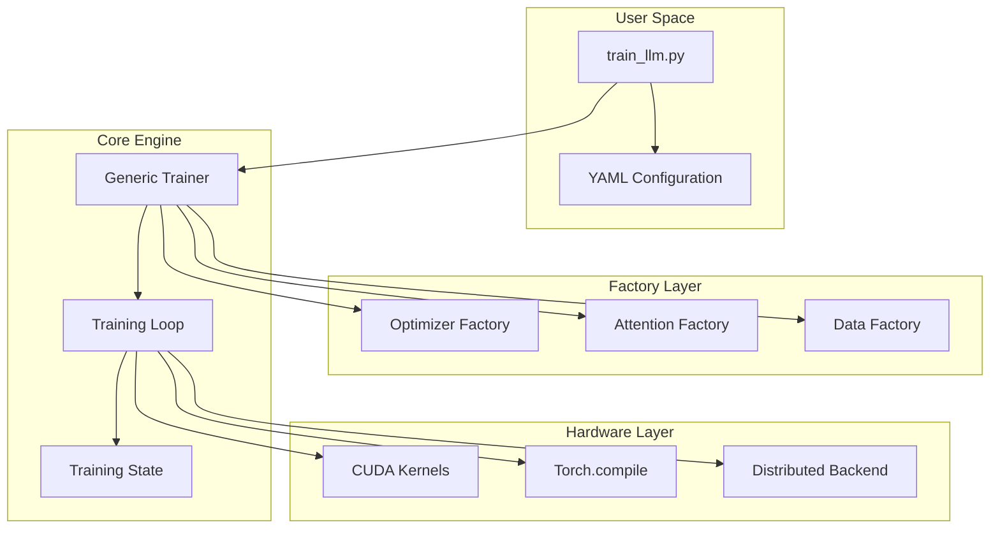
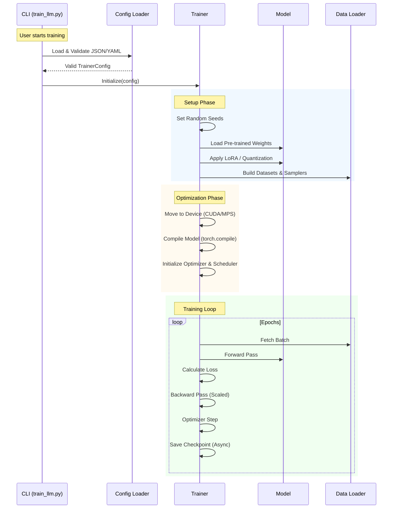

# System Architecture

The TruthGPT Optimization Core is designed as a **modular, registry-based framework**. This architecture separates the *definition* of components (like optimizers or attention mechanisms) from their *usage*, allowing for seamless extensibility and rapid experimentation.

## 🏗️ High-Level Design

The system is stratified into four distinct layers, each with a specific responsibility:

1.  **Configuration Layer (`configs/`)**:
    -   **Responsibility**: Defines the "What".
    -   **Mechanism**: A unified YAML structure that controls every aspect of the training run.
    -   **Benefit**: reproducibility. You can version check your YAMLs to track exact experimental conditions.

2.  **Factory Layer (`factories/`)**:
    -   **Responsibility**: The "Builder".
    -   **Mechanism**: Uses the `Registry` pattern to instantiate objects based on string identifiers in the config.
    -   **Benefit**: Decoupling. The Trainer doesn't need to import `LionOptimizer` directly; it just asks the factory for `"lion"`.

3.  **Core Engine (`trainers/`)**:
    -   **Responsibility**: The "Orchestrator".
    -   **Mechanism**: The `GenericTrainer` class manages the training loop, state synchronization, and data flow.
    -   **Benefit**: abstraction. The complex logic of gradient accumulation, AMP, and distributed sync is hidden from the user.

4.  **Hardware Abstraction**:
    -   **Responsibility**: The "Accelerator".
    -   **Mechanism**: Utilities that interface with PyTorch/CUDA/XLA to optimize execution.
    -   **Benefit**: Performance. Automatic selection of the best kernels for the available hardware.



## 🧩 Deep Dive: The Registry System

The `Registry` pattern is the cornerstone of TruthGPT's modularity. It allows the system to discover and load components dynamically.

### How it Works

1.  **Registration**: A component (class or function) is decorated with `@REGISTRY.register("name")`.
2.  **Lookup**: When the config specifies `type: "name"`, the registry returns the corresponding class.
3.  **Instantiation**: The factory initializes the class with arguments from the config.

```python
# 1. Definition (in optimization_core/optimizers/lion.py)
from factories.registry import OPTIMIZERS

@OPTIMIZERS.register("lion")
class LionOptimizer(torch.optim.Optimizer):
    def __init__(self, params, lr=1e-4, ...):
        ...

# 2. Configuration (in config.yaml)
# optimizer:
#   type: lion
#   lr: 0.0001

# 3. Usage (in trainers/trainer.py)
self.optimizer = OPTIMIZERS.build(
    cfg.optimizer.type,  # "lion"
    model.parameters(),
    lr=cfg.optimizer.lr
)
```

## 🔄 Component Lifecycle

Understanding the lifecycle of a training run helps in debugging and extending the system.



## 🛠️ Extensibility Guide

### Adding a New Attention Mechanism

1.  Create a file in `optimization_core/modules/attention/`.
2.  Implement your attention class inheriting from `nn.Module`.
3.  Register it using the `ATTENTION_REGISTRY`.

```python
from factories.registry import ATTENTION_REGISTRY

@ATTENTION_REGISTRY.register("my_fast_attention")
class MyFastAttention(nn.Module):
    def forward(self, x):
        # Your custom implementation
        return x
```

4.  Use it in your YAML:
```yaml
model:
    attention:
        backend: my_fast_attention
```
