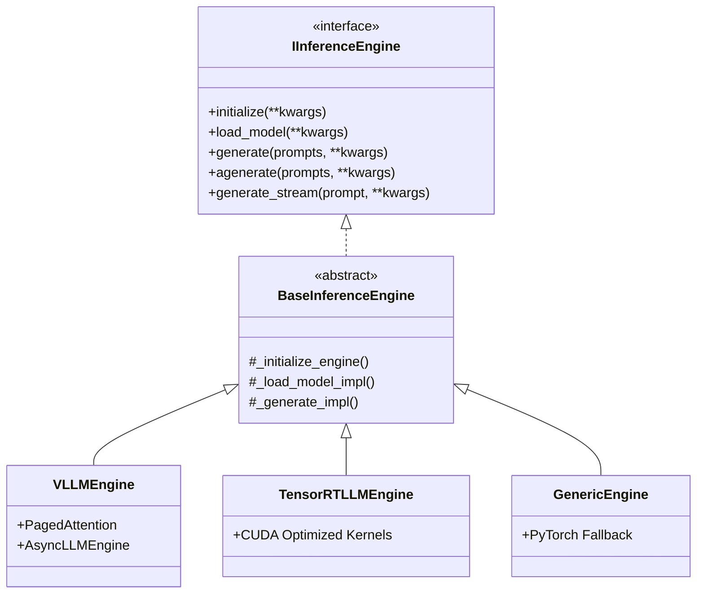

# ⚡ Especificación de Motores de Inferencia - Optimization Core

## 📋 Resumen

Este documento especifica los motores de inferencia de alto rendimiento para LLMs, incluyendo vLLM, TensorRT-LLM, Llama.cpp y motores genéricos (PyTorch), con fuerte enfoque en operaciones asíncronas y streaming.

## 🎯 Objetivos

1. **Alto Rendimiento**: 5-10x más rápido que PyTorch estándar.
2. **Eficiencia de Memoria**: Reducción de 3-5x en uso de memoria (PagedAttention).
3. **Batching Optimizado**: Continuous batching para máxima utilización de la GPU.
4. **Soporte Multi-GPU**: Soporte nativo para Tensor Parallelism (TP).
5. **Cuantización**: Soporte nativo para AWQ, GPTQ, INT8, FP8.
6. **Streaming & Async**: API 100% asíncrona compatible con casos de uso en tiempo real (SSE/WebSockets).

## 🏗️ Arquitectura

### Diagrama de Componentes



## 📦 Componentes

### Excepciones Base

```python
class InferenceError(Exception):
    """Base para errores de inferencia."""
    pass

class NotInitializedError(InferenceError):
    """Motor o modelo no inicializado antes de la ejecución."""
    pass

class ModelLoadError(InferenceError):
    """Error crítico al cargar los pesos del modelo."""
    pass
```

### BaseInferenceEngine

**Propósito**: Interfaz base asíncrona y estructurada que provee inicialización robusta y validación común.

```python
from abc import ABC, abstractmethod
from typing import Union, List, Optional, Any, Dict, Tuple, AsyncGenerator
from pathlib import Path
import logging

class BaseInferenceEngine(ABC):
    """
    Abstract base class for high-performance inference engines.
    Provides common interface, validation, and lifecycle management.
    """
    
    def __init__(self, model: Union[str, Path], **kwargs):
        self.model_path = Path(model) if isinstance(model, (str, Path)) else model
        self._initialized = False
        self._model_loaded = False
        self._logger = logging.getLogger(self.__class__.__name__)
    
    def initialize(self, **kwargs) -> 'BaseInferenceEngine':
        """
        Public initialization lifecycle method.
        Ensure resources are allocated safely.
        """
        if not self._initialized:
            self._logger.info(f"Initializing {self.__class__.__name__}...")
            self._initialize_engine(**kwargs)
            self._initialized = True
        return self
        
    def load_model(self, **kwargs) -> bool:
        """
        Public model loading method.
        Initializes the engine if it hasn't been initialized yet.
        """
        if not self._initialized:
            self.initialize()
        if not self._model_loaded:
            self._logger.info(f"Loading weights from {self.model_path}...")
            self._model_loaded = self._load_model_impl(self.model_path, **kwargs)
        return self._model_loaded

    @abstractmethod
    def _initialize_engine(self, **kwargs) -> Any:
        pass
    
    @abstractmethod
    def _load_model_impl(self, model: Union[str, Path], **kwargs) -> bool:
        pass
    
    def generate(self, prompts: Union[str, List[str]], max_tokens: int = 64, temperature: float = 0.7, top_p: float = 0.95, **kwargs) -> Union[str, List[str]]:
        """Synchronous text generation (fallback/blocking)."""
        if not self._model_loaded:
            raise NotInitializedError("Model must be loaded before generating.")
            
        prompts_list, was_single = self._normalize_prompts(prompts)
        self._validate_generation_params(max_tokens, temperature, top_p)
        
        results = self._generate_impl(prompts_list, max_tokens=max_tokens, temperature=temperature, top_p=top_p, **kwargs)
        return results[0] if was_single else results

    @abstractmethod
    def _generate_impl(self, prompts: List[str], **kwargs) -> List[str]:
        pass

    @abstractmethod
    async def agenerate(self, prompts: Union[str, List[str]], **kwargs) -> Union[str, List[str]]:
        """Asynchronous text generation (preferred)."""
        pass

    @abstractmethod
    async def generate_stream(self, prompt: str, **kwargs) -> AsyncGenerator[str, None]:
        """Streaming generation for continuous token yielding."""
        pass

    def _normalize_prompts(self, prompts: Union[str, List[str]]) -> Tuple[List[str], bool]:
        if isinstance(prompts, str):
            return [prompts], True
        return list(prompts), False
    
    def _validate_generation_params(self, max_tokens: int, temperature: float, top_p: float) -> None:
        if max_tokens < 1:
            raise ValueError("max_tokens must be >= 1")
        if not 0.0 <= temperature <= 2.0:
            raise ValueError("temperature must be in [0.0, 2.0]")
        if not 0.0 <= top_p <= 1.0:
            raise ValueError("top_p must be in [0.0, 1.0]")
```

### VLLMEngine

**Propósito**: Motor de inferencia usando `vLLM` con soporte para alto throughput asíncrono.

```python
class VLLMEngine(BaseInferenceEngine):
    """
    vLLM inference engine using AsyncLLMEngine.
    Features: PagedAttention, Continuous Batching, Async APIs.
    """
    
    def __init__(self, model: Union[str, Path], tensor_parallel_size: int = 1, gpu_memory_utilization: float = 0.9, dtype: str = "auto", quantization: Optional[str] = None, **kwargs):
        super().__init__(model, **kwargs)
        self.tensor_parallel_size = tensor_parallel_size
        self.gpu_memory_utilization = gpu_memory_utilization
        self.dtype = dtype
        self.quantization = quantization
        self._engine = None
        
    def _initialize_engine(self, **kwargs) -> Any:
        from vllm.engine.async_llm_engine import AsyncLLMEngine
        from vllm.engine.arg_utils import AsyncEngineArgs
        
        engine_args = AsyncEngineArgs(
            model=str(self.model_path),
            tensor_parallel_size=self.tensor_parallel_size,
            gpu_memory_utilization=self.gpu_memory_utilization,
            dtype=self.dtype,
            quantization=self.quantization,
            disable_log_requests=True,
            **kwargs
        )
        self._engine = AsyncLLMEngine.from_engine_args(engine_args)
        return self._engine
        
    def _load_model_impl(self, model: Union[str, Path], **kwargs) -> bool:
        return True # vLLM loads weights intrinsically during AsyncLLMEngine init
        
    def _generate_impl(self, prompts: List[str], **kwargs) -> List[str]:
        raise NotImplementedError("VLLMEngine in asynchronous mode requires using agenerate().")

    async def agenerate(self, prompts: Union[str, List[str]], max_tokens: int = 64, temperature: float = 0.7, top_p: float = 0.95, **kwargs) -> Union[str, List[str]]:
        from vllm import SamplingParams
        import uuid
        
        if not self._model_loaded:
            raise NotInitializedError("Model not loaded")

        prompts_list, was_single = self._normalize_prompts(prompts)
        self._validate_generation_params(max_tokens, temperature, top_p)
        
        sampling_params = SamplingParams(max_tokens=max_tokens, temperature=temperature, top_p=top_p, **kwargs)
        
        tasks = []
        for prompt in prompts_list:
            request_id = str(uuid.uuid4())
            tasks.append(self._engine.generate(prompt, sampling_params, request_id))
            
        results = []
        for task in tasks:
            final_output = None
            async for request_output in task:
                final_output = request_output
            results.append(final_output.outputs[0].text)
            
        return results[0] if was_single else results

    async def generate_stream(self, prompt: str, max_tokens: int = 64, temperature: float = 0.7, top_p: float = 0.95, **kwargs) -> AsyncGenerator[str, None]:
        from vllm import SamplingParams
        import uuid
        
        if not self._model_loaded:
            raise NotInitializedError("Model not loaded")

        self._validate_generation_params(max_tokens, temperature, top_p)
        sampling_params = SamplingParams(max_tokens=max_tokens, temperature=temperature, top_p=top_p, **kwargs)
        request_id = str(uuid.uuid4())
        
        previous_text_len = 0
        async for request_output in self._engine.generate(prompt, sampling_params, request_id):
            current_text = request_output.outputs[0].text
            yield current_text[previous_text_len:]
            previous_text_len = len(current_text)
```

### TensorRTLLMEngine

**Propósito**: Motor TensorRT-LLM integrado para el máximo rendimiento en arquitectura Nvidia.

```python
class TensorRTLLMEngine(BaseInferenceEngine):
    """
    TensorRT-LLM engine.
    Features: Optimized kernels, High Static Throughput, Multi-GPU.
    """
    
    def __init__(self, model_path: Union[str, Path], engine_dir: Optional[Union[str, Path]] = None, **kwargs):
        super().__init__(model_path, **kwargs)
        self.engine_dir = Path(engine_dir) if engine_dir else None
        self._trt_llm = None
    
    def _initialize_engine(self, **kwargs) -> Any:
        from tensorrt_llm.runtime import PYRuntime
        if not self.engine_dir:
            raise ValueError("engine_dir is required for TensorRTLLMEngine")
        
        self._trt_llm = PYRuntime(
            engine_dir=str(self.engine_dir),
            tokenizer_dir=str(self.model_path),
            **kwargs
        )
        return self._trt_llm
        
    def _load_model_impl(self, model: Union[str, Path], **kwargs) -> bool:
        return True
        
    def _generate_impl(self, prompts: List[str], max_tokens: int = 64, temperature: float = 0.7, top_p: float = 0.95, **kwargs) -> List[str]:
        input_ids = self._trt_llm.tokenizer.encode(prompts)
        outputs = self._trt_llm.generate(input_ids, max_new_tokens=max_tokens, temperature=temperature, top_p=top_p, **kwargs)
        return self._trt_llm.tokenizer.decode(outputs)

    async def agenerate(self, prompts: Union[str, List[str]], **kwargs) -> Union[str, List[str]]:
        # Wraps synchronous generate in asyncio execution natively or using asyncio.to_thread
        import asyncio
        loop = asyncio.get_running_loop()
        prompts_list, was_single = self._normalize_prompts(prompts)
        results = await loop.run_in_executor(None, lambda: self._generate_impl(prompts_list, **kwargs))
        return results[0] if was_single else results

    async def generate_stream(self, prompt: str, **kwargs) -> AsyncGenerator[str, None]:
        raise NotImplementedError("Standard TensorRT LLM Python bindings might lack native raw streaming out of the box. Implement via custom callbacks if needed.")
```

### GenericEngine

**Propósito**: PyTorch fallback tradicional (baseline). Útil cuando las optimizaciones de hardware fallan.

```python
import torch

class GenericEngine(BaseInferenceEngine):
    """Fallback PyTorch engine."""
    
    def __init__(self, model: Union[str, Path], device: str = "cuda", torch_dtype: str = "float16", **kwargs):
        super().__init__(model, **kwargs)
        self.device = device
        self.torch_dtype = torch_dtype
        self._model = None
        self._tokenizer = None
    
    def _initialize_engine(self, **kwargs) -> Any:
        pass # Not applicable for raw PyTorch
        
    def _load_model_impl(self, model: Union[str, Path], **kwargs) -> bool:
        from transformers import AutoModelForCausalLM, AutoTokenizer
        
        self._tokenizer = AutoTokenizer.from_pretrained(str(model), **kwargs)
        dtype_map = {"float16": torch.float16, "bfloat16": torch.bfloat16, "float32": torch.float32}
        
        self._model = AutoModelForCausalLM.from_pretrained(
            str(model),
            torch_dtype=dtype_map.get(self.torch_dtype, torch.float16),
            device_map=self.device,
            **kwargs
        )
        self._model.eval()
        return True
        
    def _generate_impl(self, prompts: List[str], max_tokens: int = 64, temperature: float = 0.7, top_p: float = 0.95, **kwargs) -> List[str]:
        inputs = self._tokenizer(prompts, return_tensors="pt", padding=True).to(self.device)
        with torch.no_grad():
            outputs = self._model.generate(
                **inputs, max_new_tokens=max_tokens, temperature=temperature, top_p=top_p, do_sample=(temperature > 0.0), **kwargs
            )
        return self._tokenizer.batch_decode(outputs, skip_special_tokens=True)

    async def agenerate(self, prompts: Union[str, List[str]], **kwargs) -> Union[str, List[str]]:
        import asyncio
        loop = asyncio.get_running_loop()
        prompts_list, was_single = self._normalize_prompts(prompts)
        results = await loop.run_in_executor(None, lambda: self._generate_impl(prompts_list, **kwargs))
        return results[0] if was_single else results

    async def generate_stream(self, prompt: str, **kwargs) -> AsyncGenerator[str, None]:
        from transformers import TextIteratorStreamer
        from threading import Thread
        import asyncio
        
        streamer = TextIteratorStreamer(self._tokenizer, skip_prompt=True, skip_special_tokens=True)
        inputs = self._tokenizer([prompt], return_tensors="pt").to(self.device)
        
        generation_kwargs = dict(**inputs, streamer=streamer, max_new_tokens=kwargs.get("max_tokens", 64))
        thread = Thread(target=self._model.generate, kwargs=generation_kwargs)
        thread.start()
        
        for new_text in streamer:
            yield new_text
            await asyncio.sleep(0) # Yield control
        thread.join()
```

## 🏭 EngineFactory (Registry Pattern)

**Propósito**: Desacoplar la instanciación de clases y permitir extensibilidad con un patrón Registry.

```python
from typing import Type, Dict

class EngineFactory:
    """Registry-based factory for creating inference engines."""
    
    _registry: Dict[str, Type[BaseInferenceEngine]] = {}
    
    @classmethod
    def register(cls, name: str):
        """Decorator for registering engine classes to the factory."""
        def wrapper(engine_class: Type[BaseInferenceEngine]):
            cls._registry[name] = engine_class
            return engine_class
        return wrapper

    @classmethod
    def create_engine(cls, engine_name: str, model: Union[str, Path], **kwargs) -> BaseInferenceEngine:
        """Instantiates an engine by name."""
        if engine_name not in cls._registry:
            if engine_name == "auto":
                engine_name = cls._select_best_engine()
            else:
                raise ValueError(f"Engine '{engine_name}' not found. Available: {list(cls._registry.keys())}")
                
        return cls._registry[engine_name](model, **kwargs)

    @staticmethod
    def _select_best_engine() -> str:
        """Autodiscovery logic fallback."""
        try:
            import vllm
            return "vllm"
        except ImportError:
            try:
                import tensorrt_llm
                return "tensorrt"
            except ImportError:
                return "generic"

# Ejemplo de Registro Interno Activo:
EngineFactory.register("vllm")(VLLMEngine)
EngineFactory.register("tensorrt")(TensorRTLLMEngine)
EngineFactory.register("generic")(GenericEngine)
```

## 📊 Métricas y Rendimiento Esperado

| Engine | Latency (ms/token) | Throughput (tokens/s) | Memory (GB for 7B) | Async APIs |
|--------|-------------------|---------------------|-------------------|------------|
| vLLM | 15-25 | 2000-5000 | 8-12 | ✅ Nativo (Alto Rendimiento) |
| TensorRT-LLM | 10-20 | 3000-6000 | 6-10 | ⚠️ Mediante Threads |
| Generic (PyTorch)| 50-100 | 500-1000 | 14-20 | ⚠️ Mediante Threads |

## 🧪 Testing

### Ejemplo de Tests Asíncronos

```python
import pytest

@pytest.mark.asyncio
async def test_vllm_engine_async_generation():
    engine = EngineFactory.create_engine("vllm", "mistralai/Mistral-7B-Instruct-v0.2")
    engine.initialize().load_model()
    
    result = await engine.agenerate("Explain quantum computing in one sentence:", max_tokens=30)
    assert isinstance(result, str)
    assert len(result) > 0

@pytest.mark.asyncio
async def test_vllm_engine_streaming():
    engine = EngineFactory.create_engine("vllm", "mistralai/Mistral-7B-Instruct-v0.2")
    engine.initialize().load_model()
    
    chunks = []
    async for chunk in engine.generate_stream("Count from 1 to 5:", max_tokens=20):
        chunks.append(chunk)
        
    assert len(chunks) > 0
    generated_text = "".join(chunks)
    assert "5" in generated_text
```

---

**Versión**: 1.1.0  
**Última actualización**: Marzo 2026
