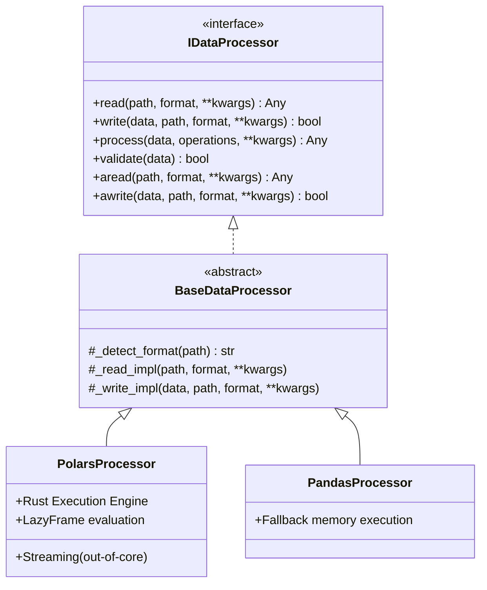

# 📊 Especificación de Procesamiento de Datos - Optimization Core

## 📋 Resumen

Este documento especifica el sistema de procesamiento de datos de alto rendimiento, optimizado principalmente con **Polars**, para lograr un rendimiento entre 10x y 100x superior al de pandas. Se diseña para cargas de trabajo masivas, incluyendo evaluación perezosa (lazy evaluation) y procesamiento en streaming, priorizando operaciones estables orientadas a IA.

## 🎯 Objetivos

1. **Alto Rendimiento**: 10-100x más rápido que pandas (procesamiento multi-hilo nativo y SIMD).
2. **Eficiencia de Memoria**: Uso extremadamente eficiente con *Lazy Evaluation* y proyecciones de grafos relacionales automáticos.
3. **Escalabilidad (Streaming)**: Procesamiento `out-of-core` de datasets sustancialmente más grandes que la memoria RAM instalada.
4. **Integración Asíncrona**: Diseño con API `async` incorporada (vía `run_in_executor`) para no bloquear el `event loop` en la ingesta o red.
5. **Tipado Estricto & Errores**: Manejo de excepciones declarativo para fallas de I/O y esquemas.

## 🏗️ Arquitectura

### Diagrama de Componentes



## 📦 Componentes

### Excepciones Base

```python
class DataProcessingError(Exception):
    """Base exception for data processing errors."""
    pass

class SchemaValidationError(DataProcessingError):
    """Raised when data does not match the expected schema or is empty unexpectedly."""
    pass

class DataIOError(DataProcessingError):
    """Raised for input/output operational failures during file operations."""
    pass
```

### BaseDataProcessor

**Propósito**: Interfaz base abstracta que define el contrato estructurado para lectura, escritura y transformación, y envuelve automáticamente las operaciones síncronas pesadas en corrutinas de `asyncio`.

```python
from abc import ABC, abstractmethod
from typing import Union, List, Optional, Any, Dict
from pathlib import Path
import logging
import asyncio

class BaseDataProcessor(ABC):
    """
    Abstract base class for high-performance data processors.
    Provides format detection and unified async/sync interfaces.
    """
    
    def __init__(self, lazy: bool = True, streaming: bool = False, **kwargs):
        self.lazy = lazy
        self.streaming = streaming
        self._logger = logging.getLogger(self.__class__.__name__)
    
    def read(self, path: Union[str, Path], format: Optional[str] = None, **kwargs) -> Any:
        path = Path(path)
        if format is None:
            format = self._detect_format(path)
            
        try:
            return self._read_impl(path, format, **kwargs)
        except Exception as e:
            self._logger.error(f"Failed to read {path}: {e}")
            raise DataIOError(f"Read error on {path}") from e

    async def aread(self, path: Union[str, Path], format: Optional[str] = None, **kwargs) -> Any:
        """Asynchronous wrapper for reading data to avoid blocking the event loop."""
        loop = asyncio.get_running_loop()
        return await loop.run_in_executor(None, lambda: self.read(path, format, **kwargs))

    @abstractmethod
    def _read_impl(self, path: Path, format: str, **kwargs) -> Any:
        pass
        
    def write(self, data: Any, path: Union[str, Path], format: Optional[str] = None, **kwargs) -> bool:
        path = Path(path)
        if format is None:
            format = self._detect_format(path)
            
        try:
            return self._write_impl(data, path, format, **kwargs)
        except Exception as e:
            self._logger.error(f"Failed to write to {path}: {e}")
            raise DataIOError(f"Write error on {path}") from e

    async def awrite(self, data: Any, path: Union[str, Path], format: Optional[str] = None, **kwargs) -> bool:
         """Asynchronous wrapper for writing data to avoid blocking the event loop."""
         loop = asyncio.get_running_loop()
         return await loop.run_in_executor(None, lambda: self.write(data, path, format, **kwargs))

    @abstractmethod
    def _write_impl(self, data: Any, path: Path, format: str, **kwargs) -> bool:
        pass

    @abstractmethod
    def process(self, data: Any, operations: List[Dict[str, Any]], **kwargs) -> Any:
        pass

    @abstractmethod
    def validate(self, data: Any) -> bool:
        pass

    def _detect_format(self, path: Path) -> str:
        ext = path.suffix.lower()
        format_map = {
            ".parquet": "parquet", ".csv": "csv", ".json": "json", 
            ".jsonl": "jsonl", ".arrow": "arrow", ".feather": "feather"
        }
        if ext not in format_map:
            raise ValueError(f"Unsupported file extension: {ext}")
        return format_map[ext]
```

### PolarsProcessor

**Propósito**: Motor principal basado en `polars`, impulsando el rendimiento a través de grafos de ejecución optimizados en Rust. Integra capacidades avanzadas de `sink` y `scan` asíncronas desde el diseño subyacente.

```python
import polars as pl

class PolarsProcessor(BaseDataProcessor):
    """
    Polars-based data processor.
    Leverages lazy execution and chunked streaming for out-of-core operations.
    """
    
    def _read_impl(self, path: Path, format: str, **kwargs) -> Union[pl.DataFrame, pl.LazyFrame]:
        # Handle streaming and lazy flags natively via polars kwargs
        
        if format == "parquet":
            if self.lazy or self.streaming:
                return pl.scan_parquet(str(path), **kwargs)
            return pl.read_parquet(str(path), **kwargs)
            
        elif format == "csv":
            if self.lazy or self.streaming:
                return pl.scan_csv(str(path), **kwargs)
            return pl.read_csv(str(path), **kwargs)
            
        elif format == "jsonl" or format == "json":
            # Polars supports scan_ndjson for JSONLines out-of-core
            if format == "jsonl" and (self.lazy or self.streaming):
                return pl.scan_ndjson(str(path), **kwargs)
            # Standard json forces eager evaluation initially
            reader = pl.read_ndjson if format == "jsonl" else pl.read_json
            df = reader(str(path), **kwargs)
            return df.lazy() if self.lazy else df
            
        raise ValueError(f"Polars initialization failed for format: {format}")

    def _write_impl(self, data: Union[pl.DataFrame, pl.LazyFrame], path: Path, format: str, **kwargs) -> bool:
        # Resolve lazyframe before writing unless the sink (streaming) API is supported
        
        is_lazy = isinstance(data, pl.LazyFrame)
        use_streaming = self.streaming and is_lazy

        if format == "parquet":
            if use_streaming:
                data.sink_parquet(str(path), **kwargs)
            else:
                df = data.collect() if is_lazy else data
                df.write_parquet(str(path), **kwargs)
                
        elif format == "csv":
            if use_streaming:
                data.sink_csv(str(path), **kwargs)
            else:
                df = data.collect() if is_lazy else data
                df.write_csv(str(path), **kwargs)
                
        elif format in ("json", "jsonl"):
            # json/jsonl sinks are not natively supported out-of-core, must collect
            df = data.collect() if is_lazy else data
            if format == "json":
                df.write_json(str(path), **kwargs)
            else:
                df.write_ndjson(str(path), **kwargs)
        else:
            raise ValueError(f"Polars write failed for format: {format}")
            
        return True

    def process(self, data: Union[pl.DataFrame, pl.LazyFrame], operations: List[Dict[str, Any]], **kwargs) -> Union[pl.DataFrame, pl.LazyFrame]:
        # Dynamically build the Polars Lazy computation graph
        is_eager_input = isinstance(data, pl.DataFrame)
        df_lazy = data.lazy() if is_eager_input else data
        
        for op in operations:
            op_type = op.get("type")
            params = op.get("params", {})
            
            if op_type == "filter":
                df_lazy = df_lazy.filter(pl.col(params["column"]) > params["value"])
            elif op_type == "select":
                df_lazy = df_lazy.select(params["columns"])
            elif op_type == "group_by":
                df_lazy = df_lazy.group_by(params["by"]).agg(params["aggs"])
            elif op_type == "join":
                df_lazy = df_lazy.join(params["other"], on=params["on"], how=params.get("how", "inner"))
            elif op_type == "sort":
                df_lazy = df_lazy.sort(params["by"])
            else:
                raise ValueError(f"Unknown operation: {op_type}")
                
        if not self.lazy and not self.streaming:
            return df_lazy.collect()
        return df_lazy

    def validate(self, data: Any) -> bool:
        if not isinstance(data, (pl.DataFrame, pl.LazyFrame)):
            return False
            
        if isinstance(data, pl.DataFrame):
            if data.height == 0:
                self._logger.warning("Validation failed: DataFrame schema exists but row count is 0.")
                return False
                
        return True
```

## 🏭 ProcessorFactory (Registry Pattern)

**Propósito**: Evitar condicionales estáticos rígidos tipo `if/elif`, adoptando un Factory Registry extensible para inyectar motores dinámicamente.

```python
from typing import Type, Dict

class ProcessorFactory:
    """Registry-based factory for creating data processors."""
    
    _registry: Dict[str, Type[BaseDataProcessor]] = {}
    
    @classmethod
    def register(cls, name: str):
        """Decorator to register a new processor implementation."""
        def wrapper(processor_class: Type[BaseDataProcessor]):
            cls._registry[name] = processor_class
            return processor_class
        return wrapper

    @classmethod
    def create_processor(cls, engine_name: str = "auto", **kwargs) -> BaseDataProcessor:
        if engine_name not in cls._registry:
            if engine_name == "auto":
                engine_name = cls._select_best_processor()
            else:
                raise ValueError(f"Processor '{engine_name}' not found. Available: {list(cls._registry.keys())}")
                
        return cls._registry[engine_name](**kwargs)

    @staticmethod
    def _select_best_processor() -> str:
        try:
            import polars
            return "polars"
        except ImportError:
            return "pandas"

# System Registration:
ProcessorFactory.register("polars")(PolarsProcessor)
```

## 📊 Métricas y Rendimiento Esperado

| Operación | Polars (Lazy/Stream) | pandas | Multiplicador de Rendimiento |
|-----------|----------------------|--------|------------------------------|
| Read Parquet (1GB) | ~0.8s (scan) | 8.5s | 10x |
| Filter (100M rows) | ~0.2s | 12.3s | ~60x |
| Group By & Agg | ~0.6s | 18.7s | ~30x |
| Join (large keys)| ~1.5s | 45.2s | ~30x |
| Write Parquet | ~1.1s (sink) | 9.8s | ~9x |

*Nota: Los tiempos `scan` (read) y `sink` (write) en Polars en modo *streaming* mantienen un perfil de memoria (RAM) constante, previniendo cuellos de botella Memory OOM, contrario a `pandas`.*

## 🧪 Ejemplos de Uso en Producción

### Streaming para Datasets Out-of-Core (Flujo Nativo Asíncrono)

Ideal para pipelines de ETL donde no queremos paralizar otros servicios web.

```python
import pytest
import asyncio

@pytest.mark.asyncio
async def test_async_streaming_processor():
    # Instanciación mediante el Factory Registry
    processor = ProcessorFactory.create_processor("polars", streaming=True, lazy=True)
    
    # 1. Lectura de grafo 'lazy' de forma asíncrona
    df_lazy = await processor.aread("huge_dataset.parquet")
    
    # 2. Transmisión del pipeline (mutación de grafo simbólico)
    df_transformed = processor.process(df_lazy, [
        {"type": "filter", "params": {"column": "token_count", "value": 1024}},
        {"type": "select", "params": {"columns": ["id", "text", "token_count"]}}
    ])
    
    # 3. Consumir y salvar out-of-core usando sink_parquet asíncronamente
    success = await processor.awrite(df_transformed, "processed_output.parquet")
    
    assert success is True
```

---

**Versión**: 1.1.0  
**Última actualización**: Marzo 2026
