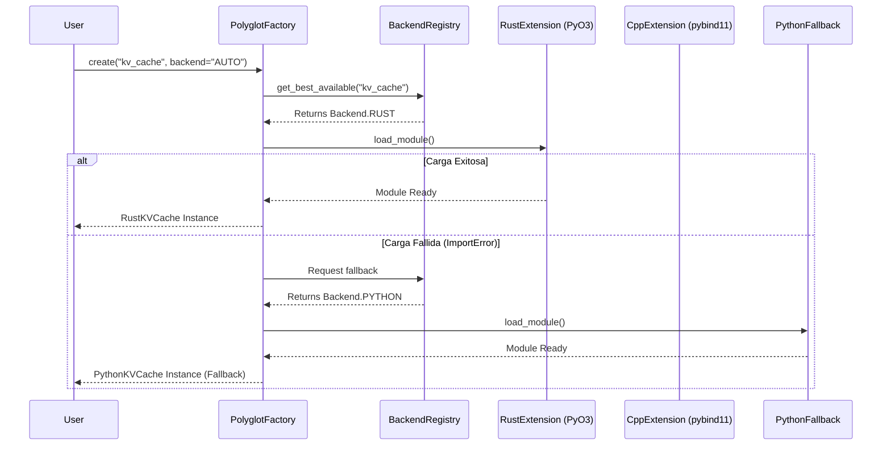

# 🔄 Especificación de Polyglot Core - Optimization Core

## 📋 Resumen

Este documento especifica el módulo `polyglot_core`, el cual actúa como una capa de abstracción ágil y de ultra bajo retardo (Zero-Overhead Abstraction) para acceder a backends de alto rendimiento (Rust, C++, Go) desde código Python. Su enfoque es la orquestación de tensores, cachés y llamadas a sistemas de forma transparente y asíncrona.

## 🎯 Objetivos

1. **API Unificada y Asíncrona**: Interfaces Python robustas y `async-first` para operaciones no bloqueantes.
2. **Auto-Selección Activa**: Negociación automática del mejor backend en tiempo de ejecución.
3. **Mínima Sobrecarga (Zero-Overhead)**: Uso de `PyO3` (Rust) y `pybind11` (C++) con acceso a memoria compartida (`memoryviews`/`Arrow`).
4. **Fallback Resistente**: Degradación gradual (graceful degradation) hacia Python puro si los binarios compilados fallan al cargar.
5. **Observabilidad Inyectada**: Trazabilidad de qué backend ejecuta qué operación y cuánto tarda.

## 🏗️ Arquitectura

### Diagrama de Secuencia de Resolución de Backend



## 📦 Componentes Principales

### Excepciones Base

```python
class PolyglotError(Exception):
    """Base exception for polyglot routing errors."""
    pass

class BackendNotAvailableError(PolyglotError):
    """Requested backend is not installed or failed to load."""
    pass

class ComponentCreationError(PolyglotError):
    """All available backends failed to initialize for the requested component."""
    pass
```

### Registry & Backend Detection

**Propósito**: Mantener un estado global de qué binarios compilados están realmente presentes en el entorno en tiempo de arranque.

```python
from enum import Enum
from dataclasses import dataclass, field
from typing import List, Optional, Dict, Any, Type
import logging
import sys

logger = logging.getLogger(__name__)

class Backend(Enum):
    """Supported execution backends."""
    AUTO = "auto"
    RUST = "rust"
    CPP = "cpp"
    GO = "go"
    PYTHON = "python"  # Universal fallback

@dataclass
class BackendInfo:
    """Telemetry and status for a specific backend payload."""
    name: str
    available: bool
    version: Optional[str] = None
    capabilities: List[str] = field(default_factory=list)
    performance_score: float = 0.0  # 0.0-1.0 (Higher is better)
    error: Optional[str] = None

class BackendRegistry:
    """Central registry for discovering and ranking backends."""
    
    _cached_status: Dict[str, BackendInfo] = {}

    @classmethod
    def initialize_discovery(cls) -> None:
        """Probes the environment for compiled extensions."""
        cls._cached_status["rust"] = cls._probe_rust()
        cls._cached_status["cpp"] = cls._probe_cpp()
        cls._cached_status["go"] = cls._probe_go()
        cls._cached_status["python"] = BackendInfo(
            name="python", available=True, version=sys.version.split(" ")[0],
            capabilities=["kv_cache", "compression", "attention", "inference"], performance_score=0.1
        )

    @staticmethod
    def _probe_rust() -> BackendInfo:
        try:
            import truthgpt_rust
            return BackendInfo(name="rust", available=True, version=getattr(truthgpt_rust, "__version__", "1.0"), capabilities=["kv_cache", "compression", "tokenization"], performance_score=0.95)
        except ImportError as e:
            return BackendInfo(name="rust", available=False, error=str(e), performance_score=0.0)

    @staticmethod
    def _probe_cpp() -> BackendInfo:
        try:
            import _cpp_core
            return BackendInfo(name="cpp", available=True, version=getattr(_cpp_core, "__version__", "1.0"), capabilities=["attention", "cuda_kernels", "inference"], performance_score=0.98)
        except ImportError as e:
            return BackendInfo(name="cpp", available=False, error=str(e), performance_score=0.0)

    @staticmethod
    def _probe_go() -> BackendInfo:
        # Go usually operates over RPC/gRPC/CGO
        return BackendInfo(name="go", available=False, error="Go microservices not actively probed at import", performance_score=0.0)

    @classmethod
    def get_status(cls, backend: Backend) -> BackendInfo:
        if not cls._cached_status:
            cls.initialize_discovery()
        return cls._cached_status.get(backend.value, BackendInfo(name=backend.value, available=False))

    @classmethod
    def is_available(cls, backend: Backend) -> bool:
        return cls.get_status(backend).available
```

### Component Factory (Routing Engine)

**Propósito**: Proveer el componente correcto basado en las capacidades listadas.

```python
FEATURE_ROUTING_TABLE = {
    # Feature -> List of backends in preference order
    "kv_cache": [Backend.RUST, Backend.CPP, Backend.PYTHON],
    "compression": [Backend.RUST, Backend.CPP, Backend.PYTHON],
    "attention": [Backend.CPP, Backend.RUST, Backend.PYTHON],
    "tokenization": [Backend.RUST, Backend.PYTHON],
}

class PolyglotFactory:
    """Instantiates the optimal cross-language component for a given feature."""
    
    @classmethod
    def get_best_backend(cls, feature: str) -> Backend:
        if feature not in FEATURE_ROUTING_TABLE:
            raise ValueError(f"Feature '{feature}' is not recognized by the routing table.")
            
        preferred_backends = FEATURE_ROUTING_TABLE[feature]
        
        for backend in preferred_backends:
            if BackendRegistry.is_available(backend):
                return backend
                
        logger.warning(f"No optimized backend available for {feature}, falling back to Python.")
        return Backend.PYTHON

    @classmethod
    def create_kv_cache(cls, max_size: int = 8192, backend: Backend = Backend.AUTO, **kwargs) -> Any:
        target_backend = cls.get_best_backend("kv_cache") if backend == Backend.AUTO else backend
        
        if target_backend == Backend.RUST:
            from rust_core import PyKVCache
            return PyKVCache(max_size=max_size, **kwargs)
        elif target_backend == Backend.CPP:
            from cpp_core import CppKVCache
            return CppKVCache(max_size=max_size, **kwargs)
        else:
            from polyglot_core.fallbacks.cache import PythonKVCache
            return PythonKVCache(max_size=max_size, **kwargs)

    @classmethod
    def create_attention(cls, d_model: int, n_heads: int, backend: Backend = Backend.AUTO, **kwargs) -> Any:
        target_backend = cls.get_best_backend("attention") if backend == Backend.AUTO else backend
        
        if target_backend == Backend.CPP:
            from cpp_core import FlashAttention
            return FlashAttention(d_model=d_model, n_heads=n_heads, **kwargs)
        else:
            from polyglot_core.fallbacks.attention import PythonAttention
            return PythonAttention(d_model=d_model, n_heads=n_heads, **kwargs)
```

### Interfaz Políglota Asíncrona (`KVCache` Wrapper)

**Propósito**: Envolver las extensiones crudas de C++/Rust en una API tolerante a fallos y compatible con asincronía (si la librería compilada requiere liberar el GIL).

```python
class UnifiedKVCache:
    """
    High-level facade for KV Cache operations.
    Handles GIL release and async thread dispatching for heavy operations.
    """
    
    def __init__(self, max_size: int = 8192, backend: Backend = Backend.AUTO, **kwargs):
        self._impl = PolyglotFactory.create_kv_cache(max_size=max_size, backend=backend, **kwargs)
        self.active_backend = backend if backend != Backend.AUTO else PolyglotFactory.get_best_backend("kv_cache")
        
    def put(self, layer_idx: int, position: int, data: memoryview) -> None:
        """
        Synchronous put. Uses memoryview to ensure zero-copy transfer to Rust/C++.
        """
        self._impl.put(layer_idx, position, data)
        
    async def aput(self, layer_idx: int, position: int, data: memoryview) -> None:
        """Asynchronous put for large bulk operations."""
        import asyncio
        loop = asyncio.get_running_loop()
        await loop.run_in_executor(None, lambda: self._impl.put(layer_idx, position, data))
        
    def get(self, layer_idx: int, position: int) -> Optional[memoryview]:
        """Returns zero-copy memoryview from backend."""
        return self._impl.get(layer_idx, position)

    def get_telemetry(self) -> Dict[str, Any]:
        """Observability data including backend info."""
        stats = self._impl.get_stats() if hasattr(self._impl, "get_stats") else {}
        stats["backend"] = self.active_backend.value
        return stats
```

## 📊 Ejemplos de Uso

### Uso Básico con Auto-Selección

```python
from optimization_core.polyglot import UnifiedKVCache, UnifiedAttention

# Automáticamente usará Rust (truthgpt_rust) si está instalado
cache = UnifiedKVCache(max_size=8192)

telemetry = cache.get_telemetry()
print(f"Usando backend: {telemetry['backend']}") # 'rust' o 'python'
```

### Tolerancia a Fallos Probada

Si desinstalamos el paquete `truthgpt_rust` del entorno virtual:

```python
from optimization_core.polyglot import BackendRegistry, PolyglotFactory

BackendRegistry.initialize_discovery()
print(BackendRegistry.is_available(Backend.RUST)) # False

# Automáticamente hará degradación a Python sin causar caídas en producción
cache = UnifiedKVCache()
print(cache.active_backend) # Backend.PYTHON
```

## 🧪 Testing

### Test Backend Fallback

```python
from unittest.mock import patch
import pytest

def test_fallback_to_python_when_rust_fails():
    with patch('optimization_core.polyglot.BackendRegistry.is_available') as mock_available:
        # Simulate Rust/C++ not being installed
        mock_available.side_effect = lambda b: b == Backend.PYTHON 
        
        cache = UnifiedKVCache(backend=Backend.AUTO)
        
        # Verify it gracefully fell back to Python
        assert cache.active_backend == Backend.PYTHON
```

---

**Versión**: 1.1.0  
**Última actualización**: Marzo 2026
