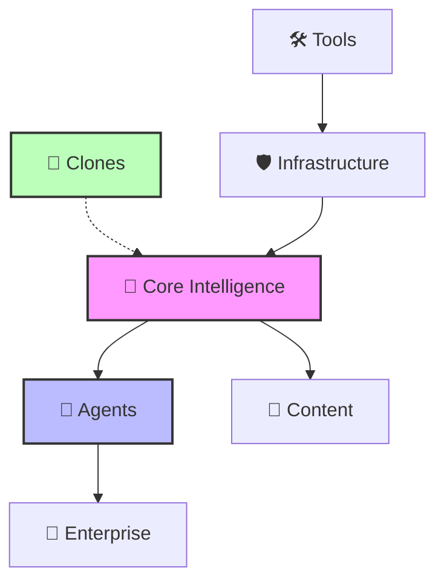

# Modelos IA

Welcome to the **Models IA** directory. This repository houses the unified intelligence units, autonomous agents, and specialized engines that power the IA closed source out there. Designed for scalability, modularity, and high-performance inference.

## ⚡ Quick Start

| | |
| :--- | :--- |
| **🚀 [Startup Replications](#-startups--clones)**   Clones of popular platforms. | **🧠 [Core Intelligence](#-core-intelligence)**   Foundation models and core reasoning engines. |
| **🤖 [Autonomous Agents](#-autonomous-agents)**   Self-directed agents for complex tasks. | **📝 [Content Factory](#-content-factory)**   Generators for text, media, and documents. |
| **💼 [Enterprise Solutions](#-enterprise-solutions)**   Business-critical logic and finance systems. | **🛡️ [Infrastructure](#%EF%B8%8F-infrastructure--security)**   Security, deployment, and cloud ops. |

---

## 🚀 Startups & Clones

| Feature | Description | Tech Stack | Status |
| :--- | :--- | :--- | :---: |
| **[Copywriting](./copywriting/README.md)** | Production Copywriting System ============================  Main entry poin... | `Python` |  |
| **[Copywriting System](./copywriting_system/README.md)** | 
 | `Unknown` |  |
| **[Cursor Backend Clone](./cursor_backend_clone/README.md)** | Cursor Agent 24/7 - Main Entry Point ===================================== ... | `Python` |  |
| **[Facebook Posts](./facebook_posts/README.md)** | FastAPI Application for Facebook Posts API Following functional programming... | `Python` |  |
| **[Frontier-Model-Run-Copy](./Frontier-Model-run-copy/README.md)** | Feature Backups & Clones | `Python` |  |
| **[Heygen Ai](./heygen_ai/README.md)** | HeyGen AI FastAPI Main Entry Point FastAPI best practices for main applicat... | `Python` |  |
| **[Instagram Captions](./instagram_captions/README.md)** | Configuration Module for Instagram Captions API v10.0  Centralized configur... | `Python, Docker` |  |
| **[Linkedin Posts](./linkedin_posts/README.md)** | LinkedIn Posts Production System ================================  Main pro... | `Python, Node.js` |  |
| **[Social Media Identity Clone Ai](./social_media_identity_clone_ai/README.md)** | Social Media Identity Clone AI ==============================  Sistema de I... | `Python, Docker, Node.js` |  |
| **[Suno Clone Ai](./suno_clone_ai/README.md)** | Aplicación principal FastAPI optimizada con arquitectura modular  Configura... | `Python, Docker` |  |
| **[Suno Clone Ai Sam3](./suno_clone_ai_sam3/README.md)** | Suno Clone AI SAM3 | `Unknown` |  |
| **[Vibe Proving Copy](./vibe_proving_copy/README.md)** | Feature Backups & Clones | `Unknown` |  |
| **[Video-Opusclip](./video-OpusClip/README.md)** | Main Entry Point for Improved Video-OpusClip API  Complete integration scri... | `Python` |  |

## 🧠 Core Intelligence

| Feature | Description | Tech Stack | Status |
| :--- | :--- | :--- | :---: |
| **[Advanced Ai Models](./advanced_ai_models/README.md)** | Advanced AI Models Module - Deep Learning, Transformers, Diffusion Models &... | `Python` |  |
| **[Agent Q](./agent_q/README.md)** | > Part of the [Blatam Academy Integrated Platform](../README.md) | `Unknown` |  |
| **[Blatam Ai](./blatam_ai/README.md)** | 🏗️ BLATAM AI - OPTIMIZED MODULAR ARCHITECTURE v6.0.0 ======================... | `Python` |  |
| **[Bulk Truthgpt](./bulk_truthgpt/README.md)** | Bulk TruthGPT Main Application =============================  FastAPI appli... | `Python, Docker` |  |
| **[Character Clothing Changer Ai Openrouter Truthgpt](./character_clothing_changer_ai_openrouter_truthgpt/README.md)** | Main Entry Point ================  FastAPI application for Character Clothi... | `Docker, Python` |  |
| **[Color Grading Ai Truthgpt](./color_grading_ai_truthgpt/README.md)** | Main entry point for Color Grading AI TruthGPT ============================... | `Python, Docker` |  |
| **[Comfyui Tensors](./comfyui_tensors/README.md)** | ComfyUI Tensors | `Unknown` |  |
| **[Core](./core/README.md)** | Core - Core System Components | `Python` |  |
| **[Embedding Cache](./embedding_cache/README.md)** | 
 | `Unknown` |  |
| **[Frontier-Model-Run](./Frontier-Model-run/README.md)** | Frontier Model Training - Enhanced Documentation | `Python` |  |
| **[Frontier-Model-Run-Polyglot](./Frontier-Model-run-polyglot/README.md)** | Frontier Model Training - Polyglot Edition | `Python` |  |
| **[Mcp Code Improvement](./mcp_code_improvement/README.md)** | Servidor MCP para mejora de código - Blatam Academy Implementa herramientas... | `Python` |  |
| **[Msa](./msa/README.md)** | vLLM Inference Service  High-performance LLM inference service using vLLM w... | `Docker, Python` |  |
| **[Multi Model Api](./multi_model_api/README.md)** | Multi-Model API Feature ========================  Optimized multi-model API... | `Python` |  |
| **[Neo Humanoid Core](./neo_humanoid_core/README.md)** | > Part of the [Blatam Academy Integrated Platform](../README.md) | `Unknown` |  |
| **[Price Tracker](./price_tracker/README.md)** | > Part of the [Blatam Academy Integrated Platform](../README.md) | `Unknown` |  |
| **[Product Description Generator](./product_description_generator/README.md)** | > Part of the [Blatam Academy Integrated Platform](../README.md) | `Unknown` |  |
| **[Prompt Generator](./prompt_generator/README.md)** | > Part of the [Blatam Academy Integrated Platform](../README.md) | `Unknown` |  |
| **[Prompt Statistics](./prompt_statistics/README.md)** | > Part of the [Blatam Academy Integrated Platform](../README.md) | `Unknown` |  |
| **[Psychological Profile Analyzer](./psychological_profile_analyzer/README.md)** | > Part of the [Blatam Academy Integrated Platform](../README.md) | `Unknown` |  |
| **[Research Agent](./research_agent/README.md)** | > Part of the [Blatam Academy Integrated Platform](../README.md) | `Unknown` |  |
| **[Sales Agent](./sales_agent/README.md)** | > Part of the [Blatam Academy Integrated Platform](../README.md) | `Unknown` |  |
| **[Truthgpt-Chatgpt-Main (1)](./TruthGPT-chatGPT-main (1)/README.md)** | External Reference Repositories | `Unknown` |  |
| **[Truthgpt-Spec](./truthgpt-spec/README.md)** | TruthGPT Specification & Master Summaries | `Unknown` |  |
| **[Ultra Extreme V18](./ultra_extreme_v18/README.md)** | Ultra Extreme V18 - Optimization Core | `Python` |  |
| **[Universal Model Benchmark Ai](./universal_model_benchmark_ai/README.md)** | Universal Model Benchmark AI - Sistema de Benchmarking de Modelos de IA ===... | `Docker, Python` |  |

## 🤖 Autonomous Agents

| Feature | Description | Tech Stack | Status |
| :--- | :--- | :--- | :---: |
| **[Agents](./agents/README.md)** | Agents package. | `Python, Docker` |  |
| **[Ai Job Replacement Helper](./ai_job_replacement_helper/README.md)** | AI Job Replacement Helper - Main Entry Point ==============================... | `Python, Docker, Node.js` |  |
| **[Autonomous Long Term Agent](./autonomous_long_term_agent/README.md)** | Autonomous Long-Term Agent - Main Application | `Python` |  |
| **[Business Agents](./business_agents/README.md)** | Business Agents System - Main Application =================================... | `Python, Docker` |  |
| **[Cursor Agent 24 7](./cursor_agent_24_7/README.md)** | Cursor Agent 24/7 - Main Entry Point ===================================== ... | `Python, Docker` |  |
| **[Github Autonomous Agent](./github_autonomous_agent/README.md)** | GitHub Autonomous Agent - Main Entry Point ================================... | `Docker, Python` |  |
| **[Github Autonomous Agent Ai](./github_autonomous_agent_ai/README.md)** | GitHub Autonomous Agent AI - Main Entry Point =============================... | `Docker, Python` |  |
| **[Robot Maintenance Ai](./robot_maintenance_ai/README.md)** | Main entry point for Robot Maintenance AI API server. | `Docker, Python` |  |
| **[Robot Maintenance Teaching Ai](./robot_maintenance_teaching_ai/README.md)** | Main entry point for Robot Maintenance Teaching AI API. | `Python` |  |
| **[Robot Movement Ai](./robot_movement_ai/README.md)** | Robot Movement AI - Main Entry Point ===================================== ... | `Docker, Python` |  |
| **[Virtual Assistant](./virtual_assistant/README.md)** | 
 | `Unknown` |  |
| **[Workflow Orchestrator Ai](./workflow_orchestrator_ai/README.md)** | Workflow Orchestrator AI | `Unknown` |  |

## 📝 Content Factory

| Feature | Description | Tech Stack | Status |
| :--- | :--- | :--- | :---: |
| **[Additional Content](./additional_content/README.md)** | Additional Content Service | `Python` |  |
| **[Ai Document Classifier](./ai_document_classifier/README.md)** | Main FastAPI Application for AI Document Classifier =======================... | `Python, Docker` |  |
| **[Ai Document Processor](./ai_document_processor/README.md)** | Advanced AI Document Processor Application | `Python, Docker` |  |
| **[Ai History Comparison](./ai_history_comparison/README.md)** | AI History Comparison System - Main Application  This is the main applicati... | `Python, Docker` |  |
| **[Ai Integration System](./ai_integration_system/README.md)** | AI Integration System - Main Application Entry Point FastAPI application wi... | `Python, Docker` |  |
| **[Ai Trading Platform](./ai_trading_platform/README.md)** | AI Trading Platform | `Node.js` |  |
| **[Ai Video](./ai_video/README.md)** | AI Video - Sistema de generación y procesamiento de video con IA ==========... | `Python` |  |
| **[Analizador De Documentos](./analizador_de_documentos/README.md)** | Aplicación Principal - Analizador de Documentos Inteligente ===============... | `Python` |  |
| **[Audio Timeline Completion Ai](./audio_timeline_completion_ai/README.md)** | Audio Timeline Completion AI | `Unknown` |  |
| **[Blog Posts](./blog_posts/README.md)** | Main FastAPI application with improved architecture | `Python, Docker` |  |
| **[Brand Voice](./brand_voice/README.md)** | Brand Voice Feature Module ===========================  AI-powered brand vo... | `Python, Docker` |  |
| **[Bul](./bul/README.md)** | BUL API - Production Main Application ==================================== ... | `Docker, Python` |  |
| **[Bulk Chat](./bulk_chat/README.md)** | Bulk Chat - Main Entry Point =============================  Punto de entrad... | `Python, Node.js` |  |
| **[Burnout Prevention Ai](./burnout_prevention_ai/README.md)** | Burnout Prevention AI - Main Application ==================================... | `Python` |  |
| **[Content](./content/README.md)** | Static & Dynamic Content | `Unknown` |  |
| **[Content Modules](./content_modules/README.md)** | 📝 CONTENT MODULES - Advanced Content Generation System ====================... | `Python` |  |
| **[Content Redundancy Detector](./content_redundancy_detector/README.md)** | Content Redundancy Detector - Functional FastAPI Application Following best... | `Python` |  |
| **[Document Set](./document_set/README.md)** | Document Set Feature Module ============================  AI-powered docume... | `Python` |  |
| **[Document Workflow Chain](./document_workflow_chain/README.md)** | Main Application - Complete Document Workflow Chain System | `Python, Docker` |  |
| **[Dog Training Coaching Ai](./dog_training_coaching_ai/README.md)** | Dog Training Coaching AI - Main Application ===============================... | `Docker, Python` |  |
| **[Email Sequence](./email_sequence/README.md)** | FastAPI Email Sequence Application  This is the main FastAPI application fo... | `Python, Docker` |  |
| **[Emails](./emails/README.md)** | Email Templates | `Unknown` |  |
| **[Export Ia](./export_ia/README.md)** | Export IA - Main Application ============================  Advanced documen... | `Python` |  |
| **[Faceless Video Ai](./faceless_video_ai/README.md)** | Faceless Video AI - Sistema de generación de videos sin rostro con IA =====... | `Docker, Python` |  |
| **[Gamma App](./gamma_app/README.md)** | Gamma App - AI-Powered Content Generation System Advanced presentation, doc... | `Docker, Python` |  |
| **[Guides](./guides/README.md)** | Learning Path & Guides | `Unknown` |  |
| **[Image Process](./image_process/README.md)** | Image Process Feature Module =============================  AI-powered imag... | `Python` |  |
| **[Image Upscaling Ai](./image_upscaling_ai/README.md)** | Image Upscaling AI - Main Entry Point =====================================... | `Python` |  |
| **[Imagen Video Enhancer Ai](./imagen_video_enhancer_ai/README.md)** | Main entry point for Imagen Video Enhancer AI =============================... | `Python` |  |
| **[Integration System](./integration_system/README.md)** | Integration System - Main Application =====================================... | `Python` |  |
| **[Key Messages](./key_messages/README.md)** | Key Messages Feature Module ============================  AI-powered key me... | `Python` |  |
| **[Logistics Ai Platform](./logistics_ai_platform/README.md)** | Main FastAPI application for Logistics AI Platform A comprehensive freight ... | `Docker, Python, Node.js` |  |
| **[Manuales Hogar Ai](./manuales_hogar_ai/README.md)** | Main entry point para Manuales Hogar AI ===================================... | `Docker, Python` |  |
| **[Markdown To Professional Docs Ai](./markdown_to_professional_docs_ai/README.md)** | Markdown to Professional Documents AI - FastAPI Application | `Python` |  |
| **[Music Analyzer Ai](./music_analyzer_ai/README.md)** | Servidor principal para Music Analyzer AI | `Python` |  |
| **[Notebooklm Ai](./notebooklm_ai/README.md)** | NotebookLM AI - Advanced Document Intelligence System =====================... | `Python` |  |
| **[Os Content](./os_content/README.md)** | Main entry point for the integrated OS Content system Runs all optimized co... | `Python` |  |
| **[Pdf Variantes](./pdf_variantes/README.md)** | PDF Variantes API - Main Application Entry Point  ⚠️ DEPRECATED: This file ... | `Python, Docker` |  |
| **[Poster Generator Ai](./poster_generator_ai/README.md)** | Poster Generator AI | `Unknown` |  |
| **[Product Descriptions](./product_descriptions/README.md)** | Product Description Generator - Main Entry Point ==========================... | `Python` |  |
| **[Product Photography Ai](./product_photography_ai/README.md)** | Product Photography AI | `Unknown` |  |
| **[Professional Documents](./professional_documents/README.md)** | Professional Document Generation System ===================================... | `Python` |  |
| **[Proposal Generator](./proposal_generator/README.md)** | 
 | `Unknown` |  |
| **[Research Paper Code Improver](./research_paper_code_improver/README.md)** | Aplicación Principal - Research Paper Code Improver =======================... | `Python` |  |
| **[Social Video Transcriber Ai](./social_video_transcriber_ai/README.md)** | Social Video Transcriber AI ===========================  A powerful AI-powe... | `Docker, Python` |  |
| **[Video Editor Ai](./video_editor_ai/README.md)** | Video Editor AI | `Unknown` |  |
| **[Virtual Event Planner](./virtual_event_planner/README.md)** | 
 | `Unknown` |  |
| **[Virtual Fashion Stylist Ai](./virtual_fashion_stylist_ai/README.md)** | Virtual Fashion Stylist AI | `Unknown` |  |
| **[Voice Coaching Ai](./voice_coaching_ai/README.md)** | 🎤 VOICE COACHING AI - MAIN MODULE ==================================  Advan... | `Python` |  |
| **[Web Content Extractor Ai](./web_content_extractor_ai/README.md)** | Servidor principal para Web Content Extractor AI | `Python, Docker` |  |
| **[Web Link Validator Ai](./web_link_validator_ai/README.md)** | Web Link Validator AI - FastAPI Application | `Python` |  |

## 💼 Enterprise Solutions

| Feature | Description | Tech Stack | Status |
| :--- | :--- | :--- | :---: |
| **[Blaze Ai](./blaze_ai/README.md)** | Enhanced Blaze AI - Enterprise-Grade AI System Refactored for better mainta... | `Python, Docker` |  |
| **[Enterprise](./enterprise/README.md)** | 🚀 ULTIMATE ENTERPRISE API ==========================  Complete enterprise-g... | `Python` |  |
| **[Entrepreneur Coach Ai](./entrepreneur_coach_ai/README.md)** | Entrepreneur Coach AI | `Unknown` |  |
| **[Folder](./folder/README.md)** | Folder Management System | `Python` |  |
| **[Input Prompt](./input_prompt/README.md)** | Input Prompt Management | `Python` |  |
| **[Manufacturing Ai](./manufacturing_ai/README.md)** | Manufacturing AI - Sistema de IA para Optimización de Manufactura =========... | `Python` |  |
| **[Marketing Funnels](./marketing_funnels/README.md)** | Marketing Funnels AI | `Unknown` |  |
| **[Marketing Intelligence Ai](./marketing_intelligence_ai/README.md)** | Marketing Intelligence AI | `Unknown` |  |
| **[Password](./password/README.md)** | Password Management System | `Python` |  |
| **[Physical Store Designer Ai](./physical_store_designer_ai/README.md)** | Physical Store Designer AI - Main Entry Point =============================... | `Python` |  |
| **[Project Management Ai](./project_management_ai/README.md)** | Project Management AI | `Unknown` |  |
| **[Shopping Engine Ai](./shopping_engine_ai/README.md)** | Shopping Engine AI | `Unknown` |  |

## 🛡️ Infrastructure & Security

| Feature | Description | Tech Stack | Status |
| :--- | :--- | :--- | :---: |
| **[Addiction Recovery Ai](./addiction_recovery_ai/README.md)** | Servidor principal para Addiction Recovery AI Refactored to use modular app... | `Python, Node.js` |  |
| **[Dermatology Ai](./dermatology_ai/README.md)** | Dermatology AI - FastAPI Server Optimized for Microservices & Serverless.  ... | `Python, Docker` |  |
| **[Metrics](./metrics/README.md)** | Metrics System | `Unknown` |  |
| **[Plastic Surgery Visualization Ai](./plastic_surgery_visualization_ai/README.md)** | Plastic Surgery Visualization AI - FastAPI Server AI system that visualizes... | `Python` |  |
| **[Previsiones Y Alertas Financieras](./previsiones_y_alertas_financieras/README.md)** | Financial Forecasts and Alerts | `Unknown` |  |
| **[Server](./server/README.md)** | Server Directory | `Node.js` |  |
| **[Validacion Psicologica Ai](./validacion_psicologica_ai/README.md)** | Validación Psicológica AI ==========================  Sistema de validación... | `Python, Node.js` |  |

## 🛠️ Tools & Utilities

| Feature | Description | Tech Stack | Status |
| :--- | :--- | :--- | :---: |
| **[3D Prototype Ai](./3d_prototype_ai/README.md)** | 3D Prototype AI - Main Entry Point ===================================  Pun... | `Python, Docker` |  |
| **[Addition Removal Ai](./addition_removal_ai/README.md)** | Addition Removal AI - Main Entry Point ====================================... | `Python` |  |
| **[Ads](./ads/README.md)** | 🚀 ADS System - Main Entry Point  Main entry point for the refactored advert... | `Python` |  |
| **[Ai Detector Multimodal](./ai_detector_multimodal/README.md)** | AI Detector Multimodal - Detector de contenido generado por IA ============... | `Python` |  |
| **[Ai Project Generator](./ai_project_generator/README.md)** | AI Project Generator - Main Entry Point ===================================... | `Docker, Python` |  |
| **[Ai Tutor Educacional Openrouter](./ai_tutor_educacional_openrouter/README.md)** | Main entry point for AI Tutor Educacional. | `Docker, Python` |  |
| **[Artist Manager Ai](./artist_manager_ai/README.md)** | Artist Manager AI =================  Sistema de IA para gestión de artistas... | `Docker, Python, Node.js` |  |
| **[Body Enhancement Ai](./body_enhancement_ai/README.md)** | Body Enhancement AI | `Unknown` |  |
| **[Bulk](./bulk/README.md)** | BUL Main Entry Point ====================  Main entry point for the Busines... | `Python, Node.js, Docker` |  |
| **[Character Clothing Changer Ai](./character_clothing_changer_ai/README.md)** | Character Clothing Changer AI - Main Entry Point ==========================... | `Python` |  |
| **[Character Consistency Ai](./character_consistency_ai/README.md)** | Main Entry Point - Character Consistency AI ===============================... | `Python` |  |
| **[Community Manager Ai](./community_manager_ai/README.md)** | Main Entry Point - Punto de Entrada Principal =============================... | `Python, Node.js` |  |
| **[Contabilidad Mexicana Ai](./contabilidad_mexicana_ai/README.md)** | Main entry point for Contabilidad Mexicana AI API | `Python` |  |
| **[Contabilidad Mexicana Ai Sam3](./contabilidad_mexicana_ai_sam3/README.md)** | Main entry point for Contabilidad Mexicana AI SAM3 ========================... | `Python` |  |
| **[Cybersec Toolkit](./cybersec_toolkit/README.md)** | CyberSec Toolkit | `Unknown` |  |
| **[Fashion Grooming Ai](./fashion_grooming_ai/README.md)** | Fashion Grooming AI | `Unknown` |  |
| **[Game Development Ai](./game_development_ai/README.md)** | Game Development AI | `Unknown` |  |
| **[Integrated](./integrated/README.md)** | Integrated Discovery Modules | `Python` |  |
| **[Interior Design Ai](./interior_design_ai/README.md)** | Interior Design AI | `Unknown` |  |
| **[Lovable](./lovable/README.md)** | Lovable Community SAM3 | `Python` |  |
| **[Lovable Community](./lovable_community/README.md)** | Aplicación principal FastAPI para la comunidad Lovable (modularizado)  Sist... | `Python` |  |
| **[Microservices Framework](./microservices_framework/README.md)** | Diffusion Service - Refactored with Modular Architecture | `Python` |  |
| **[Notifications](./notifications/README.md)** | Notifications System | `Python` |  |
| **[Persona](./persona/README.md)** | Persona Feature Module ======================  AI-powered persona creation ... | `Python` |  |
| **[Piel Mejorador Ai Sam3](./piel_mejorador_ai_sam3/README.md)** | Main entry point for Piel Mejorador AI SAM3 ===============================... | `Docker, Python` |  |
| **[Plugins](./plugins/README.md)** | System Plugins | `Unknown` |  |
| **[Production](./production/README.md)** | 🚀 ULTRA-OPTIMIZED PRODUCTION MAIN ENTRY POINT =============================... | `Python` |  |
| **[Professional Photo Ai](./professional_photo_ai/README.md)** | Professional Photo AI | `Unknown` |  |
| **[Prompt Compiler Ai Sam3](./prompt_compiler_ai_sam3/README.md)** | Prompt Compiler AI SAM3 | `Unknown` |  |
| **[Quality Control Ai](./quality_control_ai/README.md)** | Quality Control AI - Sistema de Control de Calidad con Detección de Defecto... | `Python, Node.js` |  |
| **[Real Estate Ai](./real_estate_ai/README.md)** | Real Estate AI | `Unknown` |  |
| **[Renewable Energy](./renewable_energy/README.md)** | Renewable Energy AI | `Unknown` |  |
| **[Seo](./seo/README.md)** | Punto de entrada principal para el servicio SEO ultra-optimizado en producc... | `Python` |  |
| **[Smell Detection Ai](./smell_detection_ai/README.md)** | Smell Detection AI | `Unknown` |  |
| **[Stake Casino Ai](./stake_casino_ai/README.md)** | Stake Casino AI | `Unknown` |  |
| **[Tool](./tool/README.md)** | General Tools Module | `Python` |  |
| **[Vibe Proving](./vibe_proving/README.md)** | 
 | `Unknown` |  |

## 🔗 System Topology

