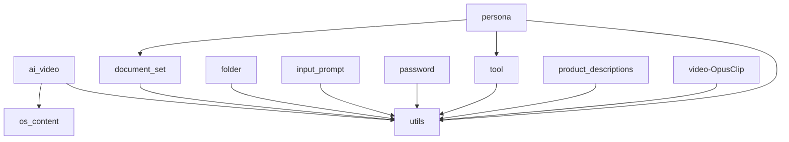

# 🌌 Onyx Features Galaxy

Welcome to the **Onyx System** modular architecture. This directory contains the unified intelligence units, autonomous agents, and specialized engines that power the platform.

**Total Modules:** 158 | **Documented:** 158

## 🔭 Quick Leap

- [🧠 Core Intelligence & Models](#core-intelligence--models)
- [🤖 Autonomous Agents](#autonomous-agents)
- [📝 Content Factory](#content-factory)
- [💼 Enterprise & Business](#enterprise--business)
- [🛡️ Security & Infrastructure](#security--infrastructure)
- [🛠️ Tools & Utilities](#tools--utilities)

---

## 🧠 Core Intelligence & Models

| Feature | Description | Tech Stack | Status |
|---|---|---|---|
| [Advanced Ai Models](./advanced_ai_models/README.md) | Advanced AI Models Module - Deep Learning, Transformers, Diffusion Models &... | Python | ✅ Documented |
| [Agent Q](./agent_q/README.md) | > Part of the [Blatam Academy Integrated Platform](../README.md) | Unknown | ✅ Documented |
| [Blatam Ai](./blatam_ai/README.md) | 🏗️ BLATAM AI - OPTIMIZED MODULAR ARCHITECTURE v6.0.0 ======================... | Python | ✅ Documented |
| [Bulk Truthgpt](./bulk_truthgpt/README.md) | Bulk TruthGPT Main Application =============================  FastAPI appli... | Python, Docker | ✅ Documented |
| [Character Clothing Changer Ai Openrouter Truthgpt](./character_clothing_changer_ai_openrouter_truthgpt/README.md) | Main Entry Point ================  FastAPI application for Character Clothi... | Docker, Python | ✅ Documented |
| [Color Grading Ai Truthgpt](./color_grading_ai_truthgpt/README.md) | Main entry point for Color Grading AI TruthGPT ============================... | Python, Docker | ✅ Documented |
| [Comfyui Tensors](./comfyui_tensors/README.md) | ComfyUI Tensors | Unknown | ✅ Documented |
| [Core](./core/README.md) | Core - Core System Components | Python | ✅ Documented |
| [Embedding Cache](./embedding_cache/README.md) | 
 | Unknown | ✅ Documented |
| [Frontier-Model-Run](./Frontier-Model-run/README.md) | Frontier Model Training - Enhanced Documentation | Python | ✅ Documented |
| [Frontier-Model-Run-Copy](./Frontier-Model-run-copy/README.md) | Feature Backups & Clones | Python | ✅ Documented |
| [Frontier-Model-Run-Polyglot](./Frontier-Model-run-polyglot/README.md) | Frontier Model Training - Polyglot Edition | Python | ✅ Documented |
| [Msa](./msa/README.md) | vLLM Inference Service  High-performance LLM inference service using vLLM w... | Docker, Python | ✅ Documented |
| [Multi Model Api](./multi_model_api/README.md) | Multi-Model API Feature ========================  Optimized multi-model API... | Python | ✅ Documented |
| [Neo Humanoid Core](./neo_humanoid_core/README.md) | > Part of the [Blatam Academy Integrated Platform](../README.md) | Unknown | ✅ Documented |
| [Truthgpt-Chatgpt-Main (1)](./TruthGPT-chatGPT-main (1)/README.md) | External Reference Repositories | Unknown | ✅ Documented |
| [Truthgpt-Spec](./truthgpt-spec/README.md) | TruthGPT Specification & Master Summaries | Unknown | ✅ Documented |
| [Ultra Extreme V18](./ultra_extreme_v18/README.md) | Ultra Extreme V18 - Optimization Core | Python | ✅ Documented |
| [Universal Model Benchmark Ai](./universal_model_benchmark_ai/README.md) | Universal Model Benchmark AI - Sistema de Benchmarking de Modelos de IA ===... | Docker, Python | ✅ Documented |

## 🤖 Autonomous Agents

| Feature | Description | Tech Stack | Status |
|---|---|---|---|
| [Agents](./agents/README.md) | Agents package. | Python, Docker | ✅ Documented |
| [Ai Job Replacement Helper](./ai_job_replacement_helper/README.md) | AI Job Replacement Helper - Main Entry Point ==============================... | Python, Docker, Node.js | ✅ Documented |
| [Autonomous Long Term Agent](./autonomous_long_term_agent/README.md) | Autonomous Long-Term Agent - Main Application | Python | ✅ Documented |
| [Business Agents](./business_agents/README.md) | Business Agents System - Main Application =================================... | Python, Docker | ✅ Documented |
| [Cursor Agent 24 7](./cursor_agent_24_7/README.md) | Cursor Agent 24/7 - Main Entry Point ===================================== ... | Python, Docker | ✅ Documented |
| [Cursor Backend Clone](./cursor_backend_clone/README.md) | Cursor Agent 24/7 - Main Entry Point ===================================== ... | Python | ✅ Documented |
| [Github Autonomous Agent](./github_autonomous_agent/README.md) | GitHub Autonomous Agent - Main Entry Point ================================... | Docker, Python | ✅ Documented |
| [Github Autonomous Agent Ai](./github_autonomous_agent_ai/README.md) | GitHub Autonomous Agent AI - Main Entry Point =============================... | Docker, Python | ✅ Documented |
| [Research Agent](./research_agent/README.md) | > Part of the [Blatam Academy Integrated Platform](../README.md) | Unknown | ✅ Documented |
| [Robot Maintenance Ai](./robot_maintenance_ai/README.md) | Main entry point for Robot Maintenance AI API server. | Docker, Python | ✅ Documented |
| [Robot Maintenance Teaching Ai](./robot_maintenance_teaching_ai/README.md) | Main entry point for Robot Maintenance Teaching AI API. | Python | ✅ Documented |
| [Robot Movement Ai](./robot_movement_ai/README.md) | Robot Movement AI - Main Entry Point ===================================== ... | Docker, Python | ✅ Documented |
| [Sales Agent](./sales_agent/README.md) | > Part of the [Blatam Academy Integrated Platform](../README.md) | Unknown | ✅ Documented |
| [Virtual Assistant](./virtual_assistant/README.md) | 
 | Unknown | ✅ Documented |
| [Workflow Orchestrator Ai](./workflow_orchestrator_ai/README.md) | Workflow Orchestrator AI | Unknown | ✅ Documented |

## 📝 Content Factory

| Feature | Description | Tech Stack | Status |
|---|---|---|---|
| [Additional Content](./additional_content/README.md) | Additional Content Service | Python | ✅ Documented |
| [Ai Document Classifier](./ai_document_classifier/README.md) | Main FastAPI Application for AI Document Classifier =======================... | Python, Docker | ✅ Documented |
| [Ai Document Processor](./ai_document_processor/README.md) | Advanced AI Document Processor Application | Python, Docker | ✅ Documented |
| [Ai History Comparison](./ai_history_comparison/README.md) | AI History Comparison System - Main Application  This is the main applicati... | Python, Docker | ✅ Documented |
| [Ai Integration System](./ai_integration_system/README.md) | AI Integration System - Main Application Entry Point FastAPI application wi... | Python, Docker | ✅ Documented |
| [Ai Trading Platform](./ai_trading_platform/README.md) | AI Trading Platform | Node.js | ✅ Documented |
| [Ai Video](./ai_video/README.md) | AI Video - Sistema de generación y procesamiento de video con IA ==========... | Python | ✅ Documented |
| [Analizador De Documentos](./analizador_de_documentos/README.md) | Aplicación Principal - Analizador de Documentos Inteligente ===============... | Python | ✅ Documented |
| [Audio Timeline Completion Ai](./audio_timeline_completion_ai/README.md) | Audio Timeline Completion AI | Unknown | ✅ Documented |
| [Blog Posts](./blog_posts/README.md) | Main FastAPI application with improved architecture | Python, Docker | ✅ Documented |
| [Brand Voice](./brand_voice/README.md) | Brand Voice Feature Module ===========================  AI-powered brand vo... | Python, Docker | ✅ Documented |
| [Bul](./bul/README.md) | BUL API - Production Main Application ==================================== ... | Docker, Python | ✅ Documented |
| [Bulk Chat](./bulk_chat/README.md) | Bulk Chat - Main Entry Point =============================  Punto de entrad... | Python, Node.js | ✅ Documented |
| [Burnout Prevention Ai](./burnout_prevention_ai/README.md) | Burnout Prevention AI - Main Application ==================================... | Python | ✅ Documented |
| [Character Clothing Changer Ai](./character_clothing_changer_ai/README.md) | Character Clothing Changer AI - Main Entry Point ==========================... | Python | ✅ Documented |
| [Content](./content/README.md) | Static & Dynamic Content | Unknown | ✅ Documented |
| [Content Modules](./content_modules/README.md) | 📝 CONTENT MODULES - Advanced Content Generation System ====================... | Python | ✅ Documented |
| [Content Redundancy Detector](./content_redundancy_detector/README.md) | Content Redundancy Detector - Functional FastAPI Application Following best... | Python | ✅ Documented |
| [Copywriting](./copywriting/README.md) | Production Copywriting System ============================  Main entry poin... | Python | ✅ Documented |
| [Copywriting System](./copywriting_system/README.md) | 
 | Unknown | ✅ Documented |
| [Dermatology Ai](./dermatology_ai/README.md) | Dermatology AI - FastAPI Server Optimized for Microservices & Serverless.  ... | Python, Docker | ✅ Documented |
| [Document Set](./document_set/README.md) | Document Set Feature Module ============================  AI-powered docume... | Python | ✅ Documented |
| [Document Workflow Chain](./document_workflow_chain/README.md) | Main Application - Complete Document Workflow Chain System | Python, Docker | ✅ Documented |
| [Dog Training Coaching Ai](./dog_training_coaching_ai/README.md) | Dog Training Coaching AI - Main Application ===============================... | Docker, Python | ✅ Documented |
| [Email Sequence](./email_sequence/README.md) | FastAPI Email Sequence Application  This is the main FastAPI application fo... | Python, Docker | ✅ Documented |
| [Emails](./emails/README.md) | Email Templates | Unknown | ✅ Documented |
| [Export Ia](./export_ia/README.md) | Export IA - Main Application ============================  Advanced documen... | Python | ✅ Documented |
| [Facebook Posts](./facebook_posts/README.md) | FastAPI Application for Facebook Posts API Following functional programming... | Python | ✅ Documented |
| [Faceless Video Ai](./faceless_video_ai/README.md) | Faceless Video AI - Sistema de generación de videos sin rostro con IA =====... | Docker, Python | ✅ Documented |
| [Folder](./folder/README.md) | Folder Management System | Python | ✅ Documented |
| [Gamma App](./gamma_app/README.md) | Gamma App - AI-Powered Content Generation System Advanced presentation, doc... | Docker, Python | ✅ Documented |
| [Guides](./guides/README.md) | Learning Path & Guides | Unknown | ✅ Documented |
| [Heygen Ai](./heygen_ai/README.md) | HeyGen AI FastAPI Main Entry Point FastAPI best practices for main applicat... | Python | ✅ Documented |
| [Image Process](./image_process/README.md) | Image Process Feature Module =============================  AI-powered imag... | Python | ✅ Documented |
| [Image Upscaling Ai](./image_upscaling_ai/README.md) | Image Upscaling AI - Main Entry Point =====================================... | Python | ✅ Documented |
| [Imagen Video Enhancer Ai](./imagen_video_enhancer_ai/README.md) | Main entry point for Imagen Video Enhancer AI =============================... | Python | ✅ Documented |
| [Instagram Captions](./instagram_captions/README.md) | Configuration Module for Instagram Captions API v10.0  Centralized configur... | Python, Docker | ✅ Documented |
| [Integrated](./integrated/README.md) | Integrated Discovery Modules | Python | ✅ Documented |
| [Integration System](./integration_system/README.md) | Integration System - Main Application =====================================... | Python | ✅ Documented |
| [Key Messages](./key_messages/README.md) | Key Messages Feature Module ============================  AI-powered key me... | Python | ✅ Documented |
| [Linkedin Posts](./linkedin_posts/README.md) | LinkedIn Posts Production System ================================  Main pro... | Python, Node.js | ✅ Documented |
| [Logistics Ai Platform](./logistics_ai_platform/README.md) | Main FastAPI application for Logistics AI Platform A comprehensive freight ... | Docker, Python, Node.js | ✅ Documented |
| [Lovable Community](./lovable_community/README.md) | Aplicación principal FastAPI para la comunidad Lovable (modularizado)  Sist... | Python | ✅ Documented |
| [Manuales Hogar Ai](./manuales_hogar_ai/README.md) | Main entry point para Manuales Hogar AI ===================================... | Docker, Python | ✅ Documented |
| [Markdown To Professional Docs Ai](./markdown_to_professional_docs_ai/README.md) | Markdown to Professional Documents AI - FastAPI Application | Python | ✅ Documented |
| [Music Analyzer Ai](./music_analyzer_ai/README.md) | Servidor principal para Music Analyzer AI | Python | ✅ Documented |
| [Notebooklm Ai](./notebooklm_ai/README.md) | NotebookLM AI - Advanced Document Intelligence System =====================... | Python | ✅ Documented |
| [Os Content](./os_content/README.md) | Main entry point for the integrated OS Content system Runs all optimized co... | Python | ✅ Documented |
| [Pdf Variantes](./pdf_variantes/README.md) | PDF Variantes API - Main Application Entry Point  ⚠️ DEPRECATED: This file ... | Python, Docker | ✅ Documented |
| [Plastic Surgery Visualization Ai](./plastic_surgery_visualization_ai/README.md) | Plastic Surgery Visualization AI - FastAPI Server AI system that visualizes... | Python | ✅ Documented |
| [Poster Generator Ai](./poster_generator_ai/README.md) | Poster Generator AI | Unknown | ✅ Documented |
| [Price Tracker](./price_tracker/README.md) | > Part of the [Blatam Academy Integrated Platform](../README.md) | Unknown | ✅ Documented |
| [Product Description Generator](./product_description_generator/README.md) | > Part of the [Blatam Academy Integrated Platform](../README.md) | Unknown | ✅ Documented |
| [Product Descriptions](./product_descriptions/README.md) | Product Description Generator - Main Entry Point ==========================... | Python | ✅ Documented |
| [Product Photography Ai](./product_photography_ai/README.md) | Product Photography AI | Unknown | ✅ Documented |
| [Professional Documents](./professional_documents/README.md) | Professional Document Generation System ===================================... | Python | ✅ Documented |
| [Professional Photo Ai](./professional_photo_ai/README.md) | Professional Photo AI | Unknown | ✅ Documented |
| [Prompt Generator](./prompt_generator/README.md) | > Part of the [Blatam Academy Integrated Platform](../README.md) | Unknown | ✅ Documented |
| [Prompt Statistics](./prompt_statistics/README.md) | > Part of the [Blatam Academy Integrated Platform](../README.md) | Unknown | ✅ Documented |
| [Proposal Generator](./proposal_generator/README.md) | 
 | Unknown | ✅ Documented |
| [Psychological Profile Analyzer](./psychological_profile_analyzer/README.md) | > Part of the [Blatam Academy Integrated Platform](../README.md) | Unknown | ✅ Documented |
| [Renewable Energy](./renewable_energy/README.md) | Renewable Energy AI | Unknown | ✅ Documented |
| [Research Paper Code Improver](./research_paper_code_improver/README.md) | Aplicación Principal - Research Paper Code Improver =======================... | Python | ✅ Documented |
| [Social Media Identity Clone Ai](./social_media_identity_clone_ai/README.md) | Social Media Identity Clone AI ==============================  Sistema de I... | Python, Docker, Node.js | ✅ Documented |
| [Social Video Transcriber Ai](./social_video_transcriber_ai/README.md) | Social Video Transcriber AI ===========================  A powerful AI-powe... | Docker, Python | ✅ Documented |
| [Suno Clone Ai](./suno_clone_ai/README.md) | Aplicación principal FastAPI optimizada con arquitectura modular  Configura... | Python, Docker | ✅ Documented |
| [Suno Clone Ai Sam3](./suno_clone_ai_sam3/README.md) | Suno Clone AI SAM3 | Unknown | ✅ Documented |
| [Video Editor Ai](./video_editor_ai/README.md) | Video Editor AI | Unknown | ✅ Documented |
| [Video-Opusclip](./video-OpusClip/README.md) | Main Entry Point for Improved Video-OpusClip API  Complete integration scri... | Python | ✅ Documented |
| [Virtual Event Planner](./virtual_event_planner/README.md) | 
 | Unknown | ✅ Documented |
| [Virtual Fashion Stylist Ai](./virtual_fashion_stylist_ai/README.md) | Virtual Fashion Stylist AI | Unknown | ✅ Documented |
| [Voice Coaching Ai](./voice_coaching_ai/README.md) | 🎤 VOICE COACHING AI - MAIN MODULE ==================================  Advan... | Python | ✅ Documented |
| [Web Content Extractor Ai](./web_content_extractor_ai/README.md) | Servidor principal para Web Content Extractor AI | Python, Docker | ✅ Documented |
| [Web Link Validator Ai](./web_link_validator_ai/README.md) | Web Link Validator AI - FastAPI Application | Python | ✅ Documented |

## 💼 Enterprise & Business

| Feature | Description | Tech Stack | Status |
|---|---|---|---|
| [Addiction Recovery Ai](./addiction_recovery_ai/README.md) | Servidor principal para Addiction Recovery AI Refactored to use modular app... | Python, Node.js | ✅ Documented |
| [Ads](./ads/README.md) | 🚀 ADS System - Main Entry Point  Main entry point for the refactored advert... | Python | ✅ Documented |
| [Ai Detector Multimodal](./ai_detector_multimodal/README.md) | AI Detector Multimodal - Detector de contenido generado por IA ============... | Python | ✅ Documented |
| [Ai Tutor Educacional Openrouter](./ai_tutor_educacional_openrouter/README.md) | Main entry point for AI Tutor Educacional. | Docker, Python | ✅ Documented |
| [Artist Manager Ai](./artist_manager_ai/README.md) | Artist Manager AI =================  Sistema de IA para gestión de artistas... | Docker, Python, Node.js | ✅ Documented |
| [Blaze Ai](./blaze_ai/README.md) | Enhanced Blaze AI - Enterprise-Grade AI System Refactored for better mainta... | Python, Docker | ✅ Documented |
| [Community Manager Ai](./community_manager_ai/README.md) | Main Entry Point - Punto de Entrada Principal =============================... | Python, Node.js | ✅ Documented |
| [Enterprise](./enterprise/README.md) | 🚀 ULTIMATE ENTERPRISE API ==========================  Complete enterprise-g... | Python | ✅ Documented |
| [Entrepreneur Coach Ai](./entrepreneur_coach_ai/README.md) | Entrepreneur Coach AI | Unknown | ✅ Documented |
| [Input Prompt](./input_prompt/README.md) | Input Prompt Management | Python | ✅ Documented |
| [Manufacturing Ai](./manufacturing_ai/README.md) | Manufacturing AI - Sistema de IA para Optimización de Manufactura =========... | Python | ✅ Documented |
| [Marketing Funnels](./marketing_funnels/README.md) | Marketing Funnels AI | Unknown | ✅ Documented |
| [Marketing Intelligence Ai](./marketing_intelligence_ai/README.md) | Marketing Intelligence AI | Unknown | ✅ Documented |
| [Microservices Framework](./microservices_framework/README.md) | Diffusion Service - Refactored with Modular Architecture | Python | ✅ Documented |
| [Password](./password/README.md) | Password Management System | Python | ✅ Documented |
| [Physical Store Designer Ai](./physical_store_designer_ai/README.md) | Physical Store Designer AI - Main Entry Point =============================... | Python | ✅ Documented |
| [Project Management Ai](./project_management_ai/README.md) | Project Management AI | Unknown | ✅ Documented |
| [Quality Control Ai](./quality_control_ai/README.md) | Quality Control AI - Sistema de Control de Calidad con Detección de Defecto... | Python, Node.js | ✅ Documented |
| [Seo](./seo/README.md) | Punto de entrada principal para el servicio SEO ultra-optimizado en producc... | Python | ✅ Documented |
| [Server](./server/README.md) | Server Directory | Node.js | ✅ Documented |
| [Shopping Engine Ai](./shopping_engine_ai/README.md) | Shopping Engine AI | Unknown | ✅ Documented |
| [Validacion Psicologica Ai](./validacion_psicologica_ai/README.md) | Validación Psicológica AI ==========================  Sistema de validación... | Python, Node.js | ✅ Documented |
| [Vibe Proving Copy](./vibe_proving_copy/README.md) | Feature Backups & Clones | Unknown | ✅ Documented |

## 🛡️ Security & Infrastructure

| Feature | Description | Tech Stack | Status |
|---|---|---|---|
| [Metrics](./metrics/README.md) | Metrics System | Unknown | ✅ Documented |
| [Previsiones Y Alertas Financieras](./previsiones_y_alertas_financieras/README.md) | Financial Forecasts and Alerts | Unknown | ✅ Documented |

## 🛠️ Tools & Utilities

| Feature | Description | Tech Stack | Status |
|---|---|---|---|
| [3D Prototype Ai](./3d_prototype_ai/README.md) | 3D Prototype AI - Main Entry Point ===================================  Pun... | Python, Docker | ✅ Documented |
| [Addition Removal Ai](./addition_removal_ai/README.md) | Addition Removal AI - Main Entry Point ====================================... | Python | ✅ Documented |
| [Ai Project Generator](./ai_project_generator/README.md) | AI Project Generator - Main Entry Point ===================================... | Docker, Python | ✅ Documented |
| [Body Enhancement Ai](./body_enhancement_ai/README.md) | Body Enhancement AI | Unknown | ✅ Documented |
| [Bulk](./bulk/README.md) | BUL Main Entry Point ====================  Main entry point for the Busines... | Python, Node.js, Docker | ✅ Documented |
| [Character Consistency Ai](./character_consistency_ai/README.md) | Main Entry Point - Character Consistency AI ===============================... | Python | ✅ Documented |
| [Contabilidad Mexicana Ai](./contabilidad_mexicana_ai/README.md) | Main entry point for Contabilidad Mexicana AI API | Python | ✅ Documented |
| [Contabilidad Mexicana Ai Sam3](./contabilidad_mexicana_ai_sam3/README.md) | Main entry point for Contabilidad Mexicana AI SAM3 ========================... | Python | ✅ Documented |
| [Cybersec Toolkit](./cybersec_toolkit/README.md) | CyberSec Toolkit | Unknown | ✅ Documented |
| [Fashion Grooming Ai](./fashion_grooming_ai/README.md) | Fashion Grooming AI | Unknown | ✅ Documented |
| [Game Development Ai](./game_development_ai/README.md) | Game Development AI | Unknown | ✅ Documented |
| [Interior Design Ai](./interior_design_ai/README.md) | Interior Design AI | Unknown | ✅ Documented |
| [Lovable](./lovable/README.md) | Lovable Community SAM3 | Python | ✅ Documented |
| [Mcp Code Improvement](./mcp_code_improvement/README.md) | Servidor MCP para mejora de código - Blatam Academy Implementa herramientas... | Python | ✅ Documented |
| [Notifications](./notifications/README.md) | Notifications System | Python | ✅ Documented |
| [Persona](./persona/README.md) | Persona Feature Module ======================  AI-powered persona creation ... | Python | ✅ Documented |
| [Piel Mejorador Ai Sam3](./piel_mejorador_ai_sam3/README.md) | Main entry point for Piel Mejorador AI SAM3 ===============================... | Docker, Python | ✅ Documented |
| [Plugins](./plugins/README.md) | System Plugins | Unknown | ✅ Documented |
| [Production](./production/README.md) | 🚀 ULTRA-OPTIMIZED PRODUCTION MAIN ENTRY POINT =============================... | Python | ✅ Documented |
| [Prompt Compiler Ai Sam3](./prompt_compiler_ai_sam3/README.md) | Prompt Compiler AI SAM3 | Unknown | ✅ Documented |
| [Real Estate Ai](./real_estate_ai/README.md) | Real Estate AI | Unknown | ✅ Documented |
| [Smell Detection Ai](./smell_detection_ai/README.md) | Smell Detection AI | Unknown | ✅ Documented |
| [Stake Casino Ai](./stake_casino_ai/README.md) | Stake Casino AI | Unknown | ✅ Documented |
| [Tool](./tool/README.md) | General Tools Module | Python | ✅ Documented |
| [Vibe Proving](./vibe_proving/README.md) | 
 | Unknown | ✅ Documented |

## 🔗 Inter-Feature Connections

The following graph shows automatically detected dependencies between features:

