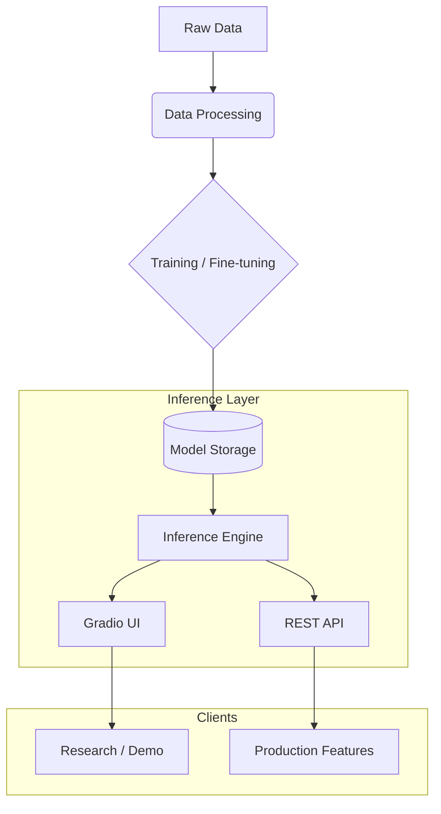

# Advanced AI Models

<div align="center">


**Advanced AI model system with full inference and training capabilities.**

[Overview](#-overview) •
[Features](#-key-features) •
[Architecture](#-architecture) •
[Installation](#-installation) •
[Usage](#-usage) •
[Documentation](#-documentation) •
[Contributing](#-contributing)

</div>

---

## 📋 Overview

**Advanced AI Models** is a comprehensive framework for managing, fine-tuning, and deploying state-of-the-art AI models. It includes optimized inference engines, data management pipelines, and pre-built Gradio interfaces for rapid prototyping and interactive testing.

This module serves as the intelligence core for various Blatam Academy services, providing the underlying models for document processing, business agents, and specialized AI systems.

## 🚀 Key Features

| Feature | Description |
|---------|-------------|
| **Multi-Model Support** | Implementation of latest LLMs, vision, and audio models. |
| **Optimized Inference** | Production-ready inference engine with caching and batching. |
| **Training Pipeline** | Modular systems for fine-tuning and supervised training. |
| **Gradio Interfaces** | Interactive web UIs for model testing and demonstration. |
| **Data Management** | Robust handling of training datasets and validation sets. |

## 🏗 Architecture



## 📁 Structure

```
advanced_ai_models/
├── models/                 # AI Model implementations
├── inference/             # Inference optimization engine
├── training/              # Training and fine-tuning scripts
├── gradio_interfaces/     # Interactive UIs
├── data/                  # Dataset management
└── utils/                 # Helper utilities
```

## 💻 Installation

```bash
# Install core dependencies
pip install -r requirements_advanced.txt
```

## ⚡ Usage

```python
from advanced_ai_models.models import AdvancedAIModel
from advanced_ai_models.inference import InferenceEngine

# Load a specific model
model = AdvancedAIModel.load("neural_prism_v2")

# Initialize the inference engine
engine = InferenceEngine(model)

# Run a prediction
result = engine.predict({"text": "Analyze this sequence."})
print(result)
```

## 📚 Documentation

- [Quick Start Guide](QUICK_START_GUIDE.md)
- [Advanced AI Models Summary](ADVANCED_AI_MODELS_SUMMARY.md)

## 🤝 Contributing

We welcome contributions! Please see our [Contributing Guidelines](../../../CONTRIBUTING.md) for details.

---

<div align="center">
  <b>Built with ❤️ by Blatam Academy</b><br>
  Part of the Onyx Server Architecture<br>
  <a href="../README.md">← Back to Main README</a>
</div>
