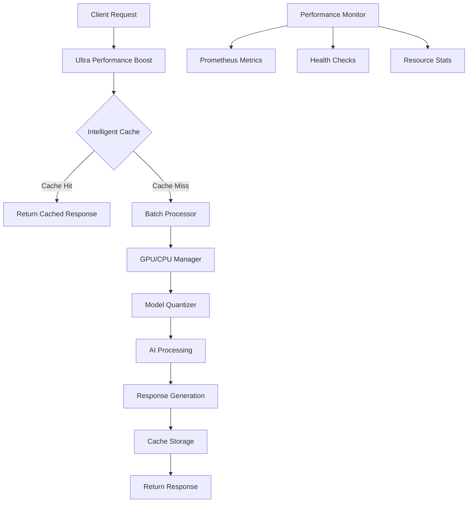

# Ultra Performance Boost - Advanced Optimization Engine

🚀 **Next-generation performance optimizations for NotebookLM AI**

## Overview

The Ultra Performance Boost module provides advanced optimization capabilities for the NotebookLM AI system, delivering exceptional performance through intelligent caching, async batch processing, GPU acceleration, and comprehensive monitoring.

## Features

### 🧠 Intelligent Caching
- **Adaptive TTL**: Automatically adjusts cache expiration based on access patterns
- **Predictive Loading**: Preloads frequently accessed data
- **Multi-level Caching**: In-memory and distributed caching support
- **Cache Statistics**: Comprehensive metrics and hit rate monitoring

### ⚡ Async Batch Processing
- **Dynamic Batching**: Automatically groups requests for optimal throughput
- **Configurable Timeouts**: Adjustable batch collection windows
- **Concurrent Processing**: Parallel execution of batch operations
- **Error Handling**: Robust error recovery and retry mechanisms

### 🖥️ GPU/CPU Optimization
- **GPU Memory Management**: Efficient GPU memory allocation and cleanup
- **Mixed Precision**: Automatic precision optimization for faster computation
- **Device Selection**: Intelligent CPU/GPU device selection
- **Memory Pooling**: Shared memory pools for reduced allocation overhead

### 🔧 Model Optimization
- **Quantization**: Model size reduction with minimal accuracy loss
- **Pruning**: Remove unnecessary model parameters
- **Distillation**: Knowledge transfer from larger to smaller models
- **ONNX Optimization**: Export models to optimized ONNX format

### 📊 Performance Monitoring
- **Prometheus Metrics**: Comprehensive performance metrics
- **Health Checks**: Real-time system health monitoring
- **Response Time Analysis**: P50, P95, P99 latency tracking
- **Resource Utilization**: CPU, GPU, and memory monitoring

## Architecture



## Installation

```bash
# Install dependencies
pip install -r requirements_ultra_optimized.txt

# For GPU support
pip install torch torchvision torchaudio --index-url https://download.pytorch.org/whl/cu118
```

## Quick Start

### Basic Usage

```python
import asyncio
from optimization.ultra_performance_boost import UltraPerformanceBoost, UltraBoostConfig

async def main():
    # Create configuration
    config = UltraBoostConfig(
        enable_gpu=True,
        max_batch_size=16,
        batch_timeout_ms=100,
        enable_quantization=True
    )
    
    # Create ultra boost instance
    boost = UltraPerformanceBoost(config)
    
    try:
        # Process request
        request_data = {
            "query": "What is artificial intelligence?",
            "model": "gpt-4",
            "max_tokens": 100
        }
        
        result = await boost.process_request(request_data)
        print(f"Response: {result['response']}")
        
        # Get performance stats
        stats = boost.get_performance_stats()
        print(f"Performance: {stats['metrics']}")
        
    finally:
        await boost.cleanup()

# Run
asyncio.run(main())
```

### Global Instance Usage

```python
from optimization.ultra_performance_boost import get_ultra_boost, cleanup_ultra_boost

async def process_with_global_instance():
    # Get global instance
    boost = get_ultra_boost()
    
    # Process requests
    result = await boost.process_request({"query": "Hello world"})
    
    # Cleanup when done
    await cleanup_ultra_boost()
```

### Performance Decorators

```python
from optimization.ultra_performance_boost import ultra_boost_monitor, ultra_boost_cache

class AIProcessor:
    def __init__(self):
        self.boost = get_ultra_boost()
    
    @ultra_boost_monitor
    @ultra_boost_cache(ttl=3600)
    async def process_text(self, text: str):
        # Your AI processing logic here
        return f"Processed: {text}"
```

## Configuration

### UltraBoostConfig Options

| Parameter | Type | Default | Description |
|-----------|------|---------|-------------|
| `enable_gpu` | bool | True | Enable GPU acceleration |
| `gpu_memory_fraction` | float | 0.8 | GPU memory usage limit |
| `mixed_precision` | bool | True | Enable mixed precision training |
| `enable_quantization` | bool | True | Enable model quantization |
| `quantization_bits` | int | 8 | Quantization bit depth |
| `max_batch_size` | int | 32 | Maximum batch size |
| `batch_timeout_ms` | int | 100 | Batch collection timeout |
| `enable_dynamic_batching` | bool | True | Enable dynamic batch sizing |
| `enable_model_cache` | bool | True | Enable model caching |
| `model_cache_size` | int | 10 | Maximum cached models |
| `enable_prediction_cache` | bool | True | Enable prediction caching |
| `prediction_cache_size` | int | 100000 | Maximum cached predictions |

### Advanced Configuration

```python
config = UltraBoostConfig(
    # GPU settings
    enable_gpu=True,
    gpu_memory_fraction=0.9,
    mixed_precision=True,
    
    # Model optimization
    enable_quantization=True,
    quantization_bits=8,
    enable_pruning=False,
    enable_distillation=False,
    
    # Batching
    max_batch_size=64,
    batch_timeout_ms=200,
    enable_dynamic_batching=True,
    
    # Caching
    enable_model_cache=True,
    model_cache_size=20,
    enable_prediction_cache=True,
    prediction_cache_size=500000,
    
    # Memory optimization
    enable_memory_mapping=True,
    enable_shared_memory=True,
    memory_pool_size_mb=2048,
    
    # Async optimization
    max_workers=16,
    enable_process_pool=True,
    enable_thread_pool=True,
    
    # Vector optimization
    enable_faiss=True,
    faiss_index_type="IVF100,SQ8",
    vector_dimension=768
)
```

## API Reference

### UltraPerformanceBoost

#### Methods

- `process_request(request_data: Dict[str, Any]) -> Dict[str, Any]`
  - Process a single request with ultra performance boost

- `get_performance_stats() -> Dict[str, Any]`
  - Get comprehensive performance statistics

- `health_check() -> Dict[str, Any]`
  - Perform system health check

- `cleanup() -> None`
  - Cleanup resources and stop background tasks

#### Properties

- `gpu_manager`: GPU memory management instance
- `quantizer`: Model quantization instance
- `batch_processor`: Async batch processing instance
- `intelligent_cache`: Intelligent caching instance

### GPUMemoryManager

#### Methods

- `get_memory_stats() -> Dict[str, Any]`
  - Get GPU memory statistics

- `optimize_memory() -> None`
  - Optimize GPU memory usage

- `get_device() -> torch.device`
  - Get current device (CPU/GPU)

### AsyncBatchProcessor

#### Methods

- `process_batch(items: List[Dict], processor_func: Callable) -> List[Dict]`
  - Process items in batch

- `get_stats() -> Dict[str, Any]`
  - Get batch processing statistics

- `start() -> None`
  - Start batch processor

- `stop() -> None`
  - Stop batch processor

### IntelligentCache

#### Methods

- `get(key: str) -> Optional[Any]`
  - Get value from cache

- `set(key: str, value: Any, ttl: int = None) -> bool`
  - Set value in cache with adaptive TTL

- `predict_and_preload(key_pattern: str) -> List[str]`
  - Predict and preload cache entries

- `get_stats() -> Dict[str, Any]`
  - Get cache statistics

## Performance Metrics

### Prometheus Metrics

The module exports the following Prometheus metrics:

- `ultra_boost_requests_total`: Total number of requests
- `ultra_boost_request_duration_seconds`: Request latency histogram
- `ultra_boost_cache_hits_total`: Cache hit count
- `ultra_boost_cache_misses_total`: Cache miss count
- `ultra_boost_memory_bytes`: Memory usage in bytes
- `ultra_boost_cpu_percent`: CPU usage percentage
- `ultra_boost_gpu_percent`: GPU usage percentage
- `ultra_boost_batch_size`: Current batch size
- `ultra_boost_model_load_duration_seconds`: Model load time

### Performance Statistics

```python
stats = boost.get_performance_stats()

# Response time metrics
avg_response_time = stats['metrics']['avg_response_time_ms']
p50_response_time = stats['metrics']['p50_response_time_ms']
p95_response_time = stats['metrics']['p95_response_time_ms']
p99_response_time = stats['metrics']['p99_response_time_ms']

# Throughput metrics
total_requests = stats['metrics']['total_requests']
cache_hit_rate = stats['metrics']['cache_hit_rate']
error_rate = stats['metrics']['error_rate']

# Component stats
gpu_stats = stats['gpu_stats']
quantization_stats = stats['quantization_stats']
batch_stats = stats['batch_stats']
cache_stats = stats['cache_stats']
```

## Testing

### Run Tests

```bash
# Run all tests
pytest optimization/test_ultra_boost.py -v

# Run specific test
pytest optimization/test_ultra_boost.py::TestUltraPerformanceBoost::test_basic_request_processing -v

# Run with coverage
pytest optimization/test_ultra_boost.py --cov=optimization --cov-report=html
```

### Run Demo

```bash
# Run complete demo
python optimization/demo_ultra_boost.py

# Run specific demo functions
python -c "
import asyncio
from optimization.demo_ultra_boost import demo_basic_usage
asyncio.run(demo_basic_usage())
"
```

## Integration

### FastAPI Integration

```python
from fastapi import FastAPI
from optimization.ultra_performance_boost import get_ultra_boost

app = FastAPI()
boost = get_ultra_boost()

@app.post("/process")
async def process_request(request: dict):
    result = await boost.process_request(request)
    return result

@app.get("/health")
async def health_check():
    return await boost.health_check()

@app.get("/stats")
async def get_stats():
    return boost.get_performance_stats()
```

### Existing System Integration

```python
# Integrate with existing NotebookLM AI system
from optimization.ultra_performance_boost import get_ultra_boost

class EnhancedNotebookLM:
    def __init__(self):
        self.boost = get_ultra_boost()
        # ... existing initialization
    
    async def process_document(self, document: str):
        # Use ultra boost for processing
        request_data = {
            "document": document,
            "operation": "analyze",
            "model": "notebooklm"
        }
        
        result = await self.boost.process_request(request_data)
        return result['response']
```

## Best Practices

### Performance Optimization

1. **Batch Size Tuning**: Adjust `max_batch_size` based on your workload
2. **Cache Configuration**: Set appropriate cache sizes for your use case
3. **GPU Memory**: Monitor GPU memory usage and adjust `gpu_memory_fraction`
4. **Timeout Settings**: Balance `batch_timeout_ms` between latency and throughput

### Memory Management

1. **Regular Cleanup**: Call `cleanup()` when done with the boost instance
2. **Monitor Memory**: Use `get_performance_stats()` to monitor memory usage
3. **Cache Eviction**: Configure appropriate cache sizes to prevent memory issues

### Error Handling

```python
try:
    result = await boost.process_request(request_data)
except Exception as e:
    logger.error("Request processing failed", error=str(e))
    # Handle error appropriately
    result = {"error": str(e)}
```

### Monitoring

```python
# Regular health checks
health = await boost.health_check()
if health['status'] != 'healthy':
    logger.warning("System health degraded", health=health)

# Performance monitoring
stats = boost.get_performance_stats()
if stats['metrics']['error_rate'] > 0.01:  # 1% error rate
    logger.error("High error rate detected", stats=stats)
```

## Troubleshooting

### Common Issues

1. **GPU Memory Errors**
   - Reduce `gpu_memory_fraction`
   - Enable `mixed_precision`
   - Call `gpu_manager.optimize_memory()`

2. **High Latency**
   - Increase `max_batch_size`
   - Reduce `batch_timeout_ms`
   - Check cache hit rate

3. **Memory Issues**
   - Reduce cache sizes
   - Enable memory mapping
   - Monitor memory usage

4. **Batch Processing Issues**
   - Check batch processor status
   - Verify processor function
   - Monitor batch statistics

### Debug Mode

```python
import logging
logging.basicConfig(level=logging.DEBUG)

# Enable debug logging for ultra boost
structlog.configure(
    processors=[
        structlog.stdlib.filter_by_level,
        structlog.processors.TimeStamper(fmt="iso"),
        structlog.processors.JSONRenderer()
    ],
    wrapper_class=structlog.stdlib.BoundLogger,
    logger_factory=structlog.stdlib.LoggerFactory(),
    cache_logger_on_first_use=True,
)
```

## Contributing

1. Fork the repository
2. Create a feature branch
3. Add tests for new functionality
4. Ensure all tests pass
5. Submit a pull request

## License

This module is part of the NotebookLM AI system and follows the same licensing terms.

## Support

For support and questions:
- Check the documentation
- Run the demo scripts
- Review the test cases
- Open an issue on GitHub 