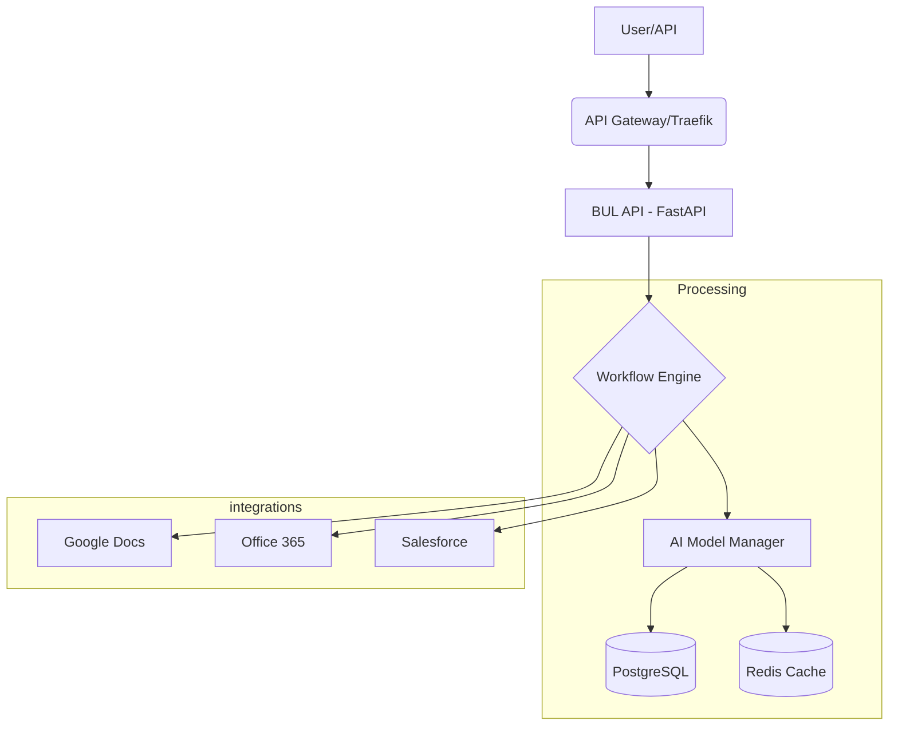

# BUL Ultimate System

<div align="center">


**The most advanced AI-powered document generation platform, featuring intelligent template selection and enterprise-grade infrastructure.**

[Overview](#-overview) •
[Quick Start](#-quick-start) •
[Features](#-key-features) •
[Architecture](#-architecture) •
[Documentation](#-documentation) •
[Monitoring](#-monitoring)

</div>

---

## 📋 Overview

The **BUL Ultimate System** is an enterprise-grade platform for automated, AI-driven document generation. It leverages multiple LLMs with intelligent A/B testing and selection to produce high-quality business documents, legal papers, and marketing content. Built for scale, it includes a robust workflow engine, real-time tracking, and deep integrations with common business tools.

## 🚀 Quick Start

### Prerequisites
- Docker 20.10+ & Docker Compose 2.0+
- 8GB RAM (16GB recommended)

### Installation
```bash
# Navigate to the feature directory
cd agents/backend/onyx/server/features/bul

# Initialize services
docker-compose up -d
```

## 🏗 Architecture



## 🌟 Key Features

| Category | Highlights |
|----------|------------|
| **AI Intelligence** | Smart templates, automated model selection, A/B testing. |
| **Workflow Engine** | Complex parallel processing with conditional logic. |
| **Integrations** | Native support for Slack, Teams, HubSpot, and Google Workspace. |
| **Security** | OAuth2, granular API key permissions, full audit logging. |
| **Observability** | Prometheus, Grafana, and Jaeger integration for performance. |

## 📁 Structure

- **[API Documentation](api/API_DOCUMENTATION.md)**: Complete REST reference.
- **[Deployment Guide](deployment/ULTIMATE_DEPLOYMENT_GUIDE.md)**: Production rollout instructions.
- **[Core Logic](ai/advanced_ml_engine.py)**: Machine learning and selection models.
- **[Workflow Engine](workflows/workflow_engine.py)**: Pipeline management.

## 📊 Monitoring

- **Grafana**: [http://localhost:3000](http://localhost:3000)
- **Jaeger**: [http://localhost:16686](http://localhost:16686)
- **API Docs**: [http://localhost:8000/docs](http://localhost:8000/docs)

---

<div align="center">
  <b>Built with ❤️ by Blatam Academy</b><br>
  Part of the Onyx Server Architecture<br>
  <a href="../README.md">← Back to Main README</a>
</div>