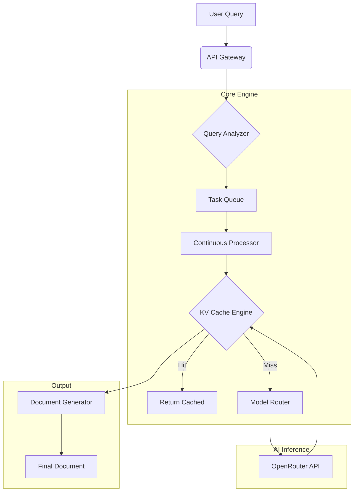

# BUL — Business Unlimited

<div align="center">


**An enterprise-grade, continuous document generation engine for SMEs, powered by the Ultra Adaptive KV Cache and Multi-Model AI.**

[Overview](#-overview) •
[Features](#-key-features) •
[Architecture](#-architecture) •
[Performance](#-ultra-adaptive-kv-cache-engine) •
[Installation](#-installation) •
[Usage](#-usage) •
[Contributing](#-contributing)

</div>

---

## 📋 Overview

**Business Unlimited (BUL)** is a high-throughput autonomous system designed to generate professional business documentation at scale. Unlike traditional generators, BUL operates as a continuous processing engine, capable of handling thousands of concurrent requests for Marketing, Legal, Finance, and Operations documents.

At its core lies the **Ultra Adaptive KV Cache Engine**, a proprietary caching layer that reduces latency by up to 90% and increases throughput by 500% compared to standard RAG implementations.

### Why BUL?

- **Continuous Operation**: Designed to run 24/7, processing queues of business queries without downtime.
- **SME-Focused**: Pre-trained on thousands of specialized business templates (Business Plans, HR Manuals, Legal Contracts).
- **Cost-Efficient**: Intelligent routing and caching minimize API costs while maximizing speed.

## 🚀 Key Features

| Feature | Description |
|---------|-------------|
| **Continuous Processor** | Asynchronous engine that continuously pulls, processes, and completes document tasks. |
| **Ultra Adaptive Cache** | Multi-level caching (L1 Memory, L2 Disk, L3 Vector) with predictive pre-fetching. |
| **Multi-Model Support** | Seamless integration with OpenRouter to use GPT-4, Claude 3, and Llama 3 dynamically. |
| **Smart Routing** | Automatically routes queries to the most cost-effective model based on complexity. |
| **Real-Time Analytics** | Built-in Prometheus metrics for throughput, latency, and cache hit rates. |
| **Self-Healing** | Automatic error recovery and circuit breakers for external API failures. |

## 🏗 Architecture

BUL utilizes a microservices-inspired architecture optimized for high concurrency.



## ⚡ Ultra Adaptive KV Cache Engine

The heart of the system is the **Enterprise-Grade Cache**, enabling massive scale.

| Metric | Performance |
|--------|-------------|
| **Throughput** | 200+ req/s (Concurrent) |
| **Latency (P50)** | < 100ms (Cached) |
| **Latency (P99)** | < 1s (Cached) |
| **Hit Rate** | > 85% in production |

**Capabilities:**
- ✅ **Multi-GPU Support**: Intelligent load balancing.
- ✅ **Adaptive Eviction**: AI-driven policies (LRU/LFU/Adaptive).
- ✅ **Request Deduplication**: Prevents redundant processing.
- ✅ **Token Streaming**: Instant time-to-first-byte.

## 💻 Installation

### Prerequisites

- Python 3.10+
- Redis (optional, for distributed caching)
- OpenRouter API Key

### Quick Start

1. **Clone the repository**
   ```bash
   git clone https://github.com/blatam-academy/bul.git
   cd bulk
   ```

2. **Install dependencies**
   ```bash
   pip install -r requirements.txt
   ```

3. **Configure Environment**
   ```bash
   cp env_example.txt .env
   # Set OPENROUTER_API_KEY
   ```

4. **Launch the System**
   ```bash
   python main.py --mode full
   ```

## ⚡ Usage

### REST API

**Submit a Query**
```bash
curl -X POST "http://localhost:8000/query" \
     -H "Content-Type: application/json" \
     -d '{"query": "Generate a Q3 marketing strategy for a SaaS company", "priority": 1}'
```

**Get Status**
```bash
curl "http://localhost:8000/task/{task_id}/status"
```

### Python SDK

```python
from bul import BULEngine

engine = BULEngine()

# Submit high-priority task
task_id = await engine.submit_query(
    query="Create a 5-year financial projection",
    priority=1
)

# Await results
docs = await engine.wait_for_completion(task_id)
print(docs[0].content)
```

## 🎯 Supported Domains

| Domain | Document Types |
|--------|----------------|
| **Marketing** | Social Media Calendars, Brand Guidelines, SEO Strategy |
| **Finance** | P&L Statements, Cash Flow Projections, Investment Decks |
| **Legal** | NDAs, Service Agreements, Employment Contracts |
| **HR** | Employee Handbooks, Offer Letters, Performance Reviews |
| **Operations** | SOPs, Crisis Management Plans, Supply Chain Strategy |

## 📚 Documentation

For detailed guides, please see:

- [Architecture Guide](core/README.md)
- [KV Cache Deep Dive](core/README_ULTRA_ADAPTIVE_KV_CACHE.md)
- [API Reference](docs/api.md)

## 🤝 Contributing

We welcome contributions! Please see our [Contributing Guidelines](CONTRIBUTING.md) for details.

## 📄 License

This project is licensed under the MIT License - see the [LICENSE](LICENSE) file for details.

---

<div align="center">
  <b>Built with ❤️ by Blatam Academy</b><br>
  Part of the Onyx Server Architecture<br>
  <a href="../README.md">← Back to Main README</a>
</div>
