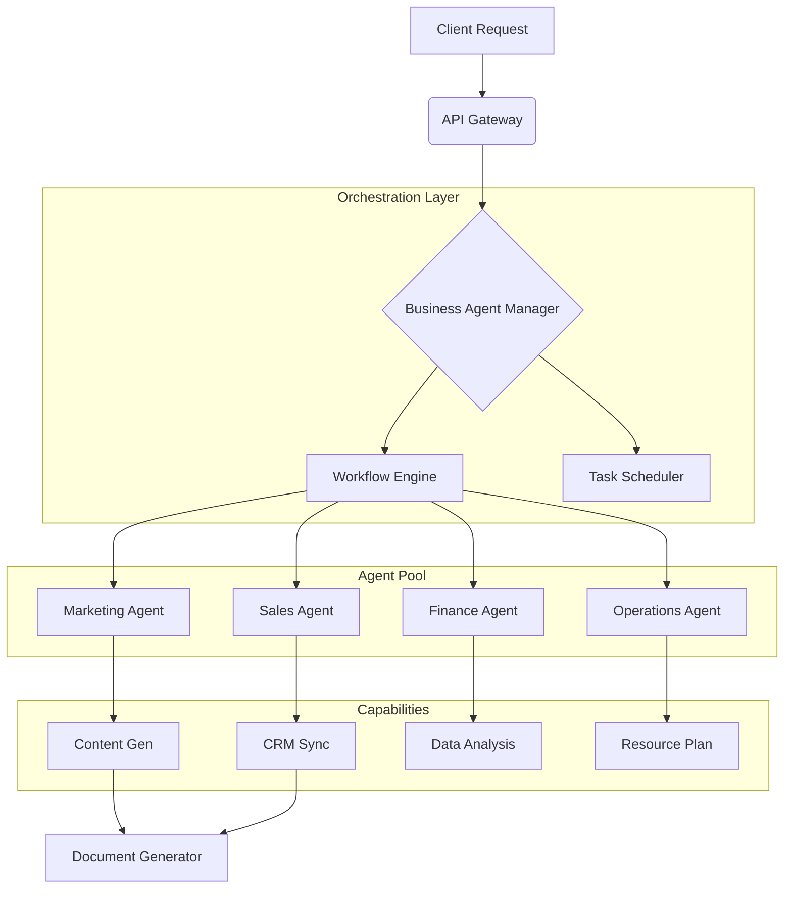

# Business Agents Module

<div align="center">


**A unified orchestration layer for intelligent business agents, automated workflows, and cross-domain task execution.**

[Overview](#-overview) •
[Agents](#-available-agents) •
[Architecture](#-architecture) •
[Usage](#-usage) •
[API Reference](#-api-reference) •
[Contributing](#-contributing)

</div>

---

## 📋 Overview

The **Business Agents Module** is the central nervous system for autonomous business operations within the Onyx platform. It provides a robust framework for managing, coordinating, and executing specialized AI agents across key business domains—Marketing, Sales, Operations, HR, and Finance.

Designed for high-throughput enterprise environments, this module features a sophisticated **Workflow Engine** capable of handling complex, multi-step business processes with conditional logic, parallel execution, and automated error handling.

### Why Business Agents?

- **Centralized Orchestration**: Manage hundreds of specialized agents from a single control plane.
- **Cross-Domain Intelligence**: Facilitate seamless data sharing and task handoffs between Marketing, Sales, and Finance agents.
- **Process Automation**: Convert manual SOPs into automated, reproducible workflows.

## 🚀 Key Features

| Feature | Description |
|---------|-------------|
| **Domain-Specific Agents** | Pre-configured agents optimized for specific business verticals (e.g., *Sales Process Agent*, *HR Recruiter*). |
| **Advanced Workflow Engine** | Support for sequential, parallel, and conditional task execution chains (DAGs). |
| **Inter-Agent Communication** | standardized protocol for agents to request tasks and share context. |
| **Automated Documentation** | Integrated document generation for reports, proposals, and contracts. |
| **Scalable Infrastructure** | Async-first architecture designed to handle concurrent workflows. |

## 🏢 Available Agents

The system comes pre-loaded with high-capability agents:

| Agent Name | Business Area | Primary Capabilities |
|------------|---------------|----------------------|
| **Marketing Strategy Agent** | `marketing` | Campaign Planning, Content Generation, Market Analysis, SEO Optimization |
| **Sales Process Agent** | `sales` | Lead Qualification, Proposal Generation, Pipeline Forecasting, CRM Updates |
| **Operations Manager** | `operations` | Resource Allocation, Process Optimization, Inventory Management, Quality Assurance |
| **HR Specialist** | `hr` | Candidate Screening, Onboarding Workflows, Performance Review Analysis |
| **Financial Analyst** | `finance` | Budget Planning, Cost Analysis, Investment Risk Assessment, Financial Reporting |

## 🛠️ Architecture

The module utilizes a clean, layered architecture to ensure separation of concerns and maintainability.



## 💻 Usage

### Python SDK

Manage agents and workflows programmatically using the Python SDK.

**Initialize and List Agents**

```python
from features.business_agents import BusinessAgentManager, BusinessArea

manager = BusinessAgentManager()

# List all available marketing agents
marketing_agents = manager.list_agents(business_area=BusinessArea.MARKETING)
print(f"Found {len(marketing_agents)} marketing agents")
```

**Create and Execute a Workflow**

```python
# Define a workflow for a new marketing campaign
workflow = await manager.create_business_workflow(
    name="Q3 Product Launch",
    description="Launch campaign for the new AI feature set",
    business_area=BusinessArea.MARKETING,
    steps=[
        {
            "name": "Market Research",
            "type": "task",
            "agent": "marketing_strategist",
            "params": {"topic": "AI trends 2024", "depth": "detailed"}
        },
        {
            "name": "Draft Blog Post",
            "type": "task",
            "agent": "content_creator",
            "params": {"topic": "New AI Features", "tone": "professional"},
            "depends_on": ["Market Research"]
        }
    ]
)

# Execute the workflow
result = await manager.execute_workflow(workflow.id)
print(f"Workflow Status: {result.status}")
```

### API Endpoints

| Method | Endpoint | Description |
|--------|----------|-------------|
| `GET` | `/api/v1/agents` | List all available agents with filtering support |
| `GET` | `/api/v1/agents/{id}` | Get detailed agent metadata and capabilities |
| `POST` | `/api/v1/workflows` | Define and create a new workflow |
| `POST` | `/api/v1/workflows/{id}/execute` | Trigger execution of a workflow |
| `GET` | `/api/v1/workflows/{id}/status` | Check real-time status of a workflow |

## ⚙️ Configuration

Agents are configured via the `settings.yaml` file or environment variables.

```yaml
# settings.yaml example
agents:
  marketing:
    model: "gpt-4-turbo"
    temperature: 0.7
  finance:
    model: "claude-3-opus"
    temperature: 0.2
    precision: "high"
```

## 🧪 Testing

Run the comprehensive test suite to verify agent behavior and workflow integrity.

```bash
# Run all tests
pytest tests/features/business_agents/

# Run specific workflow tests
pytest tests/features/business_agents/test_workflow_engine.py
```

## 🤝 Contributing

We welcome contributions! Please see our [Contributing Guidelines](CONTRIBUTING.md) for details.

## 📄 License

This project is licensed under the MIT License - see the [LICENSE](LICENSE) file for details.

---

<div align="center">
  <b>Built with ❤️ by Blatam Academy</b><br>
  Part of the Onyx Server Architecture<br>
  <a href="../README.md">← Back to Main README</a>
</div>
