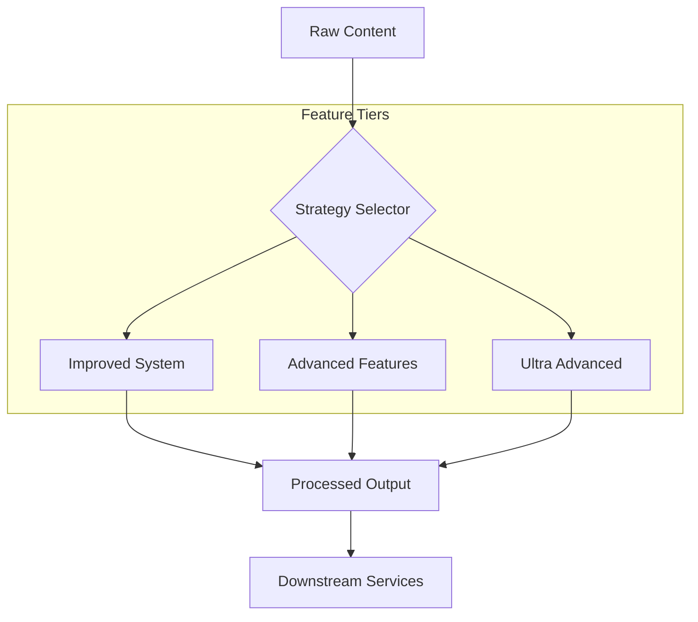

# Content Modules

<div align="center">


**Modular content engine with advanced features and enhanced system capabilities.**

[Overview](#-overview) •
[Features](#-key-features) •
[Architecture](#-architecture) •
[Installation](#-installation) •
[Usage](#-usage) •
[Documentation](#-documentation) •
[Contributing](#-contributing)

</div>

---

## 📋 Overview

**Content Modules** provides a flexible, component-based system for managing and processing various content types. It features multiple implementation tiers—from "Improved System" and "Advanced Features" to "Ultra Advanced"—allowing for progressive enhancement of content processing pipelines.

## 🚀 Key Features

| Feature | Description |
|---------|-------------|
| **Modular Content** | Switchable content components for diverse business needs. |
| **Advanced Processing** | High-level content manipulation and extraction. |
| **Progressive Tiers** | Choose between standard, improved, or ultra-advanced logic. |
| **Integrated Demos** | Comprehensive examples for each feature tier. |

## 🏗 Architecture



## 📁 Structure

```
content_modules/
├── advanced_features.py      # Core advanced logic
├── improved_system.py        # Optimized system components
├── ultra_advanced_features.py # Top-tier processing logic
├── demos/                    # Tier-specific demonstrations
└── tests/                    # Verification suite
```

## 💻 Installation

This module is a core part of the Onyx Server and is pre-installed with the main environment.

## ⚡ Usage

```python
from content_modules.ultra_advanced_features import UltraAdvancedFeatures

# Initialize the ultra-advanced processing tier
processor = UltraAdvancedFeatures()

# Process content with enhanced logic
result = processor.process_content(content="Your complex raw data here")
print(result)
```

## 📚 Documentation

- [Advanced Features](ADVANCED_FEATURES_README.md)
- [Improved System](IMPROVED_SYSTEM_README.md)
- [Ultra Advanced Features](ULTRA_ADVANCED_FEATURES_README.md)

## 🤝 Contributing

We welcome contributions! Please see our [Contributing Guidelines](../../../CONTRIBUTING.md) for details.

---

<div align="center">
  <b>Built with ❤️ by Blatam Academy</b><br>
  Part of the Onyx Server Architecture<br>
  <a href="../README.md">← Back to Main README</a>
</div>
