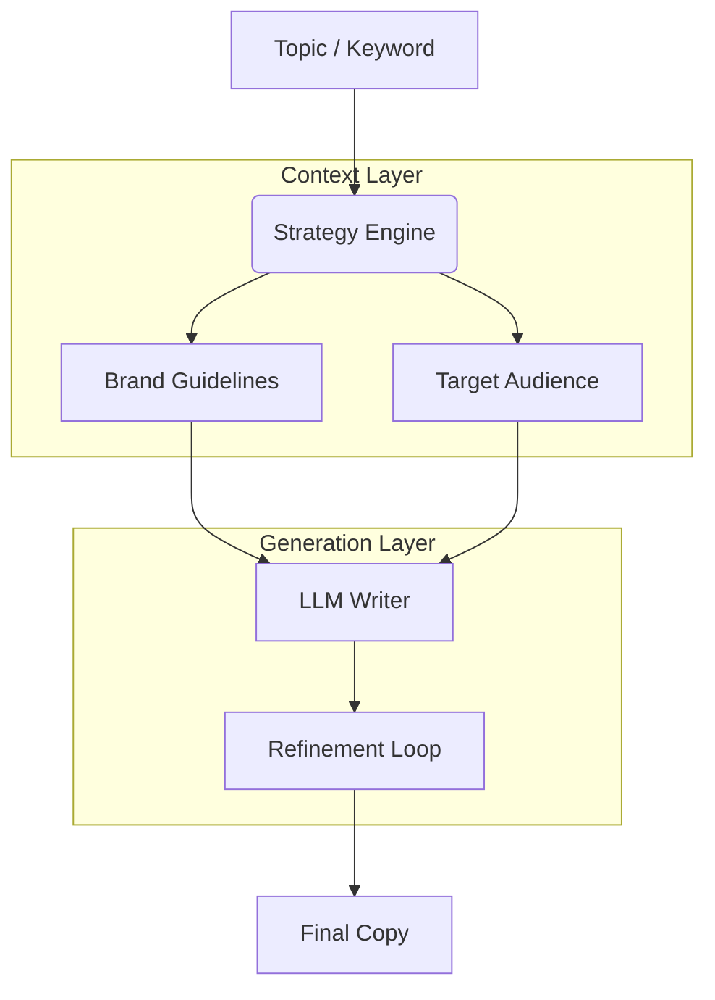

# Copywriting System

<div align="center">


**An AI-driven content generation engine optimized for conversion, SEO, and brand voice consistency.**

[Overview](#-overview) •
[Features](#-key-features) •
[Architecture](#-architecture) •
[Installation](#-installation) •
[Usage](#-usage) •
[Contributing](#-contributing)

</div>

---

## 📋 Overview

**Copywriting System** is built to produce high-impact marketing copy at scale. Unlike generic LLM outputs, this system uses a "Brand Voice" tuning layer to ensure all generated content—from ad headlines to long-form blog posts—sounds exactly like your brand.

It includes specialized modules for different platforms (Facebook, LinkedIn, Email) and objectives (Awareness, Consideration, Conversion).

### Why Copywriting System?

- **Conversion Focused**: Trained on successful ad copy frameworks (AIDA, PAS).
- **SEO Native**: Automatically integrates keywords and optimizes meta tags.
- **Multi-Format**: Generates text, HTML emails, and social media cards.

## 🚀 Key Features

| Feature | Description |
|---------|-------------|
| **Brand Voice Adapter** | Fine-tunes output tone (Professional, Witty, Urgent). |
| **Framework Library** | Built-in templates for AIDA, PAS, BAB, and 4 Ps. |
| **A/B Testing** | Generates multiple variants for split testing. |
| **Plagiarism Check** | Integrated uniqueness verification. |

## 🏗 Architecture



## 💻 Installation

```bash
pip install -r requirements.txt
```

## ⚡ Usage

```python
from copywriting_system import Copywriter

writer = Copywriter(brand_voice="luxury_minimalist")

# Generate Ad
ad = writer.generate_ad(
    product="Onyx Watch",
    platform="instagram",
    framework="PAS"
)
print(ad.text)
```

## 🤝 Contributing

We welcome contributions! Please see our [Contributing Guidelines](CONTRIBUTING.md) for details.

---

<div align="center">
  <b>Built with ❤️ by Blatam Academy</b><br>
  Part of the Onyx Server Architecture<br>
  <a href="../README.md">← Back to Main README</a>
</div>
