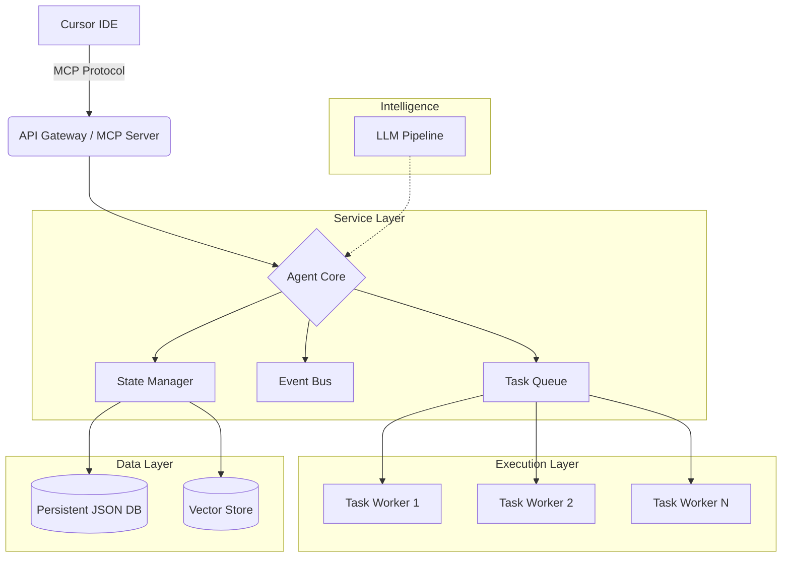

# Cursor Agent 24/7

<div align="center">


**A persistent, reliable background agent for Cursor IDE that executes commands, manages tasks, and creates a seamless bridge between your IDE and local system operations.**

[Overview](#-overview) •
[Features](#-key-features) •
[Architecture](#-architecture) •
[Installation](#-installation) •
[Usage](#-usage) •
[MCP Integration](#-cursor-ide-integration-mcp) •
[Contributing](#-contributing)

</div>

---

## 📋 Overview

**Cursor Agent 24/7** is a system-level service designed to extend the capabilities of the Cursor IDE. Unlike standard terminals or temporary scripts, this agent runs continuously in the background, listening for instructions, executing long-running tasks, and managing state across IDE restarts.

It implements the **Model Context Protocol (MCP)**, allowing it to interface natively with Cursor's AI context, enabling advanced workflows like "Watch this directory for changes and run tests" or "Deploy this service and monitor the logs for 30 minutes".

### Why Cursor Agent 24/7?

- **Persistence**: Fire-and-forget tasks that continue running even if you close Cursor.
- **Context Awareness**: Deep integration with Cursor allows the agent to understand your project structure.
- **Resilience**: Built-in health checks, auto-restart capabilities, and persistent state management.

## 🚀 Key Features

| Feature | Description |
|---------|-------------|
| **24/7 Background Service** | Runs as a daemon/service on Windows, Linux, and macOS. |
| **Native MCP Support** | Full implementation of the Model Context Protocol for direct IDE communication. |
| **Intelligent Task Queue** | Priority-based queuing system with concurrency control and rate limiting. |
| **Search & Retrieval** | Semantic search capabilities to retrieve past commands and results. |
| **Self-Correction** | AI-powered error analysis and automatic retry strategies for failed commands. |
| **Code Generation** | Integrated LLM pipeline for generating and executing code snippets on the fly. |

## 🏗 Architecture

The agent is built on a modular, event-driven architecture designed for stability and extensibility.



## 💻 Installation

### Standard Installation

1. **Clone the repository**
    ```bash
    git clone https://github.com/blatam-academy/cursor_agent.git
    cd cursor_agent_24_7
    ```

2. **Install dependencies**
    ```bash
    pip install -r requirements.txt
    ```

### Service Installation

Run the agent as a system service to ensure it starts on boot.

**Windows**
```powershell
python scripts/install_service.py
```

**Linux/macOS**
```bash
sudo python scripts/install_service.py
```

## ⚡ Usage

### CLI Control

```bash
# Start in API mode
python main.py --mode api --port 8024

# Manage the service
python main.py --mode service --action start
```

### Web Interface

Access the control panel at `http://localhost:8024` for a visual dashboard of running tasks, system health, and logs.

### REST API

**Submit a Task**
```bash
curl -X POST http://localhost:8024/api/tasks \
  -H "Content-Type: application/json" \
  -d '{"command": "run_tests", "params": {"path": "./tests"}}'
```

## 🔌 Cursor IDE Integration (MCP)

To connect Cursor to the agent:

1. Start the agent with MCP enabled:
   ```bash
   python main.py --mode api --enable-mcp --mcp-port 8025
   ```

2. In Cursor Settings > **Features** > **MCP Servers**:
   - **Name**: `cursor-agent`
   - **Type**: `SSE` (Server-Sent Events) or `HTTP`
   - **URL**: `http://localhost:8025/sse`

Once connected, you can ask Cursor: *"Ask cursor-agent to monitor the build logs for the next hour."*

## 🔧 Configuration

Configuration is managed via `config.yaml` or environment variables.

```yaml
agent:
  name: "primary-agent"
  host: "0.0.0.0"
  port: 8024
  
mcp:
  enabled: true
  port: 8025

storage:
  type: "json" # or "sqlite"
  path: "./data"
```

## 🤝 Contributing

We welcome contributions! Please see our [Contributing Guidelines](CONTRIBUTING.md) for details.

## 📄 License

This project is licensed under the MIT License - see the [LICENSE](LICENSE) file for details.

---

<div align="center">
  <b>Built with ❤️ by Blatam Academy</b><br>
  Part of the Onyx Server Architecture<br>
  <a href="../README.md">← Back to Main README</a>
</div>
