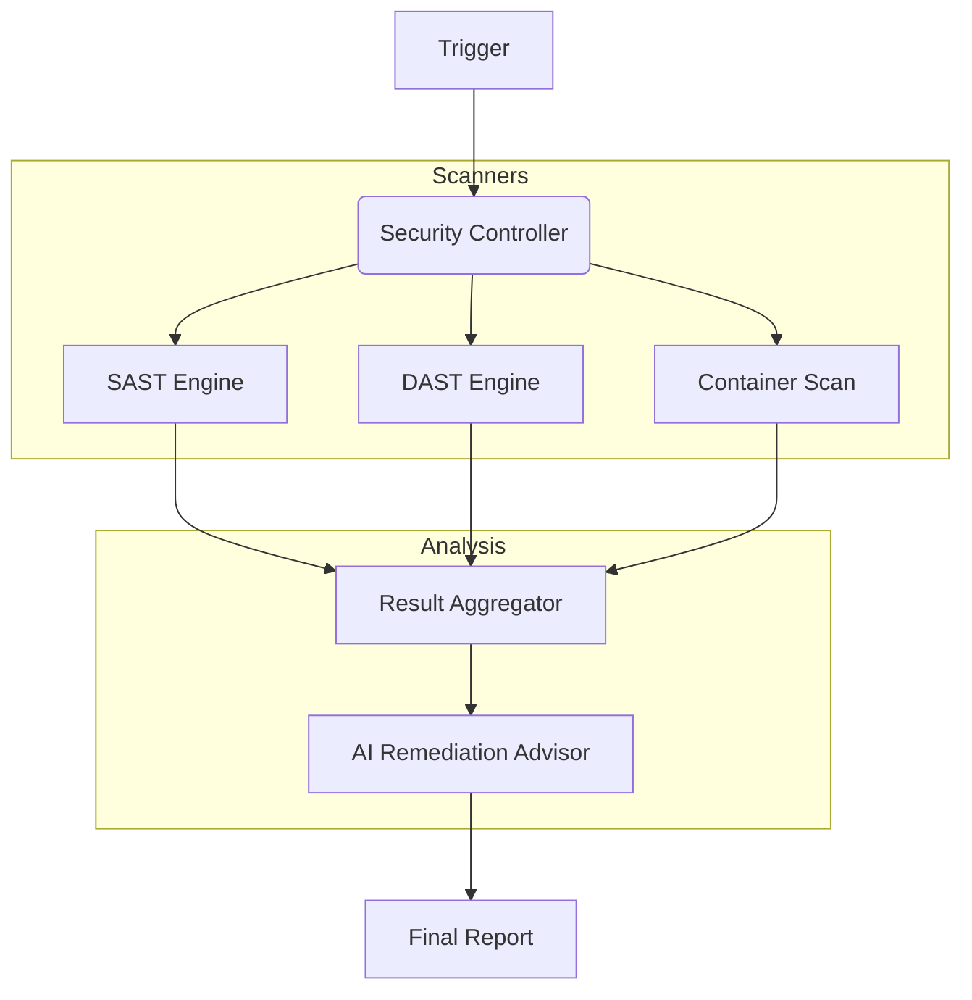

# CyberSec Toolkit

<div align="center">


**A comprehensive suite of security tools for penetration testing, vulnerability scanning, and secure code auditing.**

[Overview](#-overview) •
[Features](#-key-features) •
[Architecture](#-architecture) •
[Installation](#-installation) •
[Usage](#-usage) •
[Compliance](#-compliance) •
[Contributing](#-contributing)

</div>

---

## 📋 Overview

**CyberSec Toolkit** integrates industry-standard security scanners into a unified pipeline. It automates vulnerability assessments, dependency auditing, and configuration reviews. Designed for DevSecOps, it can be triggered via CI/CD pipelines to catch security flaws before deployment.

### Capabilities

- **Automated Scanning**: Wraps tools like Nmap, OWASP ZAP, and Trivy.
- **Reporting**: Generates consolidated PDF/HTML reports for compliance audits.
- **AI Triage**: Uses LLMs to analyze scan results and suggest remediation steps.

## 🚀 Key Features

| Feature | Description |
|---------|-------------|
| **Vulnerability Scanner** | Detects CVEs in container images and dependencies. |
| **Code Auditor** | Static Analysis (SAST) for Python, JavaScript, and Go. |
| **Network Mapper** | Discovery of open ports and services on improved infrastructure. |
| **Secrets Detection** | Scans git history for leaked API keys and passwords. |
| **Cloud Security** | IAM policy auditing and misconfiguration detection (AWS/Azure/GCP). |

## 🏗 Architecture



## 💻 Installation

```bash
pip install -r requirements.txt
```

## ⚡ Usage

```bash
# Run a full scan on a target
python -m cybersec_toolkit scan --target "http://localhost:8000" --profile "full"

# Audit a codebase
python -m cybersec_toolkit audit --path "./src" --report "audit.pdf"
```

## 🛡️ Compliance

Checks against:
- OWASP Top 10
- CIS Benchmarks
- NIST Framework

## 🤝 Contributing

We welcome contributions! Please see our [Contributing Guidelines](CONTRIBUTING.md) for details.

---

<div align="center">
  <b>Built with ❤️ by Blatam Academy</b><br>
  Part of the Onyx Server Architecture<br>
  <a href="../README.md">← Back to Main README</a>
</div>
