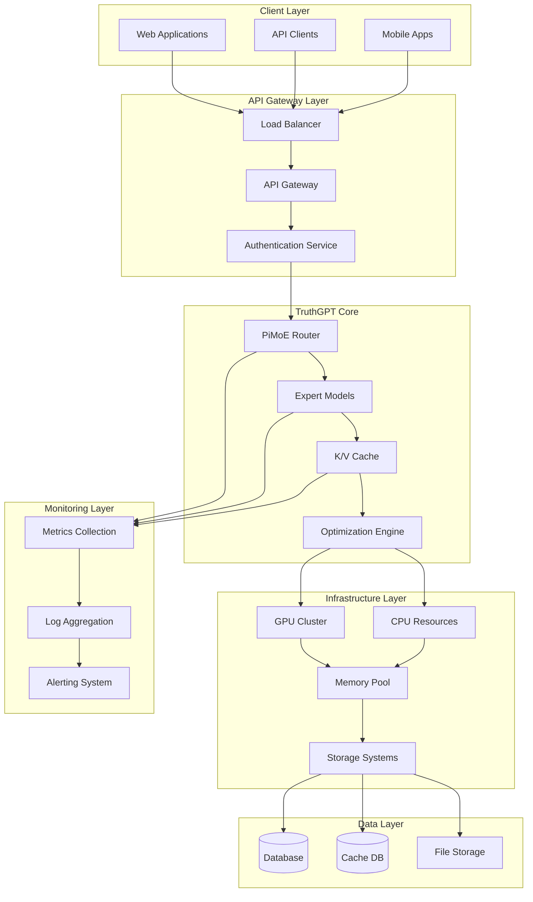
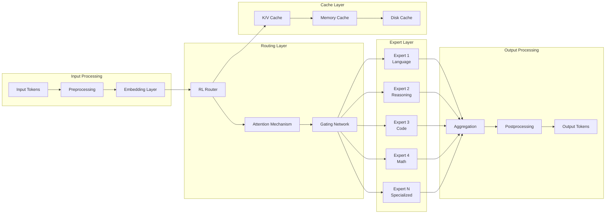
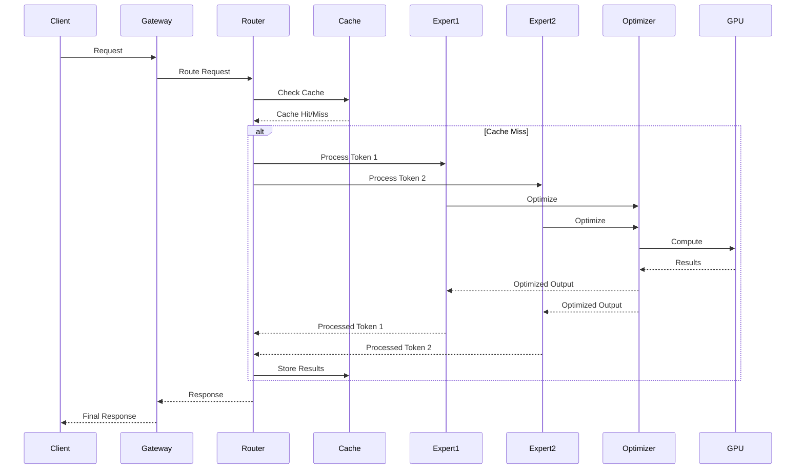
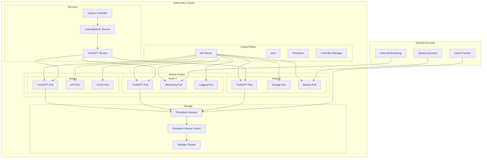
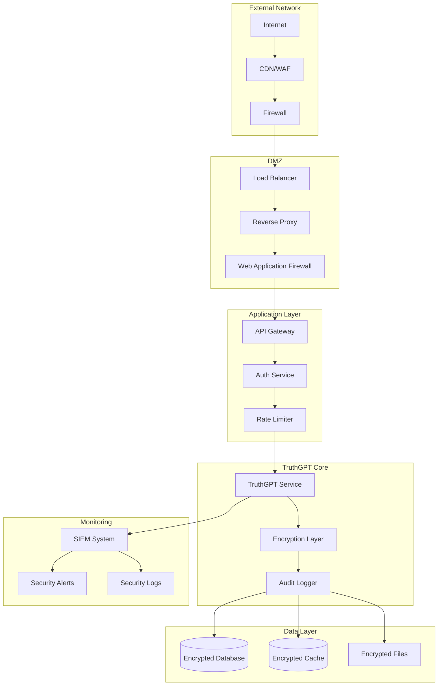
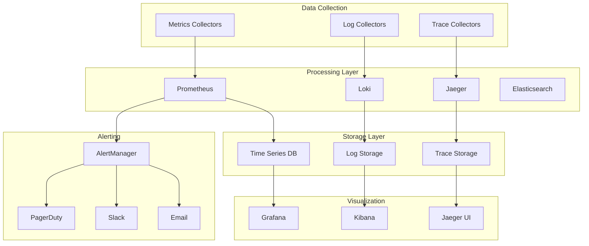
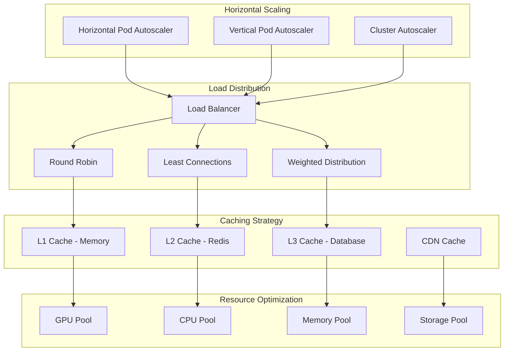

# TruthGPT Architecture Diagrams

This document contains comprehensive architecture diagrams for the TruthGPT optimization core system.

## 🎯 Design Goals

- **Visual Clarity**: Provide clear visual representations of system components
- **Comprehensive Coverage**: Include all major architectural views
- **Professional Quality**: Enterprise-grade diagram standards
- **Maintainability**: Easy to update and extend

## 🏗️ System Architecture Overview

### High-Level System Architecture

### PiMoE Internal Architecture

### Data Flow Architecture

### Deployment Architecture

### Security Architecture

### Monitoring Architecture

## 📊 Performance Architecture

### Scalability Patterns

---

*These architecture diagrams provide comprehensive visual documentation for understanding, implementing, and maintaining the TruthGPT optimization core system.*