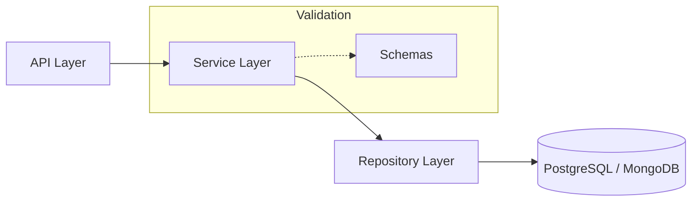

# Document Set Management

<div align="center">


**Comprehensive system for managing document collections with well-defined models, repositories, and services.**

[Overview](#-overview) •
[Features](#-key-features) •
[Architecture](#-architecture) •
[Installation](#-installation) •
[Usage](#-usage) •
[Integration](#-integration) •
[Contributing](#-contributing)

</div>

---

## 📋 Overview

**Document Set Management** is a structured module within the Onyx Server designed to handle logical groupings of documents. It abstracts the complexity of data persistence, validation, and business logic into a clean, layered architecture consisting of Repositories, Services, and Pydantic Schemas.

## 🚀 Key Features

| Feature | Description |
|---------|-------------|
| **Set Management** | Create, update, and manage logical document groupings. |
| **Layered Architecture** | Clean separation between API, Service, and Data layers. |
| **Schema Validation** | Strict type-checking and validation using Pydantic. |
| **RESTful API** | Fully documented endpoints for external integration. |

## 🏗 Architecture



## 📁 Structure

```
document_set/
├── models.py              # Data models (ORM)
├── repositories.py        # Data access layer
├── schemas.py             # Pydantic validation schemas
├── service.py             # Core business logic
├── api.py                 # REST API implementation
└── router.py              # Routing configuration
```

## 💻 Installation

This module uses standard system dependencies and requires no separate installation.

## ⚡ Usage

```python
from document_set.service import DocumentSetService
from document_set.schemas import DocumentSetCreate

# Initialize business service
service = DocumentSetService()

# Create a new document set
new_set = service.create(DocumentSetCreate(
    name="Marketing Assets 2024",
    description="Unified collection of all marketing collateral."
))
```

## 🔗 Integration

This module provides foundational data structures for:
- **Integration System**: For cross-module orchestration.
- **Workflow Chain**: For automated document processing pipelines.
- **AI Document Processor**: For batch AI analysis of document sets.

## 🤝 Contributing

We welcome contributions! Please see our [Contributing Guidelines](../../../CONTRIBUTING.md) for details.

---

<div align="center">
  <b>Built with ❤️ by Blatam Academy</b><br>
  Part of the Onyx Server Architecture<br>
  <a href="../README.md">← Back to Main README</a>
</div>
