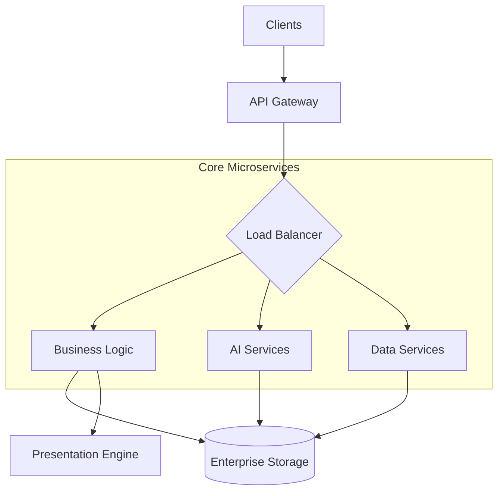

# Enterprise System

<div align="center">


**Enterprise-grade infrastructure with microservices architecture, intelligent APIs, and production-optimized performance.**

[Overview](#-overview) •
[Features](#-key-features) •
[Architecture](#-architecture) •
[Installation](#-installation) •
[Usage](#-usage) •
[Documentation](#-documentation) •
[Contributing](#-contributing)

</div>

---

## 📋 Overview

**Enterprise System** is the heavy-duty backbone of the Onyx Server, providing a scalable microservices architecture and shared infrastructure for mission-critical operations. It includes high-performance API gateways, optimized data sharing layers, and advanced presentation systems designed for high-throughput production environments.

## 🚀 Key Features

| Feature | Description |
|---------|-------------|
| **Microservices** | Scalable, decoupled service architecture for high availability. |
| **Intelligent APIs** | Advanced API endpoints with integrated AI capabilities. |
| **Performance Opt.** | Ultra-optimized components for minimal latency and high concurrency. |
| **Enterprise Infra** | Production-ready infrastructure including logging and monitoring. |
| **Presentation Sys** | Integrated system for generating professional presentations. |

## 🏗 Architecture



## 📁 Structure

```
enterprise/
├── core/                   # Central business logic
├── infrastructure/         # Deployment and monitoring configurations
├── shared/                 # Shared utilities and types across microservices
└── presentation/           # Professional reporting and presentation engine
```

## 💻 Installation

```bash
# Standard microservices dependencies
pip install -r requirements-microservices.txt

# Enhanced AI optimization
pip install -r requirements-ai-optimization.txt

# High-performance computation
pip install -r requirements-performance.txt
```

## ⚡ Usage

```python
from enterprise.ultimate_api import UltimateAPI
from enterprise.MICROSERVICES_DEMO import MicroservicesDemo

# Initialize the enterprise API gateway
api = UltimateAPI()

# Run a localized microservices demonstration
demo = MicroservicesDemo()
demo.run()
```

## 📚 Documentation

- [Quick Start](QUICK_START.md)
- [Production Deployment](PRODUCTION_DEPLOYMENT.md)
- [Architecture Overview](REFACTOR_COMPLETE.md)

## 🤝 Contributing

We welcome contributions! Please see our [Contributing Guidelines](../../../CONTRIBUTING.md) for details.

---

<div align="center">
  <b>Built with ❤️ by Blatam Academy</b><br>
  Part of the Onyx Server Architecture<br>
  <a href="../README.md">← Back to Main README</a>
</div>
