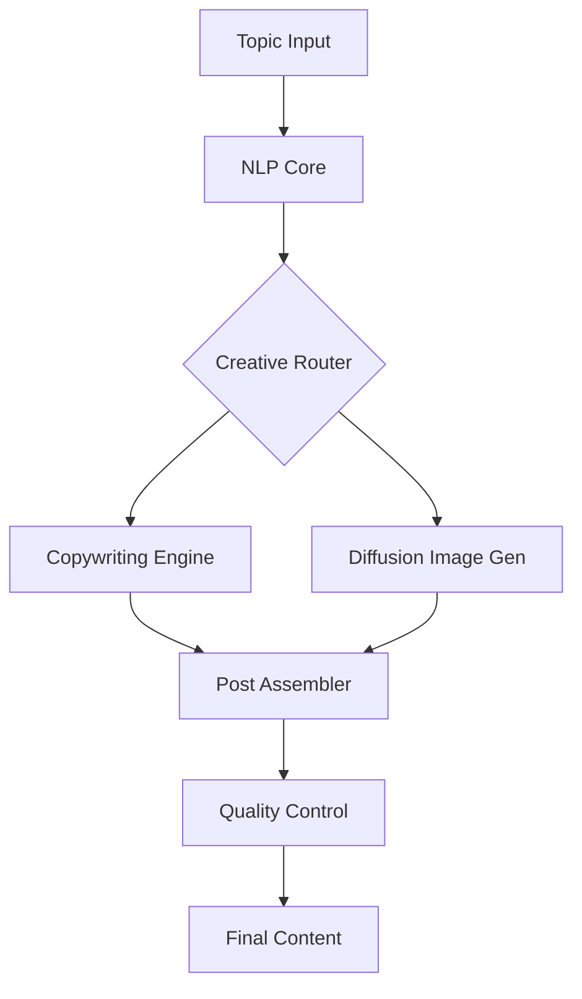

# Facebook Posts Generation System

<div align="center">


**Advanced AI-powered Facebook content generation with multi-modal capabilities and production-grade optimization.**

[Overview](#-overview) •
[Features](#-key-features) •
[Architecture](#-architecture) •
[Installation](#-installation) •
[Usage](#-usage) •
[Interactive](#-gradio-interfaces)

</div>

---

## 📋 Overview

The **Facebook Posts Generation System** is an end-to-end solution for creating highly engaging social media content. It integrates advanced LLMs for copywriting with state-of-the-art diffusion models for image generation. The system is designed for high-volume production with support for multi-GPU training, distributed optimization, and real-time performance analytics.

## 🚀 Key Features

| Feature | Description |
|---------|-------------|
| **Multi-Modal Generation** | Unified text and image generation for complete posts. |
| **Diffusion Integration** | Native support for Stable Diffusion and advanced image models. |
| **Quantum-Ready Core** | Experimental quantum components for high-entropy generation. |
| **Multi-GPU Parallelism** | Distributed training and inference for maximum throughput. |
| **Gradio Interfaces** | Interactive dashboards for real-time post preview and tuning. |
| **Analytics Engine** | Deep metrics on content quality and engagement prediction. |

## 🏗 Architecture



## 📁 Structure

```
facebook_posts/
├── api/                    # REST API endpoints
├── application/            # Application layer and service orchestration
├── domain/                 # Core domain models and business rules
├── infrastructure/         # External service adapters and data access
├── models/                 # Machine learning model definitions
├── nlp/                    # Advanced text processing and sentiment analysis
├── optimization/           # Performance and resource tuning
└── quantum_core/           # Experimental quantum generation logic
```

## 💻 Installation

```bash
# Basic system requirements
pip install -r requirements.txt

# Enhanced performance v3.5
pip install -r requirements_enhanced_v3_5.txt

# Full production refactor v3.6
pip install -r requirements_refactored_v3_6.txt
```

## ⚡ Usage

```python
from facebook_posts.main import FacebookPostsGenerator

# Initialize the master content generator
generator = FacebookPostsGenerator()

# Generate a high-engagement post
post = generator.generate(
    topic="AI Innovation in Enterprise",
    audience="Entrepreneurs & Tech Leaders",
    style="professional and visionary"
)
print(post)
```

## 🧪 Verification

```bash
# Run system-wide production tests
python test_production.py

# Launch the interactive API demonstration
python demo_improved_api.py
```

---

<div align="center">
  <b>Built with ❤️ by Blatam Academy</b><br>
  Part of the Onyx Server Architecture<br>
  <a href="../README.md">← Back to Main README</a>
</div>
