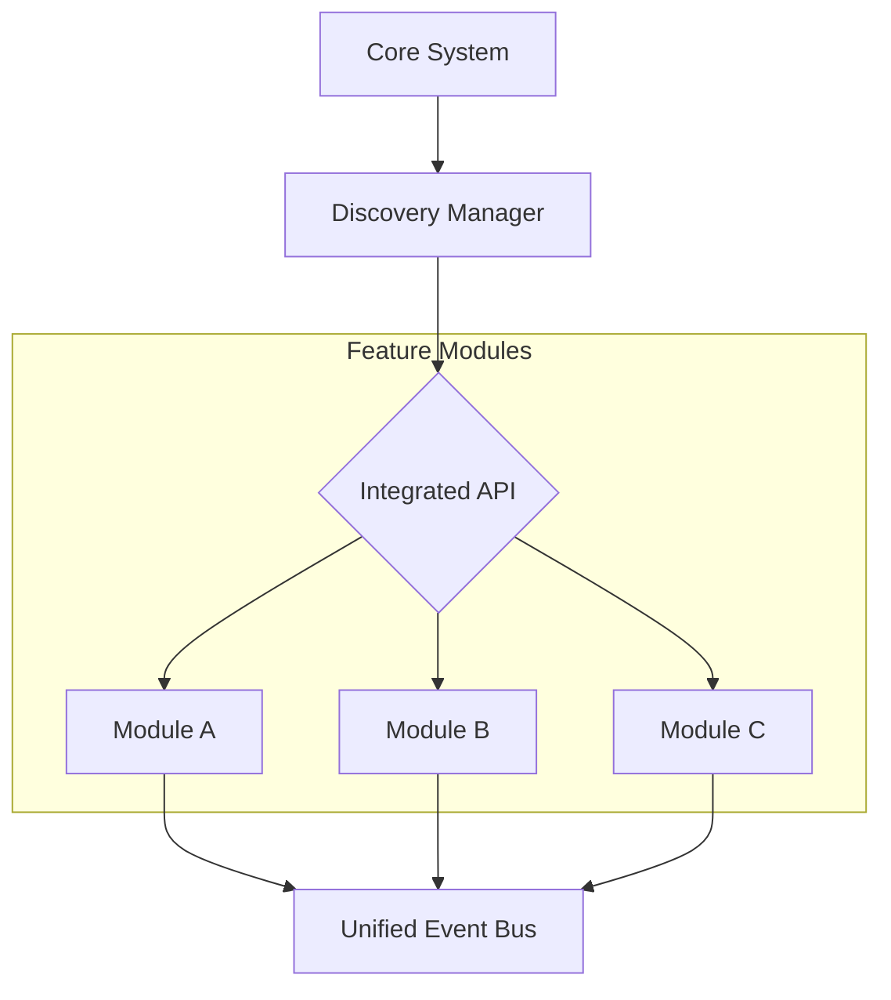

# Integrated Discovery Modules

<div align="center">


**Unified system modules for integrated feature discovery, registration, and cross-communication.**

[Overview](#-overview) •
[Features](#-key-features) •
[Architecture](#-architecture) •
[Installation](#-installation) •
[Usage](#-usage) •
[Contributing](#-contributing)

</div>

---

## 📋 Overview

**Integrated Discovery Modules** is the connective tissue of the Onyx Server, providing a standardized API for feature modules to register themselves and communicate with other components. It abstracts the discovery process and provides a unified entry point for integrated functionalities and automated regression testing.

## 🚀 Key Features

| Feature | Description |
|---------|-------------|
| **Integrated API** | Unified management API for all registered discovery modules. |
| **Feature Registry** | Dynamic registration and lookup of system-wide capabilities. |
| **Discovery Logic** | Intelligent scanning and initialization of integrated components. |
| **Testing Suite** | Comprehensive automated tests for verification of integration points. |

## 🏗 Architecture



## 📁 Structure

```
integrated/
├── api.py                  # Primary integration API
└── tests/                  # Integration and discovery verification tests
```

## 💻 Installation

This module is a prerequisite for most features and is pre-installed with the Onyx framework.

## ⚡ Usage

```python
from integrated.api import IntegratedAPI

# Initialize the integrated discovery interface
api = IntegratedAPI()

# Register or process data through the integrated layer
result = api.process_integrated({"feature": "discovery_scan", "params": {}})
print(result)
```

## 🤝 Contributing

We welcome contributions! Please see our [Contributing Guidelines](../../../CONTRIBUTING.md) for details.

---

<div align="center">
  <b>Built with ❤️ by Blatam Academy</b><br>
  Part of the Onyx Server Architecture<br>
  <a href="../README.md">← Back to Main README</a>
</div>
