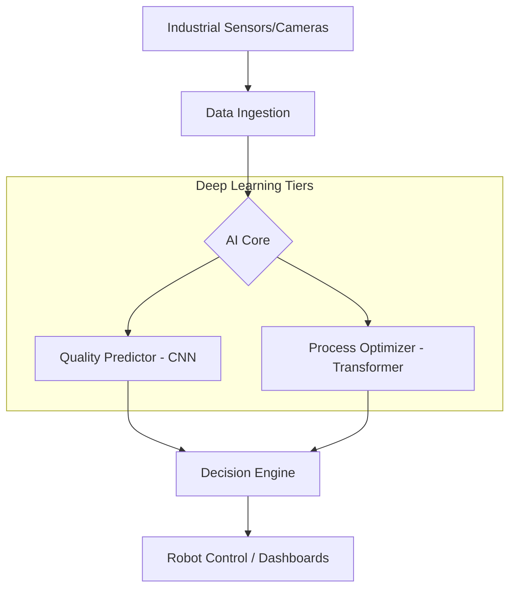

# Manufacturing AI

<div align="center">


**Intelligent manufacturing system featuring production planning, quality control, process optimization, and real-time monitoring.**

[Overview](#-overview) •
[Features](#-key-features) •
[Architecture](#-architecture) •
[API Endpoints](#-api-endpoints) •
[Usage](#-usage) •
[Contributing](#-contributing)

</div>

---

## 📋 Overview

**Manufacturing AI** is a comprehensive industrial solution designed to optimize shop-floor operations. It leverages Deep Learning (CNNs and Transformers) for predictive quality control and process parameter optimization, combined with a robust PlanOps layer for demand forecasting and predictive maintenance.

## 🚀 Key Features

| Feature | Description |
|---------|-------------|
| **Production Planning** | Automated scheduling and resource allocation for production orders. |
| **Visual Quality Control** | Computer vision-based defect detection and dimensional checks. |
| **Process Optimization** | Transformer-based parameter tuning for maximum efficiency. |
| **Real-time Monitoring** | IoT equipment status tracking and automatic alerting systems. |
| **PlanOps Integration** | LSTM-based demand forecasting and predictive maintenance. |

## 🏗 Architecture



## 📁 Structure

```
manufacturing_ai/
├── core/                   # Central business logic and scheduling
├── models/                 # Deep learning model definitions (Quality/Process)
├── architecture/           # Reusable NN components (Attention, Residual, etc.)
├── planops/                # Planning Operations (Demand, Maintenance, Capacity)
└── dashboards/             # Gradio interaction layer
```

## 💻 Installation

This module requires a GPU-enabled environment for training and high-performance inference.

```bash
# Core manufacturing dependencies
pip install -r requirements.txt
```

## ⚡ Usage

```python
# Launch production order
POST /api/v1/manufacturing/orders
{
    "product_id": "PROD_X100",
    "quantity": 500,
    "priority": "high",
    "due_date": "2025-12-01T08:00:00"
}

# Run visual quality inspection
POST /api/v1/manufacturing/quality/checks
{
    "product_id": "PROD_X100",
    "check_type": "visual_cnn_advanced"
}
```

## 🔗 Integration

The system seamlessly integrates with:
- **Universal Robot System**: For full end-to-end automation.
- **Enterprise System**: For production reporting and ERP integration.
- **Experiment Tracking**: Native support for WandB and TensorBoard.

---

<div align="center">
  <b>Built with ❤️ by Blatam Academy</b><br>
  Part of the Onyx Server Architecture<br>
  <a href="../README.md">← Back to Main README</a>
</div>
