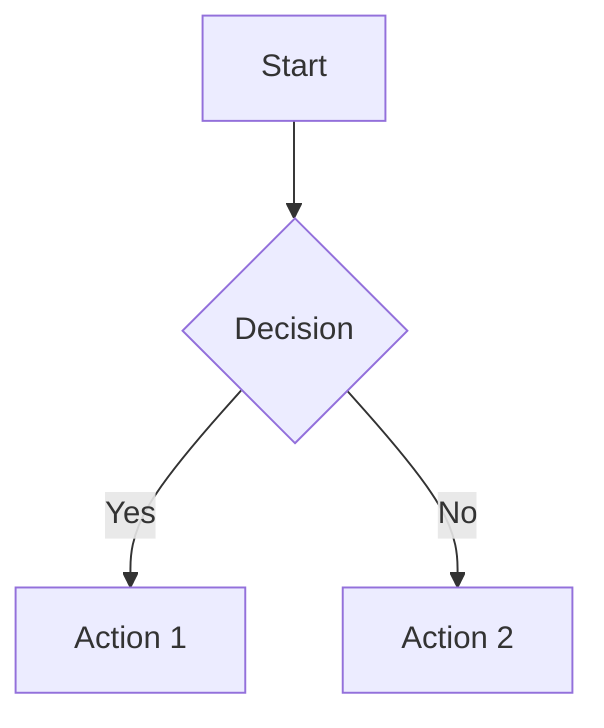

# Mejoras Adicionales v1.2.0 - Markdown to Professional Documents AI

## 🚀 Nuevas Funcionalidades

### 1. Soporte para Diagramas Mermaid ✅

- ✅ **MermaidRenderer**: Clase para renderizar diagramas Mermaid a imágenes
- ✅ **Extracción Automática**: El parser ahora extrae bloques de código Mermaid
- ✅ **Detección de Tipo**: Detecta automáticamente el tipo de diagrama (flowchart, sequence, class, etc.)
- ✅ **Renderizado a PNG/SVG**: Convierte diagramas Mermaid a imágenes
- ✅ **Soporte para Temas**: Múltiples temas disponibles (default, dark, forest, neutral)

**Uso**:
```markdown

```

### 2. Sistema de Métricas y Monitoreo ✅

- ✅ **MetricsCollector**: Recolecta métricas del servicio
- ✅ **Contadores**: Rastrea conversiones, errores, cache hits/misses
- ✅ **Histogramas**: Tamaños de archivos, palabras, tablas
- ✅ **Timers**: Tiempos de conversión, parsing, cache
- ✅ **Percentiles**: P95, P99 para análisis de performance
- ✅ **Endpoint de Métricas**: `GET /metrics` para ver todas las métricas
- ✅ **Reset de Métricas**: `POST /metrics/reset` para reiniciar

**Métricas Rastreadas**:
- Conversiones por formato
- Tiempos de conversión
- Tamaños de archivos de salida
- Estadísticas de parsing
- Cache hits/misses
- Errores por tipo

### 3. Rate Limiting ✅

- ✅ **RateLimiter**: Limita requests por IP/cliente
- ✅ **Configurable**: Límites configurables (default: 100 req/min)
- ✅ **Middleware**: Aplicado automáticamente a todos los endpoints
- ✅ **Headers HTTP**: Incluye headers `X-RateLimit-Remaining` y `X-RateLimit-Limit`
- ✅ **Excepciones**: Retorna 429 Too Many Requests cuando se excede el límite
- ✅ **Excepciones**: Health check y métricas no tienen rate limiting

**Configuración**:
```env
RATE_LIMIT_REQUESTS=100
RATE_LIMIT_WINDOW=60
```

### 4. Procesador de Imágenes ✅

- ✅ **ImageProcessor**: Procesa y optimiza imágenes
- ✅ **Descarga de URLs**: Descarga imágenes desde URLs
- ✅ **Optimización**: Redimensiona y optimiza imágenes automáticamente
- ✅ **Validación**: Valida tamaño y formato de imágenes
- ✅ **Conversión**: Convierte a formatos compatibles (JPEG, PNG)
- ✅ **Base64**: Convierte imágenes a base64 para embedding
- ✅ **Información**: Extrae metadata de imágenes (dimensiones, formato, etc.)

**Características**:
- Máximo tamaño configurable (default: 5MB)
- Máxima dimensión configurable (default: 2000px)
- Calidad JPEG configurable (default: 85)
- Thumbnail automático para imágenes grandes

### 5. Mejoras en el Parser ✅

- ✅ **Extracción de Mermaid**: Extrae diagramas Mermaid del contenido
- ✅ **Estadísticas Mejoradas**: Incluye conteo de diagramas Mermaid
- ✅ **Detección de Tipo**: Detecta automáticamente el tipo de diagrama

### 6. Mejoras en la API ✅

- ✅ **Middleware de Rate Limiting**: Aplicado automáticamente
- ✅ **Tracking de Métricas**: Todas las conversiones son rastreadas
- ✅ **Context Managers**: Timing automático de operaciones
- ✅ **Endpoints Nuevos**:
  - `GET /metrics`: Ver todas las métricas
  - `POST /metrics/reset`: Reiniciar métricas

### 7. Mejoras en Configuración ✅

- ✅ **Rate Limiting Configurable**: Variables de entorno para rate limiting
- ✅ **Image Processing Configurable**: Configuración para procesamiento de imágenes
- ✅ **Versión Actualizada**: v1.2.0

## 📊 Estadísticas de Mejoras v1.2.0

- **Nuevos Archivos**: 4 (mermaid_renderer.py, metrics.py, rate_limiter.py, image_processor.py)
- **Nuevos Endpoints**: 2 (/metrics, /metrics/reset)
- **Nuevas Funcionalidades**: 7+
- **Middleware**: 1 (rate limiting)
- **Métricas Rastreadas**: 15+

## 🎯 Casos de Uso

### Diagramas Mermaid

Los usuarios pueden ahora incluir diagramas Mermaid en sus documentos Markdown y estos serán renderizados automáticamente en los documentos de salida.

### Monitoreo y Analytics

Los administradores pueden monitorear el uso del servicio, ver métricas de performance, y analizar patrones de uso.

### Protección contra Abuso

El rate limiting protege el servicio contra abuso y garantiza disponibilidad para todos los usuarios.

### Procesamiento de Imágenes

Las imágenes en los documentos Markdown pueden ser descargadas, optimizadas y embebidas automáticamente.

## 🔧 Configuración Adicional

### Mermaid CLI (Opcional)

Para renderizar diagramas Mermaid, instala el CLI:

```bash
npm install -g @mermaid-js/mermaid-cli
```

Sin el CLI, los diagramas Mermaid serán extraídos pero no renderizados.

### Variables de Entorno Nuevas

```env
# Rate Limiting
RATE_LIMIT_REQUESTS=100
RATE_LIMIT_WINDOW=60

# Image Processing
MAX_IMAGE_SIZE_MB=5
MAX_IMAGE_DIMENSION=2000
```

## 📈 Ejemplo de Métricas

```json
{
  "uptime_seconds": 3600,
  "counters": {
    "conversions.requested": 150,
    "conversions.success": 145,
    "conversions.error": 5,
    "conversions.cache_hit": 50,
    "conversions.cache_miss": 95,
    "conversions.format.excel": 60,
    "conversions.format.pdf": 40,
    "rate_limit.exceeded": 2
  },
  "histograms": {
    "parsing.words": {
      "count": 150,
      "min": 10,
      "max": 5000,
      "avg": 500,
      "p95": 2000,
      "p99": 4000
    }
  },
  "timers": {
    "conversion.total": {
      "count": 150,
      "min_ms": 100,
      "max_ms": 5000,
      "avg_ms": 800,
      "p95_ms": 2000,
      "p99_ms": 4000
    }
  }
}
```

## 🚀 Próximas Mejoras Sugeridas

- [ ] Integración completa de Mermaid en todos los convertidores
- [ ] Soporte para más tipos de diagramas (PlantUML, Graphviz)
- [ ] Dashboard de métricas en tiempo real
- [ ] Alertas automáticas basadas en métricas
- [ ] Exportación de métricas a Prometheus/Grafana
- [ ] Rate limiting por usuario autenticado
- [ ] Procesamiento asíncrono de imágenes grandes
- [ ] Soporte para más formatos de imagen

---

**Versión**: 1.2.0  
**Fecha**: 2025-11-26  
**Estado**: ✅ Completado

