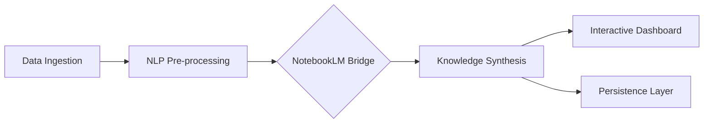

# NotebookLM AI Integration

<div align="center">


**Advanced integration bridge for NotebookLM AI with specialized performance optimizations and interactive interfaces.**

[Overview](#-overview) •
[Features](#-key-features) •
[Architecture](#-architecture) •
[Installation](#-installation) •
[Usage](#-usage) •
[Contributing](#-contributing)

</div>

---

## 📋 Overview

The **NotebookLM AI Integration** module provides a high-performance bridge between the Onyx Server and the NotebookLM ecosystem. It features an ultra-optimized production pipeline, advanced NLP processing layers, and Gradio-based interactive dashboards for real-time model interaction and data synthesis.

## 🚀 Key Features

| Feature | Description |
|---------|-------------|
| **Native Integration** | Seamless communication with NotebookLM AI backend APIs. |
| **Ultra Optimization** | Specialized processing layers for low-latency AI responses. |
| **Gradio Dashboards** | Rich, interactive web interfaces for visual data exploration. |
| **Production Pipeline** | End-to-end data flow from raw input to synthesized notebook knowledge. |
| **Advanced NLP** | Domain-specific language processing specialized for knowledge extraction. |

## 🏗 Architecture



## 📁 Structure

```
notebooklm_ai/
├── api/                    # REST API endpoints for NotebookLM services
├── application/            # Orchestration and business logic
├── core/                   # Central processing engine
├── ml_integration/          # Machine learning specific adapters
├── nlp/                    # Natural Language Processing utilities
├── optimization/           # Performance Tuning and caching logic
└── presentation/            # Dashboards and reporting interfaces
```

## 💻 Installation

```bash
# Standard integration dependencies
pip install -r requirements_notebooklm.txt

# Enhanced production-grade components
pip install -r requirements_production.txt

# High-concurrency performance tuning
pip install -r requirements_ultra_optimized.txt
```

## ⚡ Usage

```python
from notebooklm_ai.main_app import NotebookLMApp

# Initialize the notebook bridge application
app = NotebookLMApp()

# Process data and generate knowledge summaries
result = app.process_with_notebooklm(content="Advanced research paper data...")
print(result)
```

## 🔗 Integration

This module acts as a knowledge layer for:
- **Integration System**: For unified service orchestration.
- **Blatam AI**: As a specialized knowledge retrieval plugin.
- **Business Agents**: Providing factual context for automated decision-making.

---

<div align="center">
  <b>Built with ❤️ by Blatam Academy</b><br>
  Part of the Onyx Server Architecture<br>
  <a href="../README.md">← Back to Main README</a>
</div>
