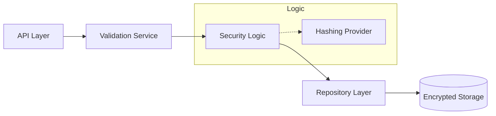

# Password Management System

<div align="center">


**Secure, enterprise-grade password management system with robust hashing, validation, and RESTful integration.**

[Overview](#-overview) •
[Features](#-key-features) •
[Architecture](#-architecture) •
[Security](#-security) •
[Usage](#-usage) •
[Contributing](#-contributing)

</div>

---

## 📋 Overview

The **Password Management System** is a security-critical module within the Onyx Server designed to handle credential lifecycles with industry-standard patterns. It implements the Repository and Service patterns to provide a clean, testable interface for password creation, hashing, and verification.

## 🚀 Key Features

| Feature | Description |
|---------|-------------|
| **Secure Hashing** | Automatic Salt & Hash using modern cryptographic algorithms. |
| **Pydantic Validation** | Strict input validation for complex password requirements. |
| **RESTful API** | Clean endpoints for secure integration with external auth providers. |
| **Strength Auditing** | Real-time analysis of password complexity and entropy. |

## 🏗 Architecture



## 📁 Structure

```
password/
├── models.py              # Secure data models (ORM definitions)
├── schemas.py            # Pydantic validation and serialization schemas
├── service.py            # Hashing and business logic implementations
└── api.py                # REST API endpoint definitions
```

## 💻 Installation

This module is a core security component and is pre-configured with the standard Onyx requirements.

## ⚡ Usage

```python
from password.service import PasswordService
from password.schemas import PasswordCreate

# Initialize the secure service
service = PasswordService()

# Create a new, automatically hashed credential
new_password = service.create(PasswordCreate(
    value="P@ssw0rd_Str0ng_2024",
    user_id="user_admin_01"
))
```

## 🔒 Security Standards

- **Zero-Plaintext Policy**: Passwords are never stored or transmitted in plain text after initial ingestion.
- **Hashing**: Utilizes Argon2 or BCrypt with industry-recommended work factors.
- **Strength Validation**: Enforces length, character variety, and common-password blacklisting.

## 🔗 Integration

Integrates natively with the Onyx **Authentication System** and the **Discovery Integration Layer** for cross-module identity management.

---

<div align="center">
  <b>Built with ❤️ by Blatam Academy</b><br>
  Part of the Onyx Server Architecture<br>
  <a href="../README.md">← Back to Main README</a>
</div>
