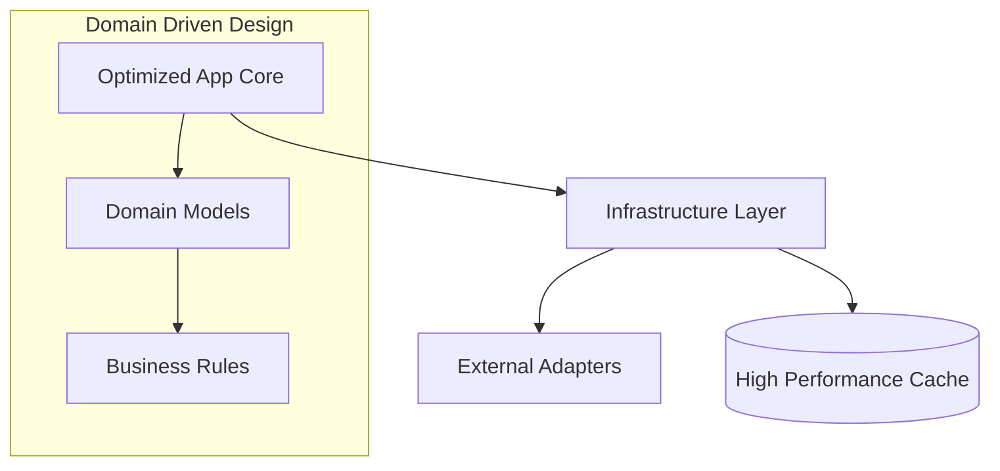

# Production System

<div align="center">


**High-availability, ultra-optimized system core for enterprise production environments and high-throughput workloads.**

[Overview](#-overview) •
[Features](#-key-features) •
[Architecture](#-architecture) •
[Installation](#-installation) •
[Usage](#-usage) •
[Contributing](#-contributing)

</div>

---

## 📋 Overview

The **Production System** module encapsulates the ultimate configurations and optimized application cores required for high-scale environments. It enforces a strict Clean Architecture and provides specialized infrastructure adapters that are tuned for maximum performance and stability.

## 🚀 Key Features

| Feature | Description |
|---------|-------------|
| **Clean Architecture** | Strict separation between domain logic and infrastructure. |
| **Ultra-Optimized Bridge** | High-performance application layer with minimal overhead. |
| **Production Config** | Battle-tested environment configurations for cloud deployment. |
| **Modular Core** | Extensible plug-and-play architecture for enterprise features. |

## 🏗 Architecture



## 📁 Structure

```
production/
├── src/                    # Primary source code entry point
├── application/            # Optimized business logic and orchestration
├── domain/                 # Core domain models and pure business rules
├── infrastructure/         # Production-grade database and API adapters
├── config/                 # Environment-specific configuration matrix
└── presentation/            # High-throughput presentation and API layers
```

## 💻 Installation

```bash
# Install the ultra-optimized production dependency stack
pip install -r requirements_ultra_optimized.txt
```

## ⚡ Usage

```python
from production.optimized_app import create_production_app

# Initialize the high-concurrency production application
app = create_production_app()

# Standard entry point for production servers (WSGI/ASGI)
if __name__ == "__main__":
    app.run_production()
```

## 🔗 Integration

This module provides the final deployment surface for:
- **Enterprise Features**: Leveraging high-performance adapters.
- **Logistics & Manufacturing AI**: Providing the stable runtime for heavy inference.

---

<div align="center">
  <b>Built with ❤️ by Blatam Academy</b><br>
  Part of the Onyx Server Architecture<br>
  <a href="../README.md">← Back to Main README</a>
</div>
