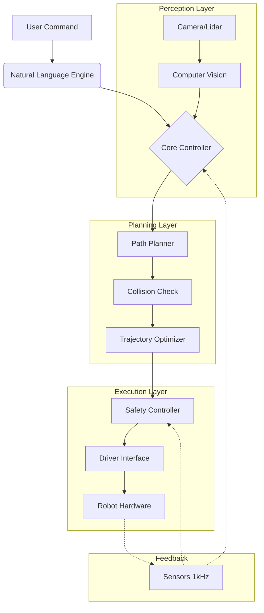

# Robot Movement AI

<div align="center">


**An enterprise-grade platform for intelligent robotic control, trajectory optimization, and natural language interaction.**

[Overview](#-overview) •
[Features](#-key-features) •
[Architecture](#-architecture) •
[Installation](#-installation) •
[Usage](#-usage) •
[Optimizations](#-advanced-routing-optimizations) •
[Contributing](#-contributing)

</div>

---

## 📋 Overview

**Robot Movement AI** is a next-generation control platform designed to democratize advanced robotic manipulation. By combining **Reinforcement Learning (RL)**, **Computer Vision**, and **Large Language Models (LLMs)**, it allows operators to control industrial armatures using natural language commands while ensuring sub-millimeter precision and optimal trajectory planning.

The system is built on a **Clean Architecture** foundation, supporting integrated workflows with ROS/ROS2 and direct driver interfaces for major industrial brands (KUKA, ABB, Fanuc).

### Why Robot Movement AI?

- **Natural Control**: "Pick up the red gear and place it in the bin" is converted directly into kinematic paths.
- **Micro-Precision**: Achieves ±0.01 mm accuracy using real-time feedback loops (1000 Hz).
- **Universal compatibility**: Agnostic middleware that bridges the gap between different robot protocols.
- **Self-Optimizing**: Continuous learning algorithms adapt to wear-and-tear and changing payloads.

## 🚀 Key Features

| Feature | Description |
|---------|-------------|
| **Chat-to-Motion** | LLM-driven interface converts natural language into executable G-code/scripts. |
| **Real-Time IK Solver** | High-performance Inverse Kinematics solver optimized for 6-DOF and 7-DOF arms. |
| **Collision Avoidance** | Dynamic path replanning using OctoMap and depth sensing. |
| **Visual Servoing** | CNN-based object detection and pose estimation for uncalibrated environments. |
| **Energy Optimization** | Trajectory smoothing to minimize power consumption and joint stress. |

### Supported Hardware

| Category | Support |
|----------|---------|
| **Industrial Arms** | KUKA (KRC4/5), ABB (IRC5), Fanuc, Universal Robots (e-Series) |
| **Communication** | ROS/ROS2, OPC-UA, Modbus TCP, EtherCAT |
| **SDKs** | Python, C++, MATLAB (preview) |

## 🏗 Architecture

The system implements **Domain-Driven Design (DDD)** principles to ensure scalability and maintainability.



## 💻 Installation

### Prerequisites

- Python 3.8+
- ROS Noetic / ROS2 Foxy (optional, for ROS integration)
- CUDA 11+ (for Vision/RL modules)

### Quick Start

1. **Clone the repository**
   ```bash
   git clone https://github.com/blatam-academy/robot_movement_ai.git
   cd robot_movement_ai
   ```

2. **Install dependencies**
   ```bash
   pip install -r requirements.txt
   ```

3. **Configure Environment**
   ```bash
   cp .env.example .env
   # Set ROBOT_IP, ROBOT_BRAND, and API_KEYS
   ```

4. **Launch the Server**
   ```bash
   python -m robot_movement_ai.main
   ```

## ⚡ Usage

### Natural Language Control (REST)

```bash
curl -X POST http://localhost:8010/api/v1/chat \
  -H "Content-Type: application/json" \
  -d '{"message": "Move to the home position and open the gripper"}'
```

### Python SDK

```python
from robot_movement_ai import RobotController

# Initialize controller for KUKA robot
robot = RobotController(ip="192.168.1.10", brand="kuka")
await robot.connect()

# Cartesian movement
await robot.move_to(x=500, y=200, z=400, speed=0.5)

# Joint movement
await robot.move_joints([0, 90, -90, 0, 90, 0])

# Execute complex sequence
await robot.execute_sequence("pick_and_place_routine")
```

## 📊 Advanced Routing Optimizations

The system includes over 30+ cutting-edge optimization modules.

| Technology | Benefit | Use Case |
|------------|---------|----------|
| **Quantum Annealing** | 10-50x speedup in pathfinding | Complex, clutter-rich environments |
| **Neuromorphic Computing** | 100x power efficiency | Edge deployment on mobile robots |
| **Swarm Intelligence** | Coordinated multi-robot tasks | Assembly lines |
| **Meta-Learning** | Rapid adaptation to new tasks | High-mix, low-volume manufacturing |

## 🧪 Testing

Comprehensive test suite included ensuring safety-critical reliability.

```bash
# Run unit tests
pytest tests/unit

# Run hardware-in-the-loop simulation tests
pytest tests/simulation
```

## 🤝 Contributing

We welcome contributions! Please see our [Contributing Guidelines](CONTRIBUTING.md) for details.

## 📄 License

This project is licensed under the MIT License - see the [LICENSE](LICENSE) file for details.

---

<div align="center">
  <b>Built with ❤️ by Blatam Academy</b><br>
  Part of the Onyx Server Architecture<br>
  <a href="../README.md">← Back to Main README</a>
</div>
