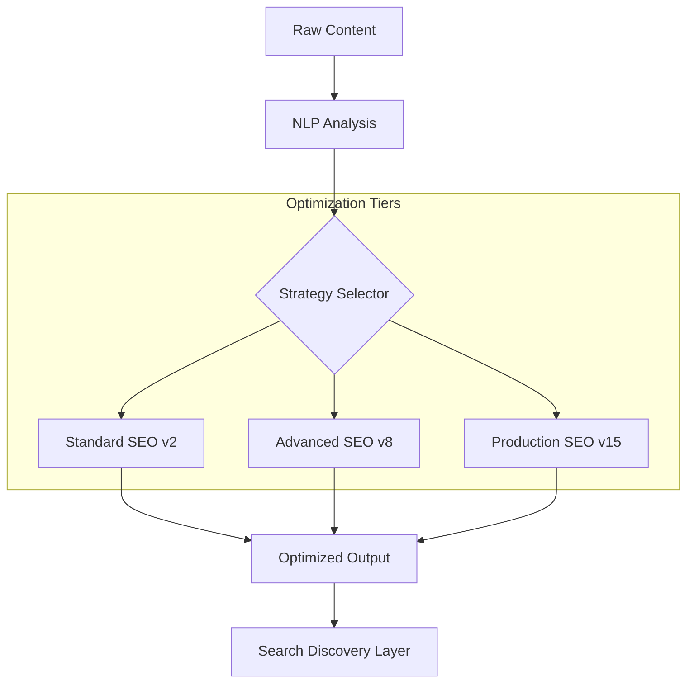

# SEO Optimization System

<div align="center">


**Comprehensive SEO optimization engine with advanced AI capabilities, multi-version performance tuning, and production-ready analytics.**

[Overview](#-overview) •
[Features](#-key-features) •
[Architecture](#-architecture) •
[Installation](#-installation) •
[Usage](#-usage) •
[Documentation](#-documentation) •
[Contributing](#-contributing)

</div>

---

## 📋 Overview

The **SEO Optimization System** is a sophisticated suite of tools within the Onyx Server designed to maximize content visibility and search ranking. It integrates modern AI models with a modular architecture that spans from baseline core logic (v2) to ultra-optimized production systems (v15).

## 🚀 Key Features

| Feature | Description |
|---------|-------------|
| **AI Content Tuning** | Intelligent keyword analysis and content structuring using LLMs. |
| **Multi-Version Pipeline** | Progressive enhancement from v2 to v15 performance levels. |
| **Gradio Dashboards** | Interactive visual tools for SEO auditing and keyword tracking. |
| **Production Analytics** | Deep-dive metrics on search engine visibility and performance. |
| **Modular Routing** | Decoupled architecture for flexible integration with diverse content types. |

## 🏗 Architecture



## 📁 Structure

```
seo/
├── application/            # SEO business logic and service orchestration
├── core/                   # Baseline optimization algorithms
├── domain/                 # SEO domain models and ranking factors
├── infrastructure/         # External service adapters and data stores
├── production/             # Ultra-high performance v15 configurations
└── services/              # Common optimization and analytics services
```

## 💻 Installation

```bash
# Basic SEO requirements
pip install -r requirements.txt

# Ultra-optimized v15 performance tier
pip install -r requirements.ultra_optimized_v15.txt

# Production-grade infrastructure
pip install -r requirements_ultra_optimized.txt
```

## ⚡ Usage

```python
from seo.main import SEOOptimizer

# Initialize the master SEO optimization engine
optimizer = SEOOptimizer()

# Run a full optimization pass
result = optimizer.optimize(
    content="The future of AI in modern enterprise...",
    keywords=["AI", "Innovation", "Onyx Server"],
    target="technical_blog"
)
print(result)
```

## 📚 Documentation

- [Production Summary V15](README_PRODUCTION_V15.md)
- [Ultra Optimization Guide](README_ULTRA_OPTIMIZED.md)

## 🔗 Integration

Natively integrated with:
- **Blog Posts**: For automated content scoring and tagging.
- **Copywriting**: For real-time SEO feedback during writing.
- **Integration System**: For unified marketing stack orchestration.

---

<div align="center">
  <b>Built with ❤️ by Blatam Academy</b><br>
  Part of the Onyx Server Architecture<br>
  <a href="../README.md">← Back to Main README</a>
</div>
