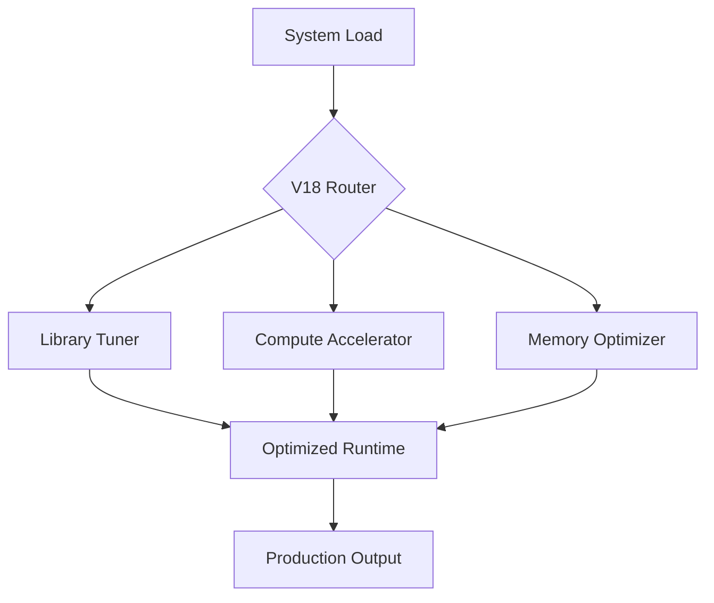

# Ultra Extreme V18 - Optimization Core

<div align="center">


**Extreme-performance optimization engine designed for maximum throughput and ultimate system-wide acceleration.**

[Overview](#-overview) •
[Features](#-key-features) •
[Architecture](#-architecture) •
[Installation](#-installation) •
[Usage](#-usage) •
[Roadmap](#-refactor-plan)

</div>

---

## 📋 Overview

**Ultra Extreme V18** represents the bleeding edge of the Onyx Server's performance layer. It is a specialized optimization engine that implements aggressive library-level tuning, high-entropy computation, and advanced production-ready management for high-load environments.

## 🚀 Key Features

| Feature | Description |
|---------|-------------|
| **Aggressive Tuning** | Low-level library optimization for maximum CPU/GPU utilization. |
| **Optimization Engine** | Centralized core for system-wide performance acceleration. |
| **Production Ready** | Battle-hardened main loops for high-concurrency scenarios. |
| **Refactor Roadmap** | Comprehensive plan for continuous performance enhancement. |

## 🏗 Architecture



## 📁 Structure

```
ultra_extreme_v18/
├── ULTRA_EXTREME_V18_LIBRARIES_OPTIMIZATION.py # Library-level tuning logic
├── ULTRA_EXTREME_V18_OPTIMIZATION_ENGINE.py   # Core acceleration algorithm
├── ULTRA_EXTREME_V18_OPTIMIZATION.py          # Main optimization interface
├── ULTRA_EXTREME_V18_PRODUCTION_MAIN.py       # Production-ready entry point
└── ULTRA_EXTREME_V18_REFACTOR_PLAN.md         # Future architectural roadmap
```

## ⚡ Usage

```python
from ultra_extreme_v18.ULTRA_EXTREME_V18_PRODUCTION_MAIN import UltraExtremeV18System

# Initialize the extreme acceleration system
system = UltraExtremeV18System()

# Execute high-throughput optimized operations
result = system.optimize(your_data_payload)
print(result)
```

## 📚 Documentation

- [Refactor Plan v18](ULTRA_EXTREME_V18_REFACTOR_PLAN.md)

## 🔗 Integration

This system is exclusively used for:
- **Maximum Performance Workloads**: Where standard optimizations are insufficient.
- **High-Concurrency API Servers**: Providing the ultimate runtime stability.

---

<div align="center">
  <b>Built with ❤️ by Blatam Academy</b><br>
  Part of the Onyx Server Architecture<br>
  <a href="../README.md">← Back to Main README</a>
</div>
