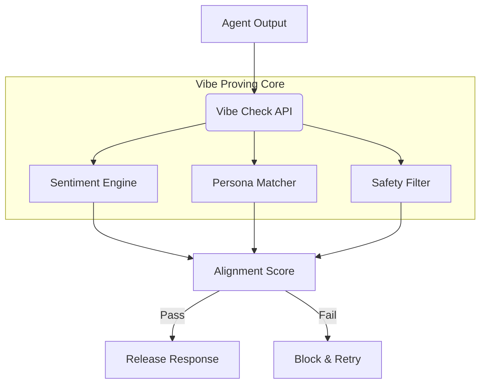

# Vibe Proving

<div align="center">


**A novel framework for validating AI agent behavior alignment through sentiment and intention analysis.**

[Overview](#-overview) •
[Features](#-key-features) •
[Architecture](#-architecture) •
[Installation](#-installation) •
[Usage](#-usage) •
[Contributing](#-contributing)

</div>

---

## 📋 Overview

**Vibe Proving** is an experimental system designed to ensure that AI agents maintain a specific "vibe" or behavioral alignment during long-running tasks. It goes beyond functional correctness tests by analyzing the *tone*, *patience*, and *subtext* of agent interactions.

It acts as a real-time monitor, flagging interactions where an agent might be technically correct but behaviorally misaligned (e.g., rude, dismissive, or overly terse).

### Why Vibe Proving?

- **Brand Safety**: Ensure customer-facing bots never damage brand reputation.
- **Agent Drift**: Detect when models start deviating from their persona.
- **Soft Skills**: Quantify and verify improved empathy and patience in support agents.

## 🚀 Key Features

| Feature | Description |
|---------|-------------|
| **Sentiment Analysis** | Real-time monitoring of agent tonality. |
| **Persona Lock** | Enforces adherence to a defined character profile. |
| **Drift Detection** | Alerts when "vibe" metrics fall below a threshold. |
| **Replay & Audit** | Dashboard to review flagged interactions for human feedback. |

## 🏗 Architecture



## 💻 Installation

```bash
pip install -r requirements.txt
```

## ⚡ Usage

```python
from vibe_proving import VibeCheck

# Define expected persona
checker = VibeCheck(persona="helpful_and_patient")

# Validate response
response = "I already told you that, read the manual."
score = checker.evaluate(response)

if score < 0.8:
    print("Vibe Check Failed: Agent is being rude.")
else:
    print("Vibe Check Passed.")
```

## 🤝 Contributing

We welcome contributions! Please see our [Contributing Guidelines](CONTRIBUTING.md) for details.

---

<div align="center">
  <b>Built with ❤️ by Blatam Academy</b><br>
  Part of the Onyx Server Architecture<br>
  <a href="../README.md">← Back to Main README</a>
</div>
