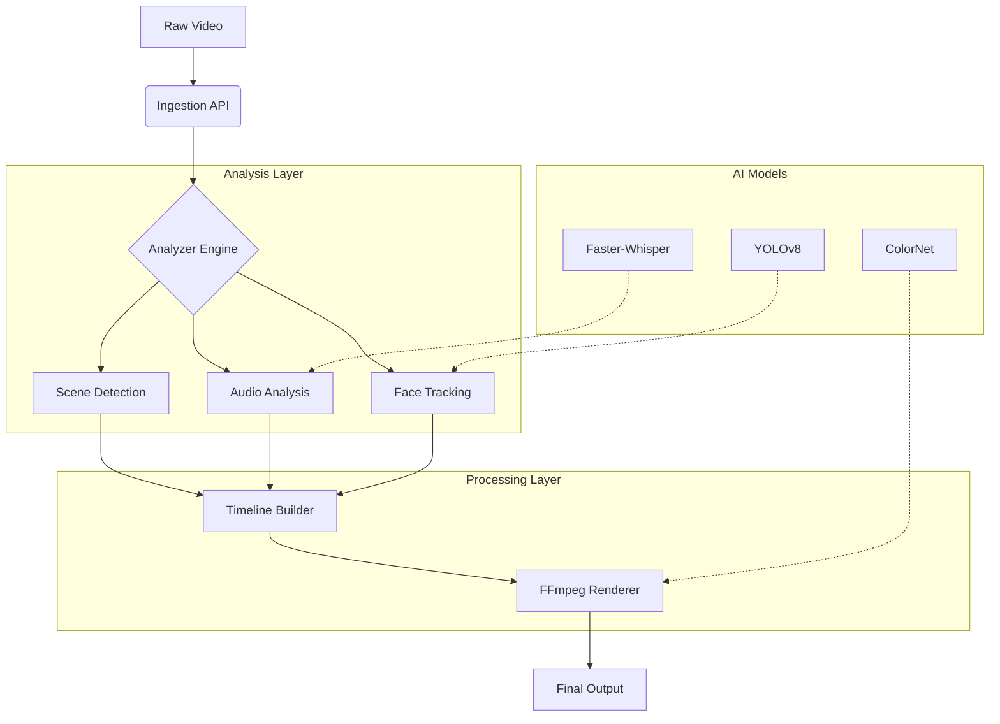

# Video Editor AI

<div align="center">


**An intelligent, automated video editing platform powered by Computer Vision and Deep Learning.**

[Overview](#-overview) •
[Features](#-key-features) •
[Architecture](#-architecture) •
[Installation](#-installation) •
[Usage](#-usage) •
[API Reference](#-api-reference) •
[Contributing](#-contributing)

</div>

---

## 📋 Overview

**Video Editor AI** transforms the tedious process of manual video editing into an automated, AI-driven workflow. Using advanced scene detection, audio analysis, and content understanding, it can automatically trim footage, apply color grading, generate smart captions, and even create highlight reels from raw content.

Built for scale, it utilizes **FFmpeg** bindings and **GPU acceleration** to process high-resolution video streams in near real-time, making it ideal for content creators, marketing teams, and media enterprises.

### Why Video Editor AI?

- **Smart Cuts**: Automatically removes silence, bad takes, and low-quality footage.
- **Content Aware**: Understands the context of the video to apply appropriate styles and transitions.
- **High Performance**: Optimized pipeline capable of rendering 4K video at 2x real-time speeds on supported hardware.

## 🚀 Key Features

| Feature | Description |
|---------|-------------|
| **Automated Editing** | Intelligent algorithms for jump-cutting, scene transitions, and pacing adjustment. |
| **Smart Captions** | Whisper-based speech-to-text with auto-alignment and customizable styling. |
| **Auto-Color Grading** | AI-driven color correction and style transfer to match professional cinematic looks. |
| **Highlight Generation** | Automatically identifies and extracts the most engaging moments from long-form content. |
| **Audio Enhancement** | Noise reduction, audio ducking, and background music synchronization. |
| **Face Tracking** | Automatic reframing (smart crop) for vertical video adaptation (Shorts/Reels/TikTok). |

## 🏗 Architecture

The system is built on a high-performance processing pipeline.



## 💻 Installation

### Prerequisites

- Python 3.9+
- FFmpeg installed and in PATH
- NVIDIA GPU (Recommended for faster rendering)

### Quick Start

1. **Clone the repository**
   ```bash
   git clone https://github.com/blatam-academy/video_editor_ai.git
   cd video_editor_ai
   ```

2. **Install dependencies**
   ```bash
   pip install -r requirements.txt
   ```

3. **Install System Dependencies (Ubuntu example)**
   ```bash
   sudo apt-get install ffmpeg libsm6 libxext6
   ```

## ⚡ Usage

### Python SDK

```python
from video_editor_ai import VideoEditor, EditProfile

# Initialize editor
editor = VideoEditor(device="cuda")

# Load video
project = editor.load("input/raw_footage.mp4")

# Apply smart editing profile
project.apply_profile(EditProfile.DOCUMENTARY)

# Add smart captions
project.add_captions(language="en", style="modern")

# Render
output_path = project.render("output/final_cut.mp4")
print(f"Video saved to {output_path}")
```

### CLI Support

```bash
# Auto-edit a video
python -m video_editor_ai process input.mp4 --style fast-paced --captions

# Extract highlights
python -m video_editor_ai highlights gameplay.mp4 --duration 60
```

### API Integration

**POST /api/v1/jobs**
```json
{
  "source_url": "s3://bucket/raw.mp4",
  "operations": [
    {"type": "remove_silence", "threshold": -30},
    {"type": "add_captions", "model": "medium"},
    {"type": "smart_crop", "aspect_ratio": "9:16"}
  ],
  "webhook_url": "https://callback.com/webhook"
}
```

## 🔧 Configuration

Configure the pipeline via `config.yaml`:

```yaml
processing:
  max_resolution: "4k"
  hardware_acceleration: "nvenc"
  threads: 4

models:
  whisper_model: "medium"
  face_detection: "yolov8n-face"
```

## 🤝 Contributing

We welcome contributions! Please see our [Contributing Guidelines](CONTRIBUTING.md) for details.

## 📄 License

This project is licensed under the MIT License - see the [LICENSE](LICENSE) file for details.

---

<div align="center">
  <b>Built with ❤️ by Blatam Academy</b><br>
  Part of the Onyx Server Architecture<br>
  <a href="../README.md">← Back to Main README</a>
</div>
