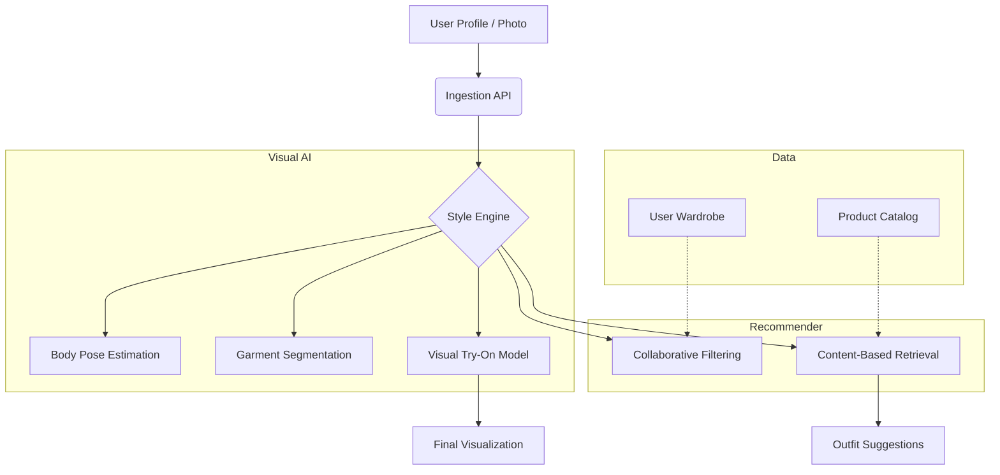

# Virtual Fashion Stylist AI

<div align="center">


**A cutting-edge AI stylist providing personalized fashion recommendations, virtual try-on capabilities, and intelligent wardrobe management.**

[Overview](#-overview) •
[Features](#-key-features) •
[Architecture](#-architecture) •
[Installation](#-installation) •
[Usage](#-usage) •
[Contributing](#-contributing)

</div>

---

## 📋 Overview

**Virtual Fashion Stylist AI** revolutionizes the online shopping experience by bringing the personal touch of a professional stylist to the digital realm. Using advanced Computer Vision and Recommender Systems, it analyzes user preferences, body types, and current trends to curate perfect outfits.

The platform includes a **Virtual Try-On (VTON)** module that allows users to visualize how clothes will look on their own avatars or uploaded photos, significantly reducing return rates for e-commerce retailers.

### Why Fashion Stylist AI?

- **Hyper-Personalization**: Goes beyond collaborative filtering to understand style content (texture, cut, color).
- **Interactive Experience**: Chat-based interface allows users to ask for advice like "What should I wear to a summer wedding?"
- **Sustainability**: Wardrobe digitizer encourages users to mix-and-match existing clothes, promoting sustainable fashion consumption.

## 🚀 Key Features

| Feature | Description |
|---------|-------------|
| **AI Recommendations** | Deep learning models that suggest items based on visual similarity and style compatibility. |
| **Virtual Try-On** | Realistic 2D image synthesis to overlay clothing items onto user photos. |
| **Wardrobe Digitizer** | Tools to upload, background-remove, and categorize personal clothing items. |
| **Outfit Builder** | Canvas for creating looks (collages) from wardrobe items and store products. |
| **Trend Analysis** | Scrapes social media and runway reports to identify emerging fashion trends. |
| **Occasion Logic** | Context-aware suggestions for specific events (Work, Date Night, Gym). |

## 🏗 Architecture

The system combines visual processing with semantic understanding.



## 💻 Installation

### Prerequisites

- Python 3.10+
- PyTorch (for VTON models)
- MongoDB (for product catalog)

### Quick Start

1. **Clone the repository**
   ```bash
   git clone https://github.com/blatam-academy/virtual_fashion_stylist_ai.git
   cd virtual_fashion_stylist_ai
   ```

2. **Install dependencies**
   ```bash
   pip install -r requirements.txt
   ```

3. **Download VTON Models**
   ```bash
   python scripts/download_models.py --model vton-hd
   ```

## ⚡ Usage

### Python SDK

```python
from fashion_stylist import Stylist, UserProfile

# Initialize
stylist = Stylist(model="v2-enterprise")
user = UserProfile(id="user_123", style_pref=["boho", "chic"])

# Get Recommendations
recommendations = stylist.recommend(
    user_context=user,
    occasion="cocktail_party",
    weather="warm"
)

# Virtual Try-On
result_image = stylist.try_on(
    person_image="input/user_photo.jpg",
    garment_image="input/dress.jpg"
)
result_image.save("output/try_on_result.jpg")
```

### API Endpoints

**POST /api/v1/recommend**
```json
{
  "user_id": "u123",
  "filters": {
    "category": "dresses",
    "price_range": [50, 200],
    "color": ["red", "black"]
  }
}
```

## 🔧 Configuration

Configure the models in `config.yaml`:

```yaml
vton:
  resolution: 512
  model_path: "checkpoints/vton_v2.pth"

recommendation:
  algorithm: "hybrid"
  exploration_rate: 0.2
```

## 🤝 Contributing

We welcome contributions! Please see our [Contributing Guidelines](CONTRIBUTING.md) for details.

## 📄 License

This project is licensed under the MIT License - see the [LICENSE](LICENSE) file for details.

---

<div align="center">
  <b>Built with ❤️ by Blatam Academy</b><br>
  Part of the Onyx Server Architecture<br>
  <a href="../README.md">← Back to Main README</a>
</div>
