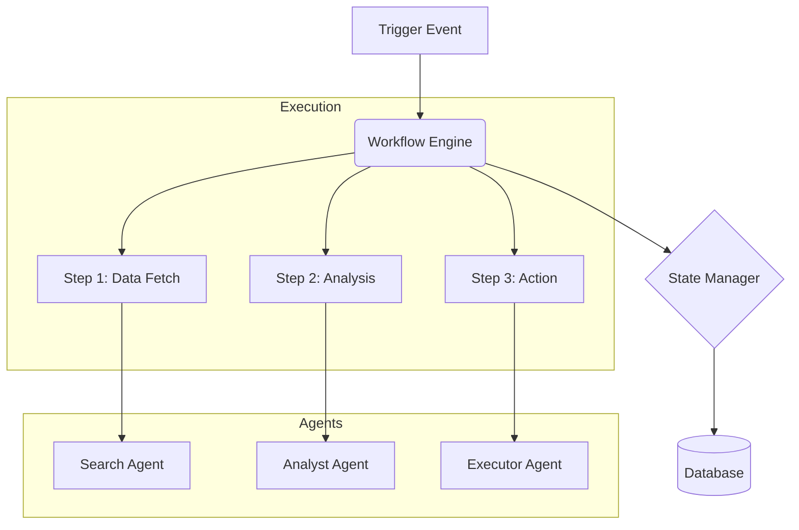

# Workflow Orchestrator AI

<div align="center">


**A resilient, event-driven engine for managing complex, multi-agent workflows.**

[Overview](#-overview) •
[Features](#-key-features) •
[Architecture](#-architecture) •
[Installation](#-installation) •
[Usage](#-usage) •
[Contributing](#-contributing)

</div>

---

## 📋 Overview

**Workflow Orchestrator AI** allows developers to define, execute, and monitor complex business logic that spans multiple agents and services. It creates a robust layer of control over the autonomous system, ensuring that tasks are executed in the correct order, data is passed reliably between steps, and errors are handled gracefully.

### Why Workflow Orchestrator?

- **Reliability:** Guarantees task execution even in the face of transient failures.
- **Visibility:** Provides a clear view of the state of every running workflow.
- **Flexibility:** Supports dynamic DAGs (Directed Acyclic Graphs) that can change based on runtime data.

## 🚀 Key Features

| Feature | Description |
|---------|-------------|
| **Visual Workflow Building** | Define workflows using JSON/YAML or a visual editor. |
| **State Persistence** | All workflow states are saved to a durable store (Redis/Postgres). |
| **Retry Policies** | Configurable backoff strategies for failing steps. |
| **Conditional Logic** | Branching paths based on step outputs (if/else/switch). |
| **Parallel Execution** | Run independent steps concurrently to reduce total duration. |

## 🏗 Architecture



## 💻 Installation

```bash
pip install -r requirements.txt
```

## ⚡ Usage

```python
from workflow_orchestrator import Workflow, Step

flow = Workflow(name="document-review")

step1 = Step(name="ingest", task="ingest_document")
step2 = Step(name="classify", task="classify_content", code="ai_document_classifier")
step3 = Step(name="archive", task="store_document", depends_on=[step2])

flow.add_steps([step1, step2, step3])
flow.run()
```

## 🤝 Contributing

We welcome contributions! Please see our [Contributing Guidelines](CONTRIBUTING.md) for details.

---

<div align="center">
  <b>Built with ❤️ by Blatam Academy</b><br>
  Part of the Onyx Server Architecture<br>
  <a href="../README.md">← Back to Main README</a>
</div>
